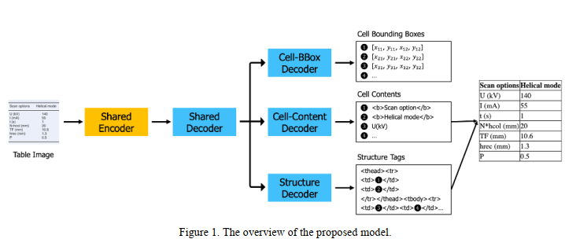
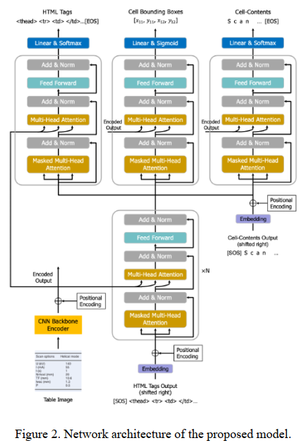
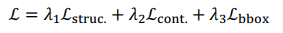

## An End-to-End Multi-Task Learning Model for Image-based Table Recognition(VISIGRAPP2023)

### 一.前述

作者称类似tablemaster这种以前的很多方法都是将表格的识别拆分成了两个独立的子任务，即表格结构识别（包括单元格位置检测）以及单元格的内容识别（包括文本检测），接着还需要进行复杂的后处理对齐任务。那么这篇文章作者称将表格识别的三个子任务表格结构识别、单元格内容识别以及单元格位置检测融合成了一个端到端的多任务学习模型，作者声称达到了state-of-the-art。还公开了代码：https://github.com/namtuanly/MTL-TabNet。

总之，作者在文中説本论文主要贡献在以下几点：

1.提出了一个新的端到端表格识别多任务学习模型，此方法能够很easy的以端到端的方式去进行train和infer。

2.新模型在基准数据集（FinTabNet，PubTabNet）中的表现优于其它先进方法。

3.新模型没有使用额外的训练数据也没有使用集成技术，但与icdar2021竞赛的top3方案具有竞争力。

### 二.结构概述

从上图中可以看出，所提出的模型由一个共享的编码器encoder，一个共享的解码器deocder，以及三个独立的解码器decoder组成，后面这三个独立的deocder对应表格识别的三个子任务。

1.共享的编码器encoder将输入的表格图像编码成序列特征。

2.将序列特征输入到共享的解码器decoder中。

3.2的结果输入到structure decoder预测HTML标签结构

4.2的结果输入到cell-bbox deocder预测单元格边框坐标

5.2的结果输入到cell-content deocder预测单元格文本内容

6.最后，将单元格的文本内容插入到与其单元格相对应的HTML结构标记中，以生成最终结果

#### 三.组件概述

1.共享的编码器Encoder（shared encoder）

    这里使用一个基于CNN-backbone的网络作为特征抽取器，后面跟一个位置编码层positional encoding，得到table图像的序列编码特征。
    这个特征作为Key vector和Value vector会输入到共享的解码器以及三个独立的解码器的多头注意力部分。

2.共享的解码器Decoder（shared decoder）

    这里所有的解码器decoder都与原始的transformer的decoder部分一样（从图中可以看出）。共享的解码器deocder部分作者设N=2即2层，
    在训练时这里的输入是HTML标签的右移序列加上位置编码，推理时这里的输入是structure decoder的输出进行拼接。最后共享的解码器decoder的输出作为三个子任务的输入。

3.结构解码器Decoder（structure deocder）

    这部分是利用共享的解码器deocder的输出（作为query vector）以及共享的编码器encoder的输出(作为key vector和value vector)作为输入，
    去预测表格结构的HTML标签序列。decoder的后面跟着一个线性层linear以及一个softmax层。

4.单元格边框解码器Decoder（cell-bbox decoder）
 
    当结构解码器生成表示新单元格（' <td></td> '或' <td '）的结构token时，将触发cell-bbox解码器，
    并使用与该单元格对应的共享解码器的输出来预测该单元格的边界框坐标（四个坐标）。deocder后面跟着一个线性层linear以及一个sigmoid层。

5.单元格内容解码器Decocer（cell-content decoder）

    该部分中的单元内容解码器可视为文本识别器，文本的输出是字符级别。模型的输入是内容的右移序列加位置编码以及加上共享解码器的输出部分。
    decoder后面跟着一个线性层linear以及一个softmax层。
    
#### 四.训练概述
1.损失函数

整个模型，共享组件从从三个子任务接收到的梯度中重复训练，而三个独立解码器中的每个都从其任务获得的梯度中训练。整个系统可以通过随机梯度下降算法对table图像及其对table结构、文本内容和每个非空表单元的边界框的注释进行端到端训练。

损失函数：

上式中的ℒstruc. and ℒcont.是利用交叉熵cross-entropy分别实现的table结构识别损失和单元格内容预测损失，ℒbbox是利用L1 loss实现的单元格边框预测的损失。𝜆1、𝜆2和𝜆3为权值超参数。

2.其它

作者利用Resnet-31作为cnn backbone，另外为了构建输入图像的全局上下文，作者在Resnet-31的每一个残差块后又增加了multi-aspect全局注意力。所有图像大小是480*480，cnn的feature map的维度是60*60。在解码器上，所有相同的层具有相同的架构，输入特征大小为512，前馈网络大小为2048，注意头为8。结构解码器中的结构token序列的最大长度为500，单元内容解码器中的单元token序列的最大长度为150。

作者计划未来在strucutre deocder和cell-content decoder加入语言模型以改善模型的性能。

