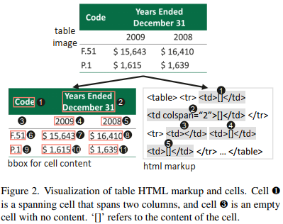
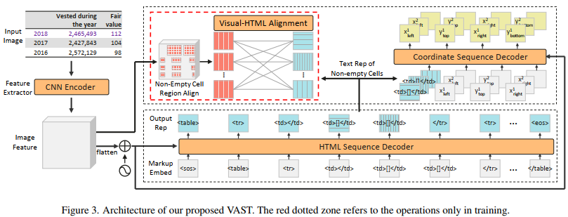
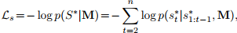
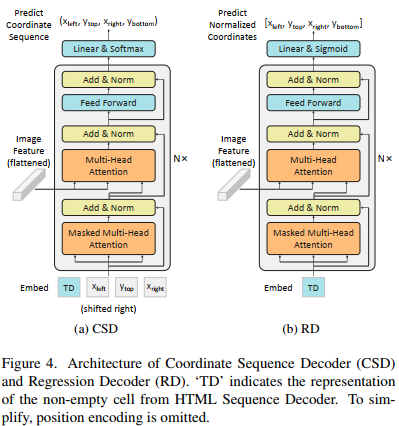
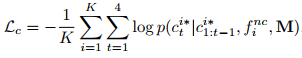
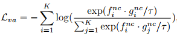
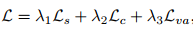
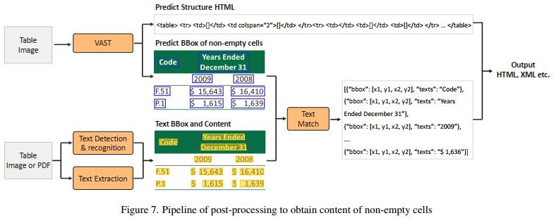

## Improving Table Structure Recognition with Visual-Alignment Sequential Coordinate Modeling(cvpr2023)
### 一.概述
作者认为表格结构识别的目的是将非结构化表格图像的逻辑和物理结构提取成机器可读的格式。目前最新的端到端图像-文本方法通过两个解码器同时预测两种结构，其中物理结构(单元格的边界框)的预测是基于逻辑结构的表示。作者认为之前的方法对单元格边界框的预测不准，是由于逻辑表示缺乏局部视觉信息导致的。

为此，作者提出了一个名为VAST的端到端的表格结构识别序列模型框架。它包含一个新的被来自逻辑结构解码器的非空单元格的表示而触发的坐标序列解码器。在坐标序列解码器中，我们将边界框坐标建模为语言序列，其中左、上、右和下坐标依次解码，以利用坐标间的依赖关系。此外，提出了一个辅助的视觉对齐loss，去加强非空单元格的逻辑表示以包含更多的局部视觉细节，这有助于产生更好的单元格边界框。

在坐标序列解码器中，非空单元格的开始嵌入是来自HTML序列解码器的表示。这种表示通常包含更全局的表格上下文，并且具有更少的局部视觉细节。由于局部视觉外观对于预测准确的坐标至关重要，因此我们将HTML序列解码器中的非空单元格表示与CNN图像编码器的视觉特征进行对齐。文中设计了一个视觉对齐的loss，用于最大化visual-Html对表示的cosine相似度。

文中主要有三大贡献（将边界框预测作为坐标序列生成任务，并配合视觉对齐loss生成更精确的边界框）：

1.为了在端到端表格识别系统中显著提高表格的物理结构精度，提出了一种坐标序列解码器。

2.在HTML解码器和坐标序列解码器之间引入了视觉对齐loss。这使得(增强)HTML解码模块的表示包含更详细的视觉信息，这可以为非空单元格生成更好的边界框。

3.开发了一个端到端序列建模框架用于表格结构识别，证明了方法的有效性。

### 二.任务定义

输入一张表格图片，任务目标是端到端的预测它的逻辑结构和物理结构。这里逻辑结构是指表格的HTML标签，物理结构是指所有非空单元格的边框坐标。

### 三.方法概述

如上图所示，该模型主要由3个部分组成：CNN图片编码器；HTML 序列解码器以及坐标序列解码器。输入一张表格图片，利用CNN编码器抽取图片feature map，然后将feature map输入到HTML序列解码器和坐标序列解码器，分别生成HTML序列标签和非空单元格边框。这里的HTML序列解码器的非空单元格的表示将会触发坐标序列解码器。为了增强表示的局部视觉信息，在训练阶段使用了视觉对齐loss。

#### 1.CNN图片编码器(CNN Image Encoder)
利用带multi-aspect global content attention的ResNet作为CNN图片编码器。结果图片的feature map是C4，这是来自于第4个stage最后一个卷积层的输出。输入的是H × W × 3 的RGB图片。输出的是H/16 × W/16 × d 的feature map。

#### 2.HTML序列解码器(HTML Sequence Decoder)
    表格的逻辑结构包含诸如单元格数量、行数、列数、邻接数、跨单元格数等信息。这里利用HTML表示表格的逻辑结构。
    使用<td></td>和<td>[]</td>表示空单元格和非空单元格。对于跨单元格，HTML的标签
    为<td, colspan= " n "或rowspan= " n "， >和</td>，使用第一个token <td来表示跨单元格。
    HTML序列解码器是一个N=3层的transformer结构。Keys和Values是打平后的CNN编码特征feature map，
    再加上位置编码。Queries是移位的结构token。Transformer是通过自回归解码输出HTML序列。第i步的输出是一个概率分布：p(st|M,s1:t-1) 。
在训练阶段，将使用交叉熵损失：

这里的S∗是目标table的HTML的真值。起始标记s *1或s1在训练和测试阶段都是一个固定的标记<sos>。
#### 3.坐标序列解码器(Coordinate Sequence Decoder)

对于坐标预测，本文将坐标序列解码器级联在HTML序列解码器之后。解码器由一个非空单元格触发。对左、上、右和下(left,top,right,bottom)坐标一次对一个元素进行解码。每个连续的角坐标被均匀离散成一个整数[0, nbins]。在解码器中，利用先前预测坐标的embedding来预测后一个坐标，这会将上下文信息注入到下一个坐标的预测中。
与HTML序列解码器相似，坐标序列解码器的Keys和Values来自打平后的CNN编码器的输出feature map，而移位坐标当作Queries。而起始token的embedding是来自HTML序列解码器的snc i的表示，用finc表示。第i步的输出是分布：p(ct|c1:t-1, finc, M) ，其中{ct}4 t=1为离散随机变量，取值范围为[0,nbins]。

坐标序列解码器的损失也为交叉熵损失：

这里的K是非空单元格的数量，这里的ci* 1，ci *2 ，ci *3，ci *4对应于第i个单元格的左、上、右、下坐标的真值。finc来自HTML序列解码器，它包含上下文信息和视觉信息，可以帮助坐标序列解码器描述不同的单元格。

#### 4.视觉对齐loss(Visual-alignment loss)
为了丰富坐标序列解码器起始embedding的局部视觉信息，文中提出了一种视觉对齐loss来辅助坐标序列解码器的学习。视觉对齐loss的主要动机是将非空单元格的逻辑结构表示与其视觉特征对齐。
在训练期间，收集所有非空单元格{finc}Ki=1的HTML表示。使用ROIAlign提取每个非空单元格的视觉表示{ginc}K i=1。根据真值的边界框从图像feature map中裁剪出视觉特征，将其进一步投影为与finc具有相同维度的向量。假定一个包含K个非空单元格的表格图像，我们有K个visual-HTML对(ginc, finc)。在finc和图像中的所有视觉表示{ginc}K i=1之间使用InfoNCE损失。

视觉对齐损失函数如下:

其中τ是温度超参数，设为0.04. 余弦相似度是通过点积来测量的。
这种损失只在训练中使用，在推理过程中不会给模型带来任何负担。

#### 5.参数与loss

##### (1).参数设置：输入图片size为608× 608；图片特征的维度是512；两个解码器为3层相同结构；8个头；nbins是608。

##### (2).训练loss

训练的损失函数是3个损失的联合形式。λ1, λ1, 和 λ3 分别设置为1.0，1.0和1.0。优化器为AdamW。初始学习率是1e-4，每步减少0.1。为防过拟合，HTML序列解码器和坐标序列解码器的dropout为0.1。HTML序列解码器最大长度为500。ROIAlign输出大小为2× 2，利用线性变换将CNN打平后的特征映射成512的向量。

#### 6.其它
作者在后面补充了一些材料，比如单元格内容如何提取等。

