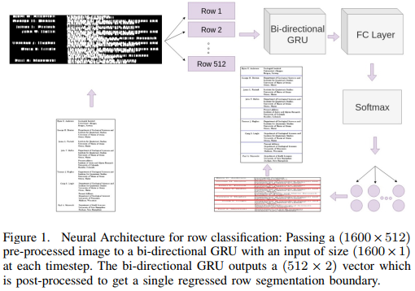
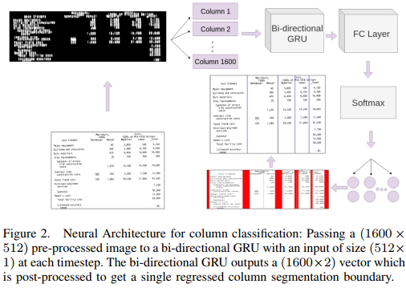

## Table Structure Extraction with Bi-directional Gated Recurrent Unit Networks(icdar2019)
### 一.概述
&emsp;&emsp;文中提出了一种利用深度学习方法去抽取表格的行和列的方法，该方法首先对表格图像进行预处理，然后将其输入双向循环神经网络门控循环单元(GRU)，后面接一个带softmax激活的全连接层。该网络从上到下以及从左到右扫描图像，并将每个输入分类为行分隔符或列分隔符。方法在数据集UNLV和ICDAR2013上取得了state-of-the-art。
### 二.方法概述
方法主要包括三个模块：

1).图像预处理:将包含文本的表格图像转换为不包含文本特征的自然图像。

2).一个行-列分类器：然后将这些图像传递给分类器，分类器使用行和列作为时间步，对每一行和每一列进行分类。

3).后处理：对分类器生成的分割空间进行解析，给出行和列的单行预测。
#### 1.图像预处理
&emsp;&emsp;图像转换的目的是通过对输入图像去除不必要的细节来提高分类器的效率。首先，通过删除规则线和其他非文本前景对象来清理图像。然后，通过自适应二值化对清洗后的图像二值化，使像素强度均匀。接着，对二值化后的图像resize到1600× 512。

&emsp;&emsp;二值化后，利用矩形核对调整后的图像进行三次膨胀变换迭代。在列检测的情况下，膨胀核是一个维度为3 × 5的垂直膨胀滤波器，在行检测的情况下，它是一个维度为5 × 3的水平膨胀滤波器。这些膨胀操作连接相邻的行和列，这有助于模型获取行和列分隔符的模式。接着对这些转换后的图像进行归一化到0到1之间，并将其输入到后面的循环网络中。
#### 2.模型

&emsp;&emsp;从上图中可看出所提方法被分成2部分：列分类器和行分类器。方法的关键是利用循环神经网络识别行与列之间的分割空间。文中使用双向GRU以行和列作为时间步长，并使用之前的行-列元素的信息来预测未来的行-列元素。
##### (1).列分类器
&emsp;&emsp;用于列识别的神经结构将图像的每一列分类为一列或两列之间的空白。图像一次传递一个，每个图像被认为是一个batch，就像随机梯度下降(SGD)一样。单个batch处理中尺寸为1600×512的预处理输入图像被分成1600个序列(列)，每个序列由512个像素值组成。这里使用了一个隐藏的尺寸维度512。 用隐藏维度(4 × 1 × 512)初始化两层GRU，即对应2 *层数*批量大小*隐藏维度大小。

&emsp;&emsp;GRU将图像处理为1600个“时间步长”，每个时间步长对应一个具有512个输入像素值的列。在每个时间步，GRU都有当前列左边和右边(如果有的话)的所有列的信息，以及正在评估的当前列中包含的像素值。使用这些信息，GRU可以学习识别列之间的间隙，这些列主要包含白色像素，并且在其左右两侧有两个列区域。

&emsp;&emsp;GRU输出一个形状为1600×512的张量，对应于序列长度乘以隐藏维数。然后这个张量通过一个全连接层输出一个1600×2的张量。该输出最后通过一个softmax层，产生1600 × 2的最终输出，由1600列中的每列的二分类概率组成。
##### (2).行分类器
&emsp;&emsp;行检测的神经结构是列分类器的转置，它将图像的每一行分类为一行或两行之间的空白。每次输入一个图像，每个图像被认为是一个batch。将单个batch内尺寸为1600 × 512的预处理输入图像拆分为512个序列(行)，每个序列由1600个像素值组成。文中使用了一个大小为1024的隐藏维度。初始化2层GRU的隐藏维度为(4 × 1 × 1024)，对应于2 *(层数*批大小*隐藏维度大小)。

&emsp;&emsp;在行分类的情况下，有512个时间步，每个步有1600个输入。在每个时间步，GRU都有当前行上下的所有行以及当前行内的像素值的信息。GRU输出一个形状为512×1600的张量，对应于序列长度x隐藏维度。这个张量然后通过一个全连接层，输出一个512×2形张量。再通过softmax层，输出形状为512 × 2张量，由512行中的每一行的二分类概率组成。

&emsp;&emsp;分类的最后一步是解析分类器预测的分割空间。文中取分割空间的中点，并应用逻辑在列的情况下删除最左边和最右边的预测，在行的情况下删除顶部和底部的预测。此步骤将回归输出到行和列分隔符的单行预测。
##### (3).训练
&emsp;&emsp;利用Adam优化器和二分类交叉熵损失函数训练模型。由于行和列比空白多，所以会导致类别不平衡问题，所以训练中利用加权损失来惩罚错误预测的行-列元素。

