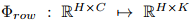

## Rethinking Semantic Segmentation for Table Structure Recognition in Documents(icdar2019)
### 一.概述
&emsp;&emsp;对于尺寸为H×W的图像，我们为行预测单列，为列预测单列。我们使用双头架构(dual-headed architecture)，其中初始特征映射feature maps(来自编码器-解码器模型)是共享的，而最后两层生成特定于类(行/列)的预测。这允许我们同时使用单个模型对行和列生成预测，而以前的方法依赖于两个单独的模型进行推理。在数据集ICDAR-13上取得了state-of-the-art。

&emsp;&emsp;作者提出了一种新的方法，其中使用预测平铺框架约束语义分割系统，以便成功地从稀疏表格区域中提取结构。本文的主要贡献有几点：

1).使用全卷积网络(FCN)同时检测行和列的统一架构。

2).基于表格结构的一致性假设，引入了一种新的预测平铺(prediction tiling)框架，大大降低了问题的复杂性，提高了分割性能。

### 二.方法概述

&emsp;&emsp;作者将表格结构识别问题当成语义分割问题来处理，此问题被分为2个子任务，一个用于行分割；一个用于列分割。如上图所示，整个系统由几个子组件组成。首先encoder-decoder模块用于抽取图像的相关特征，然后decoder输出的特征送入预测平铺模块，预测平铺模块首先对特征进行池化，然后在平铺最终预测获得分割掩码(segmentation masks)之前进行几个卷积层。对这些掩码masks进行后处理，根据它们的交集获得单元格信息。
#### 1.编码器(Encoder)
&emsp;&emsp;这里使用的编码器是Inception ResNet v2，只使用了其中几个卷积层。
#### 2.解码器(Decoder)
&emsp;&emsp;解码器将编码器的输出重新转为和输入图像维度相同的空间结果。解码器由转置卷积层，后跟3 × 3核卷积层组成，每个卷积层有256个滤波器。利用batchnorm和leaky relu在每一个卷积层后进行归一化和激活。我们使用来自编码器的特征，并将其与来自解码器的特征映射feture maps(skip-connections)在四个不同的步长级别(16,8,4,2)结合起来，直到获得全尺寸图像。
#### 3.预测平铺(Prediction Tiling)
&emsp;&emsp;对表格做一个一致性假设，即所有的行从第一列的起点开始，到最后一列的终点结束。类似地，所有列从第一行的起始点开始，并跨越到最后一行的结束点。这个简单的假设适用于所有正常的表格结构。但是，如果分层表需要额外的后处理来合并过度分段的行/列，则违反了此假设。

&emsp;&emsp;基于这个简单的假设，我们减少了每个输出预测头的负载。对于大小为H × W的图像，我们简化了两个头的预测。编码器-解码器模型产生一个与输入大小相同的中间表示。一旦计算出这个中间表示，我们根据一致性假设减少可用信息。行减少：

这里的(C是通道数)表示行特征，索引i和j分别是图像的高和宽跨度。

同样，对于列的减少：

这里的表示列特征。

一旦计算出这种简化的表示形式，我们将对行和列应用特定类型的head。这些head分别对行和列表示为和。K是输出类别数。最终的表示如下：

其中两个分类头都由三个卷积层(convd - 1d)组成，包括batchnorm、leakly ReLU和特征拼接。前两层使用内核大小为3和64个过滤器，而最后一层使用内核大小为1和K个过滤器。由于所需的分割掩码大小为H ×W，并且计算表示为2D而不是3D，我们将预测平铺(重复和堆叠)在一起以将固定表示转换为全尺寸(RH×W×K)。平铺为以下形式：

通过这种平铺，输出预测的大小与输入的大小匹配。每个头的类别是3类，分别是背景，行和列。
#### 4.后处理(Post-Processing)
&emsp;&emsp;首先用3 × 3的平方核进行闭和开的形态学操作。闭操作会填充mask上的小孔，而开操作会移除小目标。为了提取行/列的区域边界，我们然后进行轮廓检测。由于我们有从对应行/列的一端到另一端的完美边界框，我们将轮廓转换为边界框。有了边界框之后，我们根据边界框的大小执行简单的过滤。丢弃边界框的高度小于行的相应图像高度的1%或者其宽度小于列的相应图像宽度的2%的检测框。通过将所有行的起始点设置为第一列的起始点，将所有行的结束点设置为最后一列的结束点，进一步微调检测到的行边界框坐标。类似地，我们对列的注释进行微调。

