## LGPMA: Complicated Table Structure Recognition with Local and Global Pyramid Mask Alignment(icdar2021)
### 一.概述
&emsp;&emsp;作者认为基于表格结构特征，发现获取文本区域的对齐边界框可以有效地保持不同单元格的整个相关范围。然而，由于视觉上的模糊性，对齐的边界框难以准确预测。在本文中，作者的目标是通过充分利用所提出的局部特征中的文本区域和全局特征中的单元格关系的视觉信息来获得更可靠的对齐边界框。

&emsp;&emsp;为此，文中提出了局部和全局金字塔掩码对齐(Local and Global Pyramid Mask Alignment)框架，在局部和全局特征映射(feature map)中均采用软金字塔掩码学习机制。它允许边界框的预测边界突破了原始建议的限制。然后集成金字塔掩码重新评分模块，以折衷局部和全局信息并细化预测边界（在局部检测结果的基础上，结合全局信息对检测到的边界框进行细化，为空单元格分隔提供了直观的指导）。最后，我们提出了一种鲁棒的表格结构恢复管道(pipeline)来获得最终结构，有效地解决了空单元格的定位和分隔问题。

代码：https://github.com/hikopensource/
DAVAR-Lab-OCR/tree/main/demo/table_recognition/lgpma 

### 二.方法概述
&emsp;&emsp;在本文中，目标是训练网络以获得更可靠的对齐单元格区域，并用一个模型去解决空单元格生成和分隔问题。观察到人们在阅读时同时从局部文本区域和全局布局中感知视觉信息，我们提出了一种统一的表格结构识别框架，以平衡局部和全局信息的优点，称为LGPMA(Local and Global Pyramid Mask Alignment)网络。该模型同时学习了一个局部的基于mask - rcnn的对齐边界框检测任务和一个全局分割任务。 在这两个任务中，我们都采用了金字塔软遮罩(pyramid soft mask)监督，以帮助获得更精确的对齐边界框。在LGPMA中，局部分支(LPMA)通过视觉纹理感知机获得更可靠的文本区域信息，而全局分支(GPMA)可以获得更清晰的单元格范围或分隔的空间信息。这两个分支通过联合学习帮助网络更好地融合特征，并通过提出的掩码重评分策略有效地改进检测到的对齐边界框。据此，作者提出一个表格结构识别的pipeline，可以有效定位空单元格，并在全局分割的指导下进行精确合并。

&emsp;&emsp;本文的主要贡献有以下几点：

1).提出了一种新的框架，称为LGPMA网络，从局部和全局的角度平衡视觉特征。该模型通过提出的掩码重评分策略，充分利用了局部和全局特征信息，获得了更可靠的对齐单元格区域。

2).引入统一的表格结构恢复pipeline，包括单元格匹配、空单元格搜索和空单元格合并。非空单元格和空单元格都可以被有效地定位和分割。

3).在数据集ICDAR2013，SciTSR以及PubTabNet上取得了state-of-the-art。

### 三.具体方法
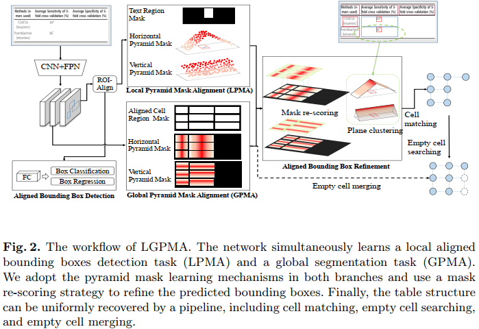

&emsp;&emsp;该模型基于Mask-RCNN构建。边界框分支直接学习非空单元格对齐边界框的检测任务。该网络同时学习基于RoI-Align操作提取的局部特征的Local Pyramid Mask Alignment (LPMA)任务和基于全局特征映射(feature map)的Global Pyramid Mask Alignment (GPMA)任务。

&emsp;&emsp;在LPMA中，除了学习文本区域掩码的二元分割任务外，还在水平和垂直两个方向上使用金字塔软掩码(pyramid soft mask)监督对网络进行训练。

&emsp;&emsp;在GPMA中，网络为所有对齐的非空单元格的边界框学习全局金字塔掩码(global pyramid mask)。为了获得更多关于空单元格分割的信息，网络还学习了同时考虑非空单元格和空单元格的全局二元分割任务。

&emsp;&emsp;然后采用金字塔掩码重评分模块来细化预测的金字塔标签label。通过平面聚类可以得到精确对齐的边界框。最后，集成了包含单元格匹配、空单元格搜索、空单元格合并的统一结构恢复管道pipeline，得到最终的表格结构。
#### 1.对齐边界框检测(Aligned Bounding Box Detection)
&emsp;&emsp;准确匹配文本区域的困难主要来自于文本区域与真实单元格区域之间的覆盖范围差距。真实单元格区域可能包含用于行/列对齐的空的空间(empty space)，特别是对于那些跨越多行/列的单元格。这里通过文本区域和行/列索引的标注，我们可以根据每行/列的最大框高/宽度轻松生成对齐的边界框标注。对齐的边界框的区域近似等于真实单元格的区域。对于印刷体格式的表格图像，在没有视觉旋转和透视变换的情况下，如果我们能够获得对齐的单元格区域，并且假设没有空单元格，那么就很容易根据水平和垂直方向的坐标重叠信息推断出单元格之间的关系。

&emsp;&emsp;文中采用Mask-RCNN作为基本模型。在边界框分支中，基于对齐的边界框对网络进行监督训练。然而，对齐的边界框学习并不容易，因为单元格很容易与空区域混淆。参考金字塔掩码文本检测器，我们发现使用软标签分割(soft-label segmentation)可以突破所提出的边界框的限制，提供更精确的对齐边界框。为了充分利用局部纹理和全局布局的视觉特征，我们提出同时学习这两个分支中的金字塔掩码对齐(pyramid mask alignment)信息。
#### 2.局部金字塔掩码对齐(Local Pyramid Mask Alignment)
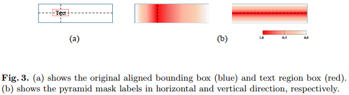

&emsp;&emsp;在mask分支，训练模型去学习一个二元分隔任务和一个金子塔mask回归任务，这就是LPMA(Local Pyramid Mask Alignment)。

&emsp;&emsp;二元分割任务与原模型相同，只将文本区域标记为1，其余区域标记为0。检测到的掩码区域可用于以下文本识别任务。

&emsp;&emsp;对于金字塔mask回归任务，我们在水平和垂直方向上用软标签(soft-label)来在边界框区域中分配像素。文本的中间点将具有最大的回归目标1。这里假定对齐的边框shape是H ×W 。文本区域的左上点和右下点分别标示为{(x1;y1);(x2);y2)}，其中0≤x1<x2≤W, 0≤y1<y2≤H。因此，金字塔掩码(pyramid mask)的目标形状为R2×H×W ∈[0;1]，其中两个通道分别表示水平掩码和垂直掩码的目标map。对于每个像素(h;w)，这两个目标可为以下形式:

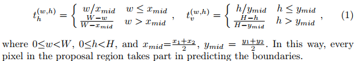
#### 3.全局金字塔掩码对齐(Global Pyramid Mask Alignment)
&emsp;&emsp;LPMA的局部感受野是受限的，为了确定一个单元格的准确覆盖区域，全局特征可以提供一些视觉线索，从全局视图中学习每个像素的偏移量可以帮助定位更准确的边界。然而，单元格级的边界框可能会以宽高比变化，从而导致回归学习中的不平衡问题。因此，我们使用金字塔标签(pyramid label)作为每个像素的回归目标，称为全局金字塔掩码对齐(GPMA)。

&emsp;&emsp;与LPMA一样，GPMA同时学习两个任务:全局分割任务和全局金字塔掩码回归任务。在全局分割任务中，我们直接分割所有对齐的单元格，包括非空和空单元格。空单元格的真值(ground-truth)是根据同一行/列中非空单元格的最大高度/宽度生成的。注意，只有这个任务学习空单元格分隔信息，因为空单元格不具有可能在一定程度上影响区域建议网络的可见文本纹理。我们希望该模型能够根据人类的阅读习惯在全局边界分割过程中捕捉到最合理的单元格分隔模式。对于全局金字塔掩码回归，由于只有文本区域可以提供不同的“mountain top”信息，因此所有非空单元格将被分配类似于LPMA的软标签。GPMA中对齐的边界框的所有ground-truth将被缩小5%，以防止框重叠。
#### 4.优化(Optimization)
采用端到端多优化任务训练模型，如下：

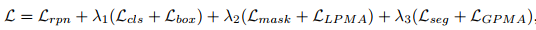

&emsp;&emsp;其中Lrpn; Lcls; Lbox; Lmask的损失Loss与Mask-RCNN的一样，分别表示the region proposal network loss，the bounding box classification loss，the bounding boxes regression loss和the segmentation loss of mask in proposals；Lseg是在Dice系数损失中实现的全局二元分割损失，LLPMA和LGPMA是金字塔标签回归损失(the pyramid label regression losses)，它们通过逐像素L1损失进行优化。λ1;λ2;λ3为加权参数。
#### 5.推理(Inference)
推理过程可以分为两个阶段。首先根据金字塔掩码(pyramid mask)预测得到精细化的对齐边界框，然后通过提出的结构恢复pipeline生成最终的表结构。
##### (1).对齐边界框细化(Aligned Bounding Box Refine)
&emsp;&emsp;局部特征预测更可靠的文本区域掩码，而全局预测可以提供更可靠的远距离视觉信息。为了平衡这两个的优点，我们提出了一个金字塔掩码重新评分策略(pyramid mask re-scoring strategy)来平衡LPMA和GPMA的预测。对于任何具有局部金字塔掩码预测的建议区域，我们添加来自全局金字塔掩码的信息来调整这些分数。我们使用一些动态权重来平衡LPMA和GPMA的影响。

&emsp;&emsp;具体来说，对于预测对齐的边界框B={(x1,y1),(x2,y2)}，首先得到文本区域掩码的边界框，记为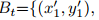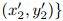。然后我们可以在全局分割图中找到一个匹配的连通区域P={p1,p2,...,pn}，其中P= (x,y)表示一个像素。用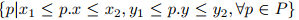表示重叠区域。 然后，点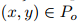的预测金字塔标签可以根据如下重新评分。

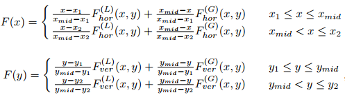 

这里的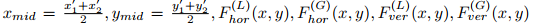分别是局部水平、全局水平、局部垂直和全局垂直金字塔标签预测。

&emsp;&emsp;接下来，对于任何提议区域，可以使用水平和垂直金字塔掩码标签(对应于z坐标)分别在三维空间中拟合两个平面。 所有四个平面与零平面的交线都是精细边界。 例如，为了细化对齐框的右边界，我们选择所有带细化的金字塔掩码预测F(x,y)像素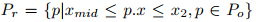 去拟合平面。如果我们用最小二乘法将平面构造为ax + by + c−z = 0，问题就等于最小化方程：

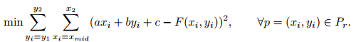 

&emsp;&emsp;其中a,b,c的参数可以通过下面的矩阵进行计算：

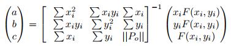 

&emsp;&emsp;其中||.||是集合大小。然后计算拟合平面与z = 0平面的交点线。假设边界框是轴对称的，我们计算精炼后的x坐标作为平均值:

 

同样，我们可以得到其他三个精炼边界。
##### (2).表格结构恢复(Table Structure Recovery)
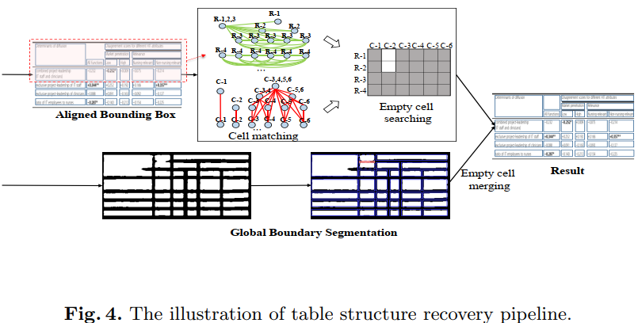 

&emsp;&emsp;表格结构恢复pipeline的目的是基于经过精细化对齐的边界框，获得最终的表格结构，包括单元格匹配、空单元格搜索和空单元格合并三个步骤，如上图所示。
###### a.单元格匹配
&emsp;&emsp;主要思想是，如果两个对齐的边界框在x/y坐标上有足够的重叠，我们将在垂直/水平方向上匹配它们。数学上，对于每两个对齐的边界框，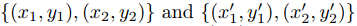 ，如果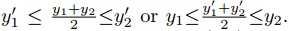 ，它们将水平连接。同样，如果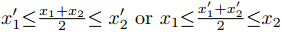 ，它们将垂直连接。
###### b.空单元格搜索
&emsp;&emsp;在获得检测到的对齐边界框之间的关系后，我们将它们视为图中的节点，连接的关系为边。同一行/列中的所有节点构成一个完整的子图。我们采用最大团搜索算法求图中所有最大团。

&emsp;&emsp;以行搜索过程为例，属于同一行的每个节点都在同一个团中。对于跨越多行的单元格，相应的节点将在不同的团中多次出现。在按平均y坐标对这些团进行排序之后，我们可以很容易地用其行索引标记每个节点。出现在多个团中的节点将使用多个行索引进行标记。我们可以很容易地找到那些空的位置，它们对应于空的单元格。
###### c.空单元格合并
&emsp;&emsp;到目前为止，我们已经获得了最小级别的空单元格(占用1行1列)。为了更可行地合并这些单元格，我们首先将具有对齐边界框形状的单个空单元格指定为单元格在同一行/列中的最大高度/宽度。利用全局分割任务学习到的视觉线索，我们可以根据分割结果设计简单的合并策略。对于每两个相邻的空单元，我们计算间隔区域中预测为1的像素比率，如上图中所示的红色区域。如果比率大于预设的阈值，我们将合并这两个单元格。我们可以看到，空白区域的视觉模糊性一直存在，分割任务很难被完美地学习。本方法直接采用全局分割提供的原始视觉线索，并使用像素投票获得更可靠的结果。
##### 6.实现细节
&emsp;&emsp;ResNet50+FPN(Feature Pyramid Netword)用于抽取特征。在LPMA中，模型以6种不同的比例[1/20，1/10，1/5，1/2，1，2]生成锚点用于捕获不同形状的边界框。RCNN的非最大值抑制(NMS) IoU阈值在测试阶段为0.1。

&emsp;&emsp;模型由SGD优化器训练，batchsize=4，动量=0.9，权重衰减=1×10−4。初始学习率为1 × 10−2，每隔5个epoch除以10。
