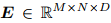

## SEMv2: Table Separation Line Detection Based on Instance Segmentation(Pattern Recognition 2024)
### 一．概述
作者称坚持基于分割和合并方法的原则，提出了一个精确的表格结构识别器，称为SEMv2 (SEM: Split, Embed and Merge)。与之前在“分割”阶段的工作不同，本文的目标是解决表格分隔线实例级的识别问题，并引入基于条件卷积的表格分隔线检测策略。具体来说，采用自顶向下的方式设计“split”，首先检测表格分隔线实例，然后动态预测每个实例的表格分隔线掩码。通过以逐行/逐列方式处理表格分隔线掩码，可以准确地获得最终的表格分隔线形状。

为了全面评估SEMv2，还提出了一个更具挑战性的表格结构识别数据集，称为iFLYTAB，它包含了各种场景(如照片、扫描文档等)中的多种样式表格。在公开可用的数据集(例如SciTSR、PubTabNet和iFLYTAB)上进行的大量实验证明了我们提出的方法的有效性。

代码：https://github.com/ZZR8066/SEMv2 

在这项工作中，遵循基于分割和合并的方法SEM，并引入了一个精确的表格结构识别器，称为SEMv2。与以往“分割”阶段的基于分割的方法不同，我们的目标是区分每个表格分隔线，并将表格分隔线检测作为实例分割任务。具体来说，将表格分隔线掩码生成(table separation line mask generation)解耦为一个掩码核预测(mask kernel prediction)和一个掩码特征学习(mask feature learning)，分别负责生成卷积核和需要卷积的特征map。通过按列/行方式处理表格行/列分隔线掩码，可以很容易地获得准确的表格行/列分隔线。此外，还提出了一种基于条件卷积的并行解码器来处理基本表格网格的合并，提高了解码速度。为了全面评估SEMv2，我们还引入了一个新的大规模TSR数据集iFLYTAB，该数据集包含照片、扫描文档等多个场景中的多个样式表。

本文主要贡献如下：

A.遵循基于分割和合并的方法，提出了SEMv2，它引入了一种新的实例分割框架，用于“分割”阶段的表格分隔线检测，使“分割”在各种场景下更加鲁棒。

B.开放iFLYTAB数据集，以推进相关研究。该数据集收集自各种场景，并经过人工精心标注。

C.基于提出的方法，在公开可用的数据集SciTSR, PubTabNet和iFLYTAB上实现了最先进的性能。
### 二．iFLYTAB 数据集

物理坐标：上图3注释的物理坐标包括表格单元格和文本行多边形。每个多边形被标记为{xlt, ylt, xrt, yrt, xrb, yrb, xlb, ylb}，代表四个顶点的坐标。

行/列信息： 行/列信息用于确定表中哪些文本行属于同一行/列。因此，还提供了一系列多边形，这些多边形包围属于同一行或列的文本行。如上图4所示，绿色多边形中的文本行表示它们位于表中的同一行/列。 

文中为表格单元格手工标注了735,781个多边形，为文本行手工标注了1,207,709个多边形，为行信息手工标注了207,972个多边形，为列信息手工标注了112,820个多边形。随机选择大约70%的表图像作为训练集，其余的数据样本用于测试。最后，iFLYTAB数据集有12104个训练样本和5187个测试样本。
### 三．方法概述

上图是整个方法的架构。SEMv2坚持其前身SEM的基于分割和合并的方法，主要由三个组件组成: 分割器、嵌入器和合并器。分割器将表格图像作为输入，并预测表格的精细网格结构。嵌入器提取每个基本表格网格的网格级特征表示。合并器预测哪些网格应该合并以恢复整个表格结构。 
#### 1.分割器
输入一个表格图像I∈RH×W×3，分割器的目标是用一组网格边界框B∈RM×N×4来预测表格网格结构，其中，M、N分别为表格网格结构占用的行数和列数。先前基于分割合并的方法应用语义分割来预测一个掩码中的所有表格行/列分隔线，然后将检测到的行/列分隔线的交集表示为网格边界框B。与之前的方法相比，我们将表格分隔线检测作为为实例分割任务，并努力预测每个表格行/列分隔线的单独掩码。

利用带FPN的ResNet-34生成一个包含4个特征图{P2、P3、P4、P5}的特征金字塔，其尺度分别为1/4、1/8、1/16、1/32。为了将来自FPN金字塔的所有级别的信息合并到一个单一的输出F中，提出了一个简单的融合操作，如下所示:

式中upnx表示n次双线性上采样运算。，这里的C特征通道(feature channels)的数量。

受CondInst的启发，将表格分隔线掩码生成(table separation line mask generation)解耦为特征分支(feature branch)和核分支(kernel branch)。特征分支包含两个1 × 1的卷积层，用于生成，它将与来自核分支的卷积核进行卷积以预测分隔线掩码。由于表格分隔线通常很细，并贯穿整个表格图像，因此有必要设计一个具有更宽感受野的核分支。为了解决这个问题，我们提出使用聚合模块(Gather module)来捕获水平/垂直视觉线索，如下图6所示。 

以Column Gather(列聚合)为例，首先对F进行三次重复下采样操作，每次操作由2×1最大池化层、3×3卷积层和relu激活函数的序列组成。 下采样的特征map将作为下面2个空间CNN模块的输入。第一个空间CNN模块将特征map分成H/32个切片，记为。具体来说，最上面的切片Std1被一个1 × 5的卷积层卷积，其输出的特征map通过逐元素相加与下一个切片Std2合并。这个过程是迭代完成的，因此信息可以有效地从最上层传播到最下层。第二个空间CNN模块以相反的方向传输信息。这样，输出特征图中的每个像素都可以利用两侧的结构信息来增强其特征表示能力。通过增强特征map的行均值得到。我们在Gcol之后添加一个线性变换来预测C维(C-dimensional)输出。θcol 将用作1 × 1卷积层的权重，以预测表格列分隔线掩码。我们还通过一个线性变换预测来检测表格列分隔线实例。损失函数表示为:

这里的Lbce是binary cross-entropy。为表格列分隔线起始点在x轴上的真值分布，如果表格列分隔线的起点位于第i列，则为1，否则为0。为了消除中表列分隔线起点的重复预测，如下图7(a)所示，我们执行如下非最大值抑制:1)将二值化为,2)对于中值为1的连续像素，将选择中得分最高的像素来表示表格的列分隔线实例。

根据检测到的表格分隔线实例，从θcol中选择卷积核与Fcol进行动态卷积，预测表格列分隔线掩码，这里的Ncol表示检测到的表格列分隔线实例的数量。上的损失函数定义如下:

这里的

为表格列分隔线掩码的真值。如果第i行、第j列、第k个通道中的像素属于第k个表格列线，则为1，否则为0。函数Lf实际上是sigmoid focal loss，σ是sigmoid函数。

考虑到表格列分隔线通常沿垂直方向展开，我们以逐行方式处理以获得最终的表格列分隔线。具体来说，如下图7(b)所示，给定一个表格列分隔线掩码，我们首先找到每一行的最大分数，用一组红点表示，如下图7(b)所示。将这些红点连接在一起可以得到表格列分隔线。网格边界框B可以由表行/列分隔线的交集产生。

、
#### 2.嵌入器
嵌入器的目的是提取网格级(grid-level)特征表示，这里的D是特征通道数量。如下图8所示，我们将从splitter分隔器中获得的图像级(image level)特征map F和划分良好的表格网格B作为输入，并应用RoIAlign为每个网格提取固定大小的R×R特征map。

然后对进行两次带ReLU函数的线性变换，得到d维输出:

其中W1和W2是学习的映射矩阵，b1和b2是偏差。目前，每个基本表格网格的特征仍然是相互独立的。因此，我们引入transformer来捕获对表格网格元素的长期依赖关系，并利用其输出作为最终的网格级(grid level)特征E。

#### 3.合并器
合并器将网格级(grid level)特征E作为输入，并产生一组合并后的map，可以表示为：。按照分隔器splitter的方法，如下图9所示，使用一个特征分支和一个核分支来联合预测M。每个分支只包含一个1 × 1的卷积层来生成特征map Ef∈RM×M×D以及核参数Ek∈RM×M×D。首先将特征map Ef与核参数eki,j进行卷积，用作为1 × 1卷积层的权值，预测合并后的map。损失函数如下：

其中，||.||1为L1范数，函数Lf定义于公式(4)中，表示第i行、第j列表格网格的合并map真值。如果的值等于1，则其表示对应的网格与相同的表格单元格相关联；否则为0。 最终的合并map mi,j可以通过对进行二值化得到。

### 四．label生成、参数设置、可视化结果与局限性
#### 1.label生成
分隔器label(Label of Splitter)：与以前的方法不同，我们将表格分隔线检测作为实例分割任务，并努力预测每个表格行/列分隔线的单独掩码(mask)。需要生成两个标签来指导分隔器的训练，即表格行/列分隔线掩码(mask)和表格行/列线实例。

根据SEM，表格分隔线掩码(mask)被设计为最大化分隔区域的大小，而不会交叉任何非跨越(不跨行/列)的单元格内容，如下图10所示。

用于区分不同的表格行/列分隔线。如下图11所示，我们将定义为表格行/列分隔线的起点在y轴/x轴上的投影。

合并器label(Label of Merger)：由于我们获得了分隔器的label，我们可以将表格划分为一系列基本的表格网格。根据原始表格结构注释提供的行/列信息，我们可以解析哪些表格网格属于同一个表格单元格。
#### 2.参数设置
ResNet-34作为backbone。特征通道C和D的数量分别设置为256和512。嵌入器中R×R RoIAlign的池化大小设置为3×3。Sigmoid focal loss 损失Lf的超参数α和γ分别设定为0.25和2。二值化操作的阈值被设置为0.5。 

模型的训练目标是最小化表格行/列分隔线分割损失()、表格行/列分隔线实例分类损失()和单元格合并损失()。优化目标函数如下:

我们采用ADADELTA算法进行优化，采用以下超参数:β1 = 0.9， β2 = 0.999， ε = 10−9。我们使用余弦退火方案设置学习率如下:

其中ηt为更新后的学习率。其中，ηmin为最小学习率，ηmax为初始学习率。Tcur和Tmax分别是当前迭代次数和最大迭代次数。设ηmin=10−6，ηmax=10−4。
#### 3.可视化结果
在本节中，我们将可视化分隔器和合并器的预测结果，以展示SEMv2如何恢复表格结构。在我们的工作中，我们将表格分隔线检测作为实例分割任务，如下图12(a-b)所示，其中不同的颜色表示SEMv2对不同表格分隔线实例的预测。通过找到表格行/列分隔线掩码(mask)的每列/行上的最大分数，我们可以得到表格行/列分隔线，如下图12(c-d)所示。如下图12(e)所示，表格网格结构可以通过相交表格行/列分隔线来产生。通过合并，可以恢复跨单元格结构，最后得到最终的表格结构，如下图12(f)中红色虚线框所示。

#### 4.局限性
A.处理旋转畸变而且图像质量差的图像时，模型的识别能力不足。

B.由于缺乏文本信息，SEMv2在预测具有多行文本的单元格结构方面表现不佳。

为了使SEMv2更具鲁棒性，将在未来的工作中研究一种高效的多模态表格结构识别方案。该方案将充分利用表格图像中的文本信息、视觉信息和布局信息来完成表格结构识别的预测。
