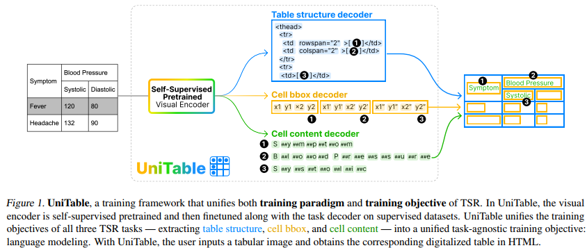
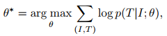

## UniTable: Towards a Unified Framework for Table Structure Recognition via Self-Supervised Pretraining(arxiv2024)
### 一.概述
提出了UniTable，这是一个将TSR的训练范式和训练目标统一起来的训练框架。其训练范式将像素级别的输入的简单性与来自不同未标注表格图像的自我监督预训练（SSP）的有效性和可扩展性相结合。此框架将所有三个TSR任务的训练目标——提取表结构、单元格内容和单元格边界框(bbox)——统一为一个与任务无关的训练目标:语言建模。大量定量和定性分析突出了UniTable在四个最大TSR数据集上的最先进（SOTA）性能。
### 二.框架

#### 1.贡献
##### (1)UniTable的训练范例将纯像素级输入的简单性与ssp(自监督预训练)从各种未标注的表格图像中获得的有效性和可扩展性相结合。
##### (2)UniTable将所有三个TSR任务(提取表结构、单元格内容和单元格bbox)的训练目标统一为一个与任务无关的统一训练目标:语言建模。
##### (3)广泛的定量和定性分析突出了UniTable在四个最大的TSR数据集上的SOTA性能。
#### 2.任务定义
TSR的目标是将输入的表格图像I转为序列T，此序列由表格结构S，表格单元格边框B以及表格单元格内容C组成。其中S=[s1,...,sm]是HTML标签序列，B=[b1,...,bn]是边框序列（b=(xmin,ymin,xmax,ymax)），C=[c1,...,cn]按阅读顺序包含每个单元格中的内容。注意B和C的序列长度是一样的，S序列的长度比他俩长，因为其包括空单元格和非空单元格。由于每个单元格i由单个bbox定义，因此ci可以有单个或多个文本行。
#### 3.模型架构
TSR模型有2个模块：visual encoder（抽取特征）与task decoder（预测序列）。为了避免单独为表域设计单独的体系结构，我们的目标是保留线性投影Transformer，并通过SSP(自监督预训练)减轻性能差距。以自监督的方式预训练视觉编码器显着帮助模型学习如何解析表结构，并获得比具有卷积的架构更高的性能。
### 三.TSR模型预训练和微调的统一框架
我们通过以自监督的方式预测masked表格图像来预训练视觉编码器visual encoder，并使用监督数据集对每个任务的任务解码器task decoder和视觉编码器visual encoder进行微调。如图1。
#### 1.视觉编码器visual encoder的自监督预训练
在预训练之前，每个表格图像I被标记为离散的视觉tokens。在预训练过程中，将I划分为多个patch，并对一部分图像patch进行mask掩码，以便视觉编码器预测选择哪个视觉token来替换被mask掩码的区域。
##### (1).图像tokens
在隐空间Z∈RK×D中定义一个视觉码本，表示视觉tokens zi∈RD的K个条目。视觉码本的训练方式是，一旦输入图像嵌入到图像网格中，嵌入图像网格上的每个像素都可以用码本中的视觉token替换。解码这个修改后的图像网格将重建输入图像。我们使用矢量量化变分自编码器AutoEncoder(VQ-VAE)来训练视觉码本。具体来说，表格图像I在经过编码器qϕ(z|I)后被标记为离散tokens z，解码器pψ(I|z)接受这些离散tokens并重建原始图像。我们在1M和2M的表格图像上训练了VQ-VAE，其中1M的K = 8192, 2M的K = 16384。
##### (2).图像patches
给定表格图像I∈RH×W ×C，线性投影将I划分为一系列平坦的2D patch Ip∈RNx (P2·C)，其中C为通道数，(P, P)为每个图像patch的大小，N = HW/P2为patch数。它是由一个核P × P，步长P的卷积实现。设P = 16, I∈R448×448×3，则图像patch的序列长度为28 × 28。大约40%的序列被替换为一个被masked屏蔽的token，预训练的目标是在给定unmasked未被屏蔽区域的情况下，最大化被masked屏蔽区域的视觉tokens的对数似然。图像标记器的码本提供了真实的视觉tokens(真值groundtruth)。
#### 2.统一微调框架
我们的目标是提供一个统一的任务无关的训练框架，其中我们的模型的输入是原始像素形式的图像，输出是标记序列形式的文本。这个设置也可以推广到PDF输入模式，因为我们可以简单地截取PDF的屏幕截图。该框架还使我们能够利用在未标注的表格图像上预训练的视觉编码器。
##### (1).表格结构S
对于非跨单元格的单元格，使用\<td>\</td>和\<td>[]\</td>表示空和非空单元格。对于跨单元格的单元格，<td表示开始，>\</td>和>[]\</td>表示空和非空单元格。对于跨单元格的特定token是rowspan=“n”以及colspan=“n”。使用n∈[2,19]，因为它涵盖了实践中的大多数表。除了数据单元格标记之外，词汇表还包含以下定义表的标记:\<thead>、\<tbody>、\<tr>及其相应的结束标记。
##### (2).表格单元格边框B
我们将坐标离散成0和图像大小之间的整数。图像的两个方向共享相同的词汇。由于我们需要预测表格图像中的所有边框bbox，因此每个量化的bbox按照阅读顺序连接在一起:从左到右，从上到下。这个公式完成了所有bbox的量化和序列化成一个离散tokens序列。在推理时，我们将预测序列反序列化为每组4个tokens。
##### (3).表格单元格内容C
在预测完所有bbox坐标后，我们只需要对每个bbox内的图像区域进行光学字符识别(OCR)。注意，每个单元格由单个bbox定义，因此单元格内容可以有单行或多行文本。在训练阶段，模型在单行和多行混合数据集上进行训练。在推理时，我们同时解析所有文本，因为每个单元格bbox都是独立的。最后，我们将单元格内容插入到非空单元格\<td>[]\</td>或>[]\</td>中，因为在S和B中已经保留了读取顺序。我们使用字符级粒度的WordPiece标记器，因为OCR要求模型读取而不是理解语义，这将总词汇表大小减少到小于6k。

到目前为止，我们已经通过统一的图像到文本框架将表格图像完全数字化为HTML。注意，所有视觉编码器都是从SSP初始化的。
##### (4).训练目标
由于所有的任务输出都被表述成一系列离散的tokens，因此目标函数只是以像素输入和先前tokens为条件的tokens的最大似然。表示第i步预测的概率p(ti|I,t1:I−1;θ)，我们使用以下公式直接最大化正确的结构预测:

θ是模型参数。

