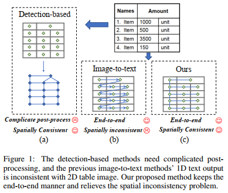
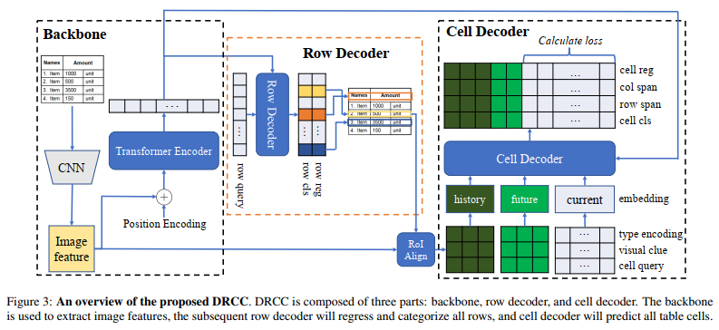

## Divide Rows and Conquer Cells: Towards Structure Recognition for Large Tables(IJCAI-23)

### 一.前述

        作者提出目前基于transformer这种表格识别模型有缺点，因为表总是以各种各样的形状和大小出现。随着预测文本长度的增加，
    自回归模型通常会出现误差积累问题，这导致大型表的性能不理想。

        基于以上这点，作者提出一种新的image-to-text模型以缓解误差积累问题，以提升识别性能。
    作者声称该模型的核心是一个级联的两步解码器架构，前一个解码器以非自回归的方式预测HTML表格行标签，
    后一个以半自回归的方式预测每一行的HTML表格单元格标签。

        作者声称与存在的自回归模型相比，有两大优势：一是它生成一个HTML标签序列，通过垂直和水平两步“扫描”，
    这更适合图像数据固有的二维结构；二是对于大型表(长序列预测)，它的性能要好得多，因为它减轻了自回归模型特有的误差积累问题。

### 二.概述

        作者是将所提出的方法称为DRCC（Divides Rows and Conquers Cells），该方法首先利用一个行解码器row deocder去检测表格的行。
    行解码器预测由上边界和下边界确定的HTML行标签类别和行位置。然后，对于行解码器检测到的每一行，应用单元格解码器cell decoder来预测
    当前行的所有单元格。单元格的预测包括HTML单元格标签类别和由边界框确定的单元格位置。前面的行解码器提取的行特征作为引导信息输入到之后
    的单元格解码器。对于单元格预测，作者提出了一种新的解码方案，该方案利用先前预测的行和单元格的指导信息半自回归地预测当前行的单元格。
    作者认为其提出的方法能够显著减少误差累积情况。文档中举例説，对于一个20 × 25大小的表，以前的图像到文本image-to-text方法
    必须一个一个地自回归预测500个单元格，任何早期的错误都可能对后来的预测造成很大的影响。相比之下，本文方法绕过了自回归的方式，
    一开始只需要预测20行，然后为每一行预测25个单元格。
    
    作者声称在公开的三个数据集的实验上具有很强的竞争力，没公开代码。

    总之，作者在文中説本论文主要贡献在以下几点：

    1.提出了一种新的两步transformer架构，用于图像到文本（image-to-text）的表格结构识别（TSR）任务。
    它减轻了现有自回归方法特有的误差积累问题。

    2.设计了一种半自回归（semi-autoregressive）的行到单元格（row-to-cell）递进解码方案，
    消除了二维图像到一维文本翻译固有的空间不一致问题。

    3.在三个公共基准（PubTabNet，SciTSR,SynthTabNet）上的表现优于之前的工作。

### 三.方法概述

        图中，输入一个表格图像，利用cnn backone抽取图像特征，序列化后的特征作为input的token embedding，输入transformer encoder编码器中。
    方法的核心部分是一个级联两步解码器结构。Transformer行解码器row decoder以可学习的query embedding序列作为输入，并通过多头交叉注意力与Transformer
    编码器输出进行交互。在输出端，行解码器row decoder非自回归地预测整个表格的行，包括HTML行标签类别和行的位置。然后，通过按从上到下的顺序遍历所有预测的行，
    应用Transformer单元格解码器cell decoder来预测每一行的HTML单元格分类和回归。单元格解码器cell decoder采用了一种新颖的半自回归解码方案。也就是说，在微观层面上，
    单元格解码器非自回归地预测当前行对应的所有单元格，而在宏观层面上，如果将属于一行的单元格作为一个单元格集，则单元格解码器按照自上而下的顺序自回归地预测另一个单元格集。
        在处理单元格预测时，添加辅助视觉特征以更好地捕捉视觉上下文。辅助视觉特征是所有其他行的特征和来自于backbone的预测单元格特征，这个特征是通过将1 × 1 
    ROIAlign应用在CNN的输出feature maps上计算得来的。
        在推理时，行解码器row decoder得到的所有行的回归位置，通过比较它们的上界/下界，应用简单的重排策略对行进行排序。对单元格，由于利用半自回归策略，
    所有单元格都可以分组到一个特定的行中。一行中的单元格可以通过它们的边界框轻松排序。结合所有预测结果，重构表的最终逻辑结构。

#### 1.特征抽取器(CNN Feature Extractor)

        作者利用删除最后一个分类层的ResNet作为cnn backbone来对输入的表格图像进行特征抽取。所有图像被调整为固定尺寸H×W×3，接着对此图像进行下采样32次，
     以获得更丰富的上下文信息。最后图像被映射成尺寸为H/32 × W/32 ×C的feature maps。

#### 2.Transformer 编码器(Transformer Encoder)

        作者利用传统的transformer encoder对1中的输出结果（shape为H/32 × W/32 ×C）进行编码，这里的位置利用VIT模型进行编码，以引入图像空间信息，
     最终的输出shape跟输入一样。
    
#### 3.Transformer 行解码器(Transformer Row Decoder)

        这部分作者利用堆叠的DETR decoder解码器层，每层由一个多头交叉注意力(MHCA)模块和一个FFN层组成。这个解码器后面又跟2个独立的3层的FFN模块，
     它的作用是将解码器的输出映射成2组预测结果：(i)行标签类别预测（shap为Lrow × 3）；(ii)行位置预测（shape为Lrow × 2）。因为是采用非自回归的方法预测，
     所有行的位置与真实行位置不匹配，所以需要根据预测的行位置进行重新排序。
     这里注意行的解码器的输入部分还有一个可学习的row query，其shape是Lrow × C（Lrow是预定义好的表格的最大行数）。

#### 4.Transformer 单元格解码器(Transformer Cell Decoder)
 
        这部分的cell decoder也是利用DETR decoder解码器层，后面跟着4个3层结构的FFN模块。它的作用是将解码器的输出映射成4组预测结果：
    (i)单元格标签类别预测（shap为Lcell × Ccell）；(ii)单元格跨行属性预测（shape为Lcell × 10）；（iii）单元格跨列属性预测（shape为Lcell × 10）；
    （iiii）单元格边框预测（shape为Lcell × 4）。这里的Lcell是预定义的表格的最大单元格数；Ccell根据不同数据集有不同的定义；跨行跨列的预测是离散值，范围是1到10；单元格边框位置是4维向量。
    
    输入部分来自三个不同的embedding的和：(i)type encoding；(ii)visual clue；(iii)cell query。shape都是Lcell×C。
    
##### (1).半自回归解码(Semi-autoregressive Decoding)
        作者将三个输入的embedding划分为三个部分：(i)history section；(ii)future section；
    (iii)current section。current section充当query，以非自回归地预测正在迭代的当前行的单元格。
    为了提升模型性能，利用了其它行的上下文信息，加入了history section和future section。history section中的
    embedding对应于已经迭代过的行和单元格的视觉特征。future section中的embedding对应于尚未迭代的行的特性。
    
        随着行迭代的进行，输入序列的history section逐渐扩展。考虑到单行单元格预测的非自回归方式和逐行单元格预测的自回归特性，
    作者将这种混合序列预测方案称为半自回归预测。

##### (2).类型编码(Type Encoding)
        类型编码序列中的每个token都是一个标记，表示当前token属于三个部分（history,future,current）中的哪个部分。
    同时指出了同一位置的视觉线索visual clue token是行特征还是单元格特征。因此，每个token都属于以下四种情况:
    (history, row), (history, cell), (future, row), (current,row)。 由于当前和未来行的单元格特征仍然不可用，
    所以这里没有(current, cell) 和(future, cell)这两项。实际上，类型编码是一个可学习的embedding层，该层将每个4维的one-hot编码映射到c维特征向量上。
    
##### (3).视觉线索(Visual Clue)
        视觉线索序列中的token是行特征或者是单元格特征。利用CNN backbone输出的feature maps，行特征是由行解码器row decoder预测的行位置确定的行区域
    1 × 1 ROIAlign结果。类似地，单元格特征是由单元格解码器cell decoder预测的边界框确定的单元区域ROIAlign结果。在history section部分，
    视觉线索的tokens包括与已迭代的所有行相对应的所有行特征和单元格特征。在future section部分，每个视觉线索token都是对应行的行特征。在current section部分，
    所有的视觉线索tokens都是正在迭代的当前行特征。
        注意，总序列长度Lcell是固定的，在行迭代期间，history section部分的长度增加，而其他两个部分（future section and current sectioin）的长度在减少。
        
##### (4).单元格查询(Cell Query)
        作者认为仅使用type encoding和visual clue序列，发现current section的tokens是相同的，不能查询不同的单元格。所以增加了
    cell query embedding，它是一种可学习的embedding，作为单元格cell检测的对象查询。
    
#### 5.损失函数(Loss Function)
    作者将模型的训练的损失作为多任务loss function。
    (1).对于行解码器row decoder与单元格解码器cell decoder中，对所有标签的分类(tag classification)使用了负对数似然损失negative log-likelihood。
    (2).对于行与单元格的位置，使用了L1损失和广义IoU (GIOU)损失的线性组合（与DETR中的位置损失相同，由于行解码器中只回归每一行的上界和下界，所以在计算损失函数时，
    手动添加一个0的左界和1的右界(即整合成有4个位置信息)，这样行和单元格的定位都可以与GIOU损失统一）。
    注意，对于单元格解码器cell decoder，损失仅根据current section中的输出token计算。因为其他两个部分仅用于为current section提供丰富的上下文信息。
    
#### 6.参数设置(Parameter Settings)
        训练和测试的所有图像的分辨率设置为H = W = 960（960×960），最终提取的CNN特征图分辨率为30 × 30。所有网络模块的特征维度设置为512。
    Transformer encoder的序列长度为900，与CNN feature map的大小一致。行解码器row decoder序列长度Lrow设置为50，单元格解码器cell decoder
    序列长度Lcell设置为500。
        作者提出在未来，将利用文本识别技术来整合更多的文本和视觉信息，用于多模态表格结构识别。

