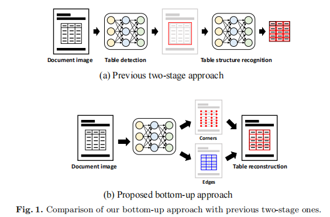
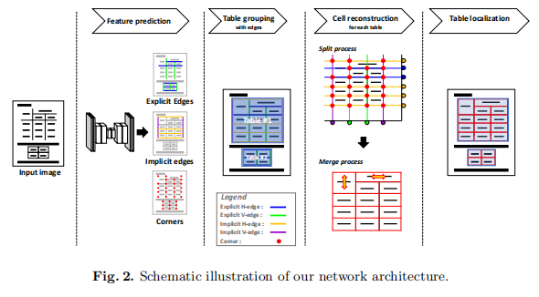
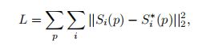
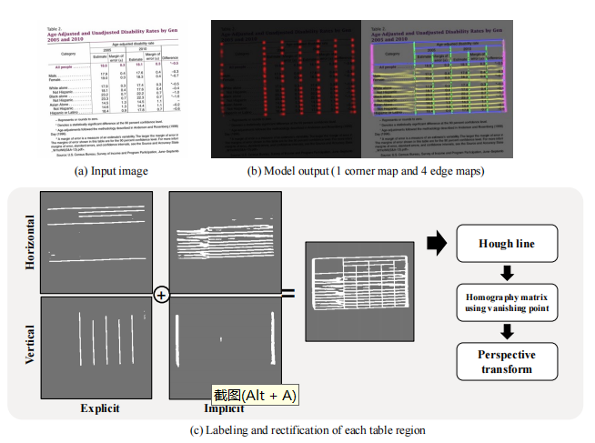
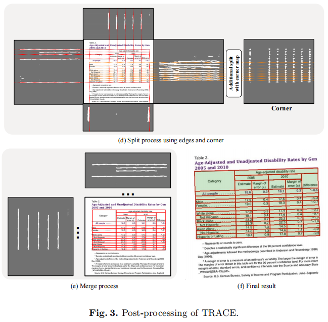
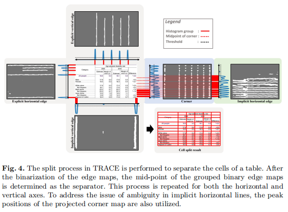

## TRACE: Table Reconstruction Aligned to Corner and Edges(ICDAR 2023)
### 一.前述

        作者认为表格的两阶段识别方法通常会导致模块之间的错误传播，并会导致训练和推理效率低下。作者分析了表格，认为每个单元格都是由相连的边组成的边界。
        基于以上这点，作者提出了一种自底向上重构表的新方法。该方法将单元格边界从低级特征(如角和边)中分离出来，并通过组合单元格来定位表的位置。作者认
    为该方法比两阶段更易训练，更少的计算量。在ICDAR2013表格数据集上以及Wired Table in the Wild(WTW)数据集上达到了state-of-the-art。

### 二.概述

        如上图所示，是两阶段识别方法与本文提出的方法的区别。作者提出一种叫做TRACE(Table Recostruction Aligned to Corners and Edges)的
    表格重建方法，该方法是一种端到端方法，它的目的是找到单元格的边和角，然后自底向上的重建表格。作者利用单个分割模型去预测低级特征(角和边)，而不是单
    元格或内容的边界框。然后利用简单的后处理去重构table。
    使用单个模型可以提高训练和推理的时效，作者主要是通过将边分类为显式的线条和隐式的线条。本文主要的贡献如下：
    1.提出利用单一的端到端模型对表格进行重构。
    2.利用单元格的角和边，以自底向上的方式去重构表格。
    3.将边分类为显式和隐式线条。

### 三.方法概述

        本文的方法使用深度学习模型去预测形成单元格的角和边的segmentation maps。模型输出五个segmentation maps,第一个通道用于检测单元格的角，
     另外四个通道用于检测单元格框的水平和垂直边。文中将边定义为单元格之间的分隔线，并且预测四种类型的边，因为每个边可以代表一条显式或隐式的线，不
     管是垂直的还是水平的。通过聚合边的maps的二值化过程，通过连通组件标记得到一个候选表区域。.在单元格重建步骤中，作者通过将每个表候选区域的水平
     边投影到y平面，将垂直边投影到x平面来计算分离的位置。这里，角也用于寻找分隔线。如果单元格边界框之间没有边，则会合并跨单元格。最后，通过不同的
     单元格的组合来定位表中的区域。如上图所示，四种类型的边用不同的颜色表示；显式的水平边为蓝色，显式的垂直边为绿色，隐式的水平边为黄色，隐式的垂
     直边为紫色。

#### 1.角和边的预测模型(Corner and Edges Prediction Model)

        作者利用一个基于CNN的分隔模型进行训练，去获取corner和edge的信息。作者采用ResNet-50作为特征抽取的backbone，整个架构类似U-Net模型，此架构能够聚合低阶和高阶特征。最后的输出有五个通道：corner map；显示的水平/垂直edge map；隐示的水平/垂直edge map。
    为了生成真实标签，这里需要单元格边界框和每条边的属性。对于corner map，本文渲染一个以单元格的每个角点为中心的固定大小的高斯热图。对于edge map，在单元格的每条边都绘制一个固定厚度的线段。这里，水平和垂直边的真实值(ground truth)是在不同的通道上产生的。此外，边的属性表示线段是否可见。如果可见，使用显式边缘通道，如果不可见，则使用隐式边缘通道。
文中使用MSE loss损失函数，如下：

这里，Si(p)表示第i个segmentation map的真值，Si∗(p)表示像素p处的预测的segmentation map。
    
    作者认为本文方法有别于传统的检测方法，主要有两点：
    (1).检测低阶视觉特征（有效处理空的单元格），而不是高级语义元素（单元格边界框或内容边界框）。
    (2).在生成分隔符时，能够识别显式和隐式边。（可见线和不可见线之间的区别有助于从表格图像中找到分隔符。）
    在获得底阶特征后，通过后处理中的一系列启发式技术实现表的重建。

#### 2.重构后处理

识别和后处理步骤如下：

(1).模型预测输出corner和edge的maps

(2).在图像修正步骤中，对推断的segmentation maps进行二值化，然后使用所有二值化edge maps的组合来近似每个表的位置。霍夫线变换用于检测二值化边中的线。通过使水平线和垂直线相垂直来修正表格图像。大多数扫描的文档图像不需要进行此修正。

(3).利用一种分隔合并策略重构表格，如下图。

它首先将显式水平边映射投影到y平面上，并将显式垂直边映射投影到x平面上。在平面上投影边组的中点被认为是每条分离线的位置。
在隐式水平线的情况下，投影可能不能清楚地分开它们。当表中的一行包含空单元格时，由于内容边界的歧义，隐式的水平线可能会被合并。
为了解决这个问题，我们使用了corner map。对corner map应用相同的二值化和投影过程。如果投影的线组较厚，有两个以上的角峰点，
则根据角点组的峰点计算最终的分隔点，而不是线组的中点。

(4).分隔后的步骤便是单元格合并。这个过程利用显式和隐式的edge maps。基本规则是，如果两个相邻的单元格在其分隔符的中点缺乏binary edge map，
则删除分隔符，并合并单元格。

(5).最后，通过计算所有被检测到的单元格的左上角、右上角、左下角和右下角的坐标来确定表位置的四条边。

作者提出，在未来计划利用弱监督技术去训练多样化数据。