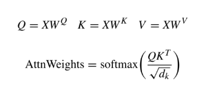
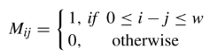
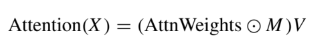
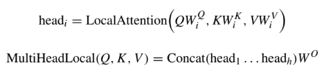
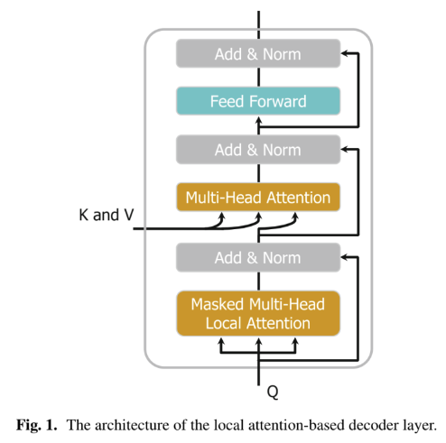
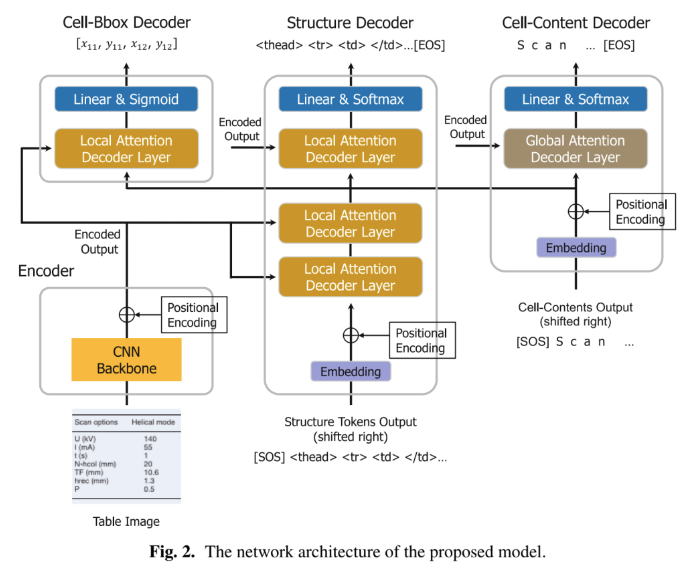
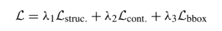

## An End-to-End Local Attention Based Model for Table Recognition(ICDAR 2023)

### 一.前述
作者认为基于Transformer的表格识别模型很难处理大表格的识别，原因是受限于它的全局注意力global attention机制。

基于以上，作者提出了一种局部注意力local attention机制。作者也提出了一种端到端的基于局部注意力模型，去识别表格结构以及表格单元格内容。

所提出的方法主要由四个组成部分：

1)1个用于特征抽取的编码器；

2)3个解码器用于表格识别的3个子任务。

本方法在数据集PubTabNet与FinTabNet上取得了state-of-the-art。

### 二.概述
本文的主要贡献如下：

1.提出在编码器decoder中使用局部注意力local attention机制。

2.提出端到端的识别模型，便于训练和推理。

3.实验证明了局部注意力机制在表格识别中的有效性。

4.提出的方法在基准数据集上达到了state-of-the-art。

### 三.方法概述
#### 1.局部注意力机制(Local Attention Mechanism)
一句话，局部注意力是利用窗口大小来使解码器更注重那些重要的tokens上。

(1).局部注意力的公式

以上公式是经典的transformer中的attention权重的计算。

为了实现局部注意力，文中定义了一个mask矩阵M，如上式，这M表示查询Q应该关注的键K的位置。当mask上的元素值1，表示注意力是活动的，如果是0表示不关注。

式中的w表示局部注意力窗口的大小。

上式是局部注意力最终的输出计算，括号内是逐元素相乘。

(2).mask多头注意力(Masked Multi-head Local Attention)

mask多头注意力通过不同的线性变换，对查询q，键k，值v映射h次，获得h个不同的表示(Q,K,V)。然后并行执行局部注意力，获得h个head输出值。

最后h个head的输出值串联起来，再经过一层线性变换，最终的公式如上所示。

(3).基于局部注意力编码层(Local Attention-Based Decoder Layer)

下图一目了然，无需再解析。

#### 2.端到端模型

上图中的端到端模型主要由4个部分组成：基于CNN的特征抽取编码器；三个解码器，用于3个表格识别的子任务（表格结构识别、表格单元格检测以及表格单元格内容识别）。大体流程是:

A.输入一张表格图像

B.特征抽取编码成序列形式

C.序列特征输入到结构解码器structure decoder预测表格结构的token序列

D.当structure decoder产生表格单元格的token时，cell-bbox decoder和cell-content decoder就触动了，其使用structure decoder的隐状态来预测边框坐标以及单元格内容。

E.最后，每个单元格内容，被插入到结构token序列的相应单元格中，输出最终的表格表示。

(1).编码器(Encoder)

利用基于ResNet-31 backbone（对于每个残差块使用Multi-Aspect Global Context Attention）的网络模型抽取输入图像的特征

（输入编码器前图像要resize到520*520），抽取的特征再经过一个位置编码层。最终输出固定大小的序列特征。输出的feature map的维度是65*65

(2).结构解码器(Structure Decoder)

这部分由三层局部注意力解码器层后再跟一个线性层和一个softmax组成。文中説这里的局部注意力机制有助于结构解码器在预测一个结构token时更加注意其局部重要特征

（即更加注重邻居的tokens）。从图中可以看出三层的local attention的K和V向量都是来自编码层的输出。在训练时，输入的右移序列会经过embedding层和position层，

这里的输出作为Q向量，和前面的K,V一起进入局部注意力机制。推理时这里的输入是structure decoder的输出进行拼接。最后再经过线性层和softmax层，生成表格结构的token。

(3).单元格边框解码器(Cell-Bbox Decoder)

这部分由一个局部注意力解码层，一个线性层和一个sigmoid层组成。这部分会在structure decoder预测新的单元格时会被触发，它的输入一部分是由

structure decoder的隐状态作为Q向量，编码器的输出作为K和V向量，一起进入一个局部注意力机制，后跟一个线性层，经过sigmoid预测输出最终的4个单元格坐标。

(4).单元格内容解码器(Cell-Content Decoder)

这部分其实就是一个文本识别器，它由一个embedding层，一个position层，一个全局注意力层global attention-based decoder，后跟一个线性层和

softmax层组成（这里没有使用局部注意力，作者説是因为单元格里的内容远少于表格结构，所以利用全局注意力更容易学到重要特征）。当structure decoder

预测输出一个新的单元格时，cell-content decoder就触发了。它的输入一部分来自编码器的输出（作为K和V向量），一部分是右移的单元格里的内容序列

（经过embedding层和position位置编码，再加上相应对的单元格structure decoder的隐状态信息。）作为Q向量，最后经过一个线性层和一个softmax层，

预测输出单元格的文本内容。

(5).损失函数

上式中的ℒstruc. and ℒcont.是利用交叉熵cross-entropy分别实现的table结构识别损失和单元格内容预测损失，ℒbbox是利用L1 loss实现的单元格边框预测的损失。

𝜆1、𝜆2和𝜆3为权值超参数。

(6).相关参数设置

structure decoder和cell-bbox decoder所有的局部注意力local attention decoder层都是设置为8头,输入特征大小为512，前馈网络大小为2048。

所有的局部注意力机制的窗口大小window size设置为300。在解码过程中，structure token和cell token最大的序列长度分别是600和150。
