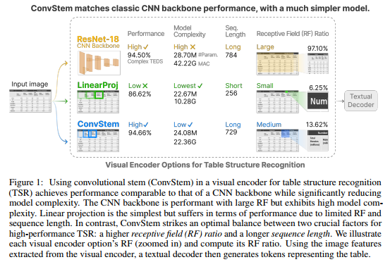
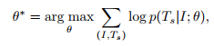
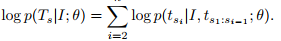

## High-Performance Transformers for Table Structure Recognition Need Early Convolutions(NeurIPS workshop 2023)

### 一.前述
作者认为在表格结构识别中，视觉编码器（CNN）用于抽取图像特征，而文本解码器（Transformer）用于生成表格的token。作者认为这种混合的CNN-Transformer的模型架构中，视觉编码占了将近一半的参数，这会显著减少训练和推理的速度，阻碍自监督学习的潜力。

基于以上这点，作者设计了一种轻量极的视觉编码器（作者认为没有牺牲模型的表达能力）。作者发现可以用一个更简单的模型convolutional stem来匹配经典的CNN backbone性能。Convolutional stem在高性能表格结构识别中的两个关键因素之间达到了最佳平衡，即：较高的感受野(RF)比率和较长的序列长度。代码：https://github.com/poloclub/tsr-convstem。

### 二.概述

本文的主要贡献如下：

1.作者发现可以用一个更简单的模型convolutional stem能够匹配经典的CNN backbone性能。作者用开始用ViT的线性映射替换CNN backbone，但发现精度有损失。原因是restnet18有17个卷积层，而线性映射只有一层。

2.Convolutional stem在高性能表格结构识别中的两个关键因素之间达到了最佳平衡，即：较高的感受野(RF)比率和较长的序列长度。作者认为，线性映射的性能受到限制，因为RF比与序列长度呈负相关，即RF比的增加意味着patch尺寸越大，导致序列越短。Convolutional stem独立地平衡这两个因素，在保持序列长度的同时增加RF比。另外，与典型的CNN backbone相比，Convolutional stem的卷积层更少，显著降低了模型的复杂性。

3.作者开源了自己的研究。

### 三.视觉编码器（visual encoder）对表格结构识别的影响
#### 1.视觉编码器（visual encoder）的比较
这里将比较三种类型的视觉编码器：CNN backbone，linear projection以及convolutional stem。
##### (1).CNN backbone
作者使用了Torchvision库中的模型，并评估了ResNet-18、ResNet-34和ResNet-50。去除倒数第二个池化层和最后一个线性层，输出是最后一个卷积层的feature map。所有ResNet-18、ResNet-34和ResNet-50都将输入图像下采样16，因此transformer的输入序列长度为N = HW/162。ResNet-18、ResNet-34和ResNet-50的受野分别为435、899和427。
##### (2).Linear projection
线性投影层将图像I∈RH×W×C重塑为一系列平坦的2D patches Ip∈RNx (P2·C)，其中C为通道数，(P, P)为每个图像patch的大小，N = HW/P2为patch数，这也是文本解码器transformer的输入序列长度。它是通过对输入图像进行步长P、核P × P卷积来实现的。线性投影的感受野与patch大小P相同。这里将“linearproject -28”表示为P = 28的线性投影层。
##### (3).Convolutional stem
为了实现卷积系统，我们使用了一个步幅为2、核为3 × 3卷积的堆栈，然后在最后使用一个步幅为1、核为1 × 1卷积来匹配transformer的d维特征。通过改变核大小、卷积层数和输入图像大小来调整convolutional steam的感受野。这里“ConvStem”作为视觉编码器，它使用convolutional stem作为CNN骨干。
#### 2.文本解码器
    利用HTML标签去表示表格结构，HTML结构有32个标记，包括(1)起始标签< head>、<tbody>、<tr>、<td>及其对应的结束标签；(2)跨单元格标签<td， >， rowspan和colspan的最大值设为10；(3)特殊标签<sos>、<eos>、<pad>和<unk>。
    文本解码器是由transformer编码器和解码器层组成的堆栈，主要由多头注意层和前馈层组成。在训练期间，应用了teacher forcing，使transformer解码器接收到真实token。在推理时，采用贪婪解码，使用先前的预测作为transformer解码器的输入。
#### 3.损失函数
我们基于语言建模任务制定训练损失，因为HTML表标签以自回归的方式预测。表示第I步预测的概率p(tsi|I, ts1:si−1;θ)，这里直接使用以下公式最大化正确的结构预测：

上式中其中θ是我们模型的参数，I是表格图像，Ts是正确的结构序列。

根据语言建模，我们应用链式法则将长度为n的序列上的联合概率建模为：

上式中起始token ts1在训练和测试中都是一个固定的token <sos>。

### 四.相关设置
#### 1.架构。
文本解码器有四层transformer解码器。对于使用CNN backbone的视觉编码器，采用两层transformer编码器。对于所有其他视觉编码器，我们使用相同的transformer编码器和解码器层。所有transformer层的输入特征尺寸为d = 512，前馈网络为1024个，8个注意力头。HTML序列解码器的最大长度设置为512。
#### 2.训练。
所有模型都使用AdamW优化器进行训练，因为transformer对优化器的选择很敏感。采用步进学习率调度器，从12个epoch的初始学习率0.0001开始，然后在随后的12个epoch中减少10倍。为了防止过拟合，设置dopout为0.5。输入图像默认调整为448 × 448，并使用均值和标准差进行归一化。
#### 3.数据和评估。
数据为PubTabNet，评估指标是TEDS（tree-edit-distance-based）。

