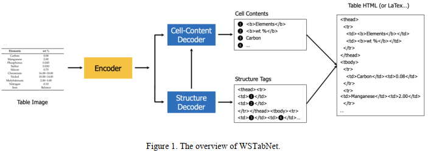
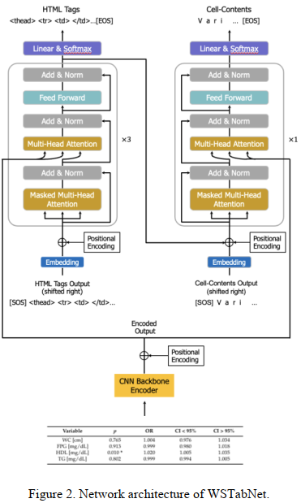
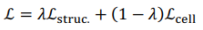

## Rethinking Image-based Table Recognition Using Weakly Supervised Methods(ICPRAM 2023)
###一.概述
作者认为现今大多数表格识别方法的训练数据需要大量的表格图像标注，单元格和文本框的图像标注，但是这些数据很难获取，标注昂贵。为此作者提出一种弱监督表格识别方法WSTabNet，该方法仅依赖HTML或LaTeX的表格标注方式。提出的方法主要由三部分组成：一个特征编码器，一个表格结构生成的结构解码器，一个预测每个单元格内容的单元格解码器，这是一种端到端训练的模型。文本还创建并发布了WikiTableSet数据集，共400万张英文表格图像、59万张日文表格图像和64万张法文表格图像。试验在数据集WikiTableSet，FinTabNet以及PubTabNet上取得了不错效果。
作者认为本文主要贡献有：

1.提出一种新的端到端弱监督学习模型WSTabNet，用于图像的表格识别。

2.提出新的数据集WikiTableSet。

3.效果不错。

### 二.方法概述

WSTabNet主要由三个部分组成，如上图所示:

1.用于特征提取的编码器。

2.用于识别表格结构的结构解码器。

3.用于预测表中每个单元格的内容的单元格解码器。

    编码器从输入表格图像中提取特征，并将其编码为特征序列。特征序列传递到结构解码器中，以预测表格结构的HTML token序列。当结构解码器生成表示新单元格(' <td> '或' <td…> ')的HTML结构token时，对应于该单元格的结构解码器的隐状态输出被传递到单元格解码器中，以预测该单元格的文本内容。最后，将单元格的文本内容插入相应的HTML结构token中。

### 三.方法组件

#### 1.编码器(Encoder)
利用ResNet-31（每个残差块后接一个Multi-Aspect Global Context Attention，即GCAttention）作为CNN-backbone，后再接一个位置编码。所有表格图像在输入模型前，都会resize到480*480。

#### 2.结构解码器(Structure Decoder)
网络：3层的Transformer Decoder layer + fc +softmax，8个注意力头，输入特征size是512，前馈网络的输入特征size是2048。最大序列长度是500。

输入：编码器Encoder的输出+query。

输出：为表格结构的html tag。

qkv说明：

编码器Encoder的输出作为key和value，query分训练和infer两种情况：

训练：gt的html tag 作为query。

infer：前几步pred的html tag作为query。

#### 3.单元格解码器(Cell Decoder)
网络：一层Transformer Decoder layer + fc +softmax，8个注意力头，输入特征size是512，前馈网络的输入特征size是2048。最大序列长度是150。

输入：编码器Encoder的输出+Table Structure Decoder输出+query。

输出：为表格结构的html tag。

qkv说明：

编码器Encoder的输出作为key和value，query分训练和infer两种情况：

训练：cell内的文本字符gt作为query。

infer：前几步pred的文本字符作为query。

    说明：只有碰html tag为 <td></td> 和 <td 时才会进入 Cell Decoder，解码结果直接插入到html字符串中形成最后的表格结果。

#### 4.损失函数

这里的Lstruc和Lcell，分别是生成结构token和预测单元token的交叉熵损失。𝜆 ∈[0,1]是权重超参。

