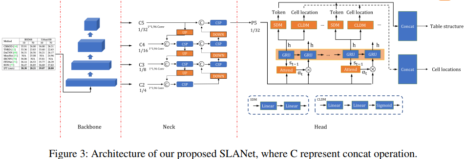
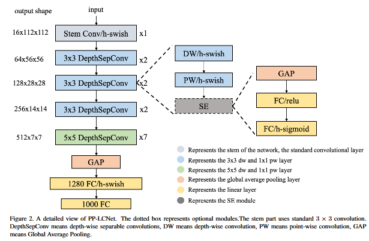
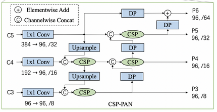
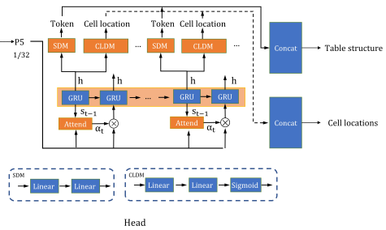

## PP-StructureV2: A Stronger Document Analysis System(arxiv 2022)
### 一.概述
这篇文章来自百度，我们只看其中的表格结构识别部分。作者説在PP-StructureV2中，提出了一个表格结构识别算法，叫SLANet(Strucutre Location Alignment Network)，如下图所示。

### 二.方法概述
#### 1.PP-LCNet：CPU-friendly Lightweight Backbone

PP-LCNet是一个基于MKLDNN加速策略的轻量级CPU网络结构，在多个任务中，比其它轻量级网络结构有更好的性能，比如ShuffleNetV2，MobileNetV3以及GhostNet等。此外，利用SSLD在ImageNet上进行预训练，将其用于表格结构识别的训练中，可以获得更高的准确率。

#### 2.CSP-PAN: Lightweight Multi-level Feature Fusion Module

将backbone网络提取的特征进行融合，可以有效缓解复杂场景中尺度变化带来的问题。CSP-PAN是在PAN基础上改进的，在保证更充分的特征融合的同时，采用了CSP块和深度可分离卷积等策略来降低计算成本。在SLANet中，将CSP-PAN的输出通道从128个减少到96个，以减小模型尺寸。
#### 3.SLAHead: Structure and Location Alignment Module

在tablerec-rare head中，每个步骤的输出被连接并输入到SDM(Structure Decode Module)和CLDM (Cell Location Decode Module)来生成所有的单元格token和坐标，然而此模块忽略了单元格token和坐标之间的一对一对应关系。为此，作者提出了SLAHead来对齐单元格token与坐标。在SLAHead中，每步的输出被送入SDM和CLDM中，以获取当前步的token与坐标，最后将所有步骤的token和坐标连接起来获取所有单元格的HTML表格表示和坐标。

#### 4.Merge Token 
    在tableleec - rare中，使用两个单独的token <td>和</td>来表示非跨行跨列的单元格，但这限制了网络处理有大量单元格的表格的能力。受TableMaster的启发，在SLANet中将<td>和</td>视为一个token。

