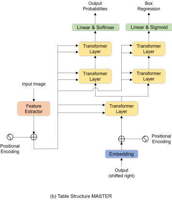
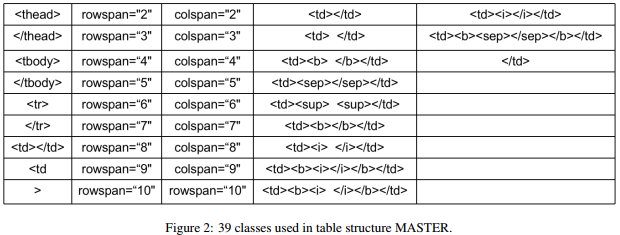
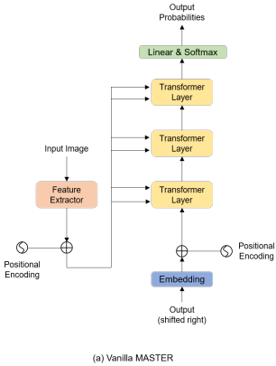
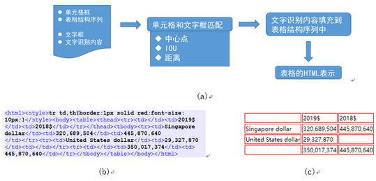

## PINGAN-VCGROUP’S SOLUTION FOR ICDAR 2021 COMPETITION ON SCIENTIFIC LITERATURE PARSING TASK B:TABLE RECOGNITION TO HTML(arxiv 2021)

### 一.概述
作者提出将表格识别任务分为4个子任务：表格结构识别，文本行检测，文本行识别以及边框对齐。表格结构识别是基于MASTER模型，文本行检测采用PSENet模型，文本行识别是基于MASTER模型。最后，在对齐阶段，将检测的文本框和表格结构联合起来，将文本行识别的内容填充到相关位置上。在数据集PubTabNet上达到不错效果。 

### 二.方法概述

#### 1.表格结构识别(Table Structure Recognition)
表格结构识别的任务是重建HTML序列项及其在表中的相应位置，但忽略每个项中的文本内容。表格结构识别模型见上图右侧，它是基于MASTER改进而来，此模型有2个分支，一个是HTML序列标签预测；另一个用于边框坐标回归预测。

    TableMaster输入就是表格图片，输出的维度为7*7*500，然后把输出的序列特征reshape到49*500，输入到解码阶段。其中500是模型的序列长度，
    49为每个位置序列特征的维度。表格的类别标签有39个，如上图，再加上开始和结束两个标签，模型中用到的类别标签一共是41个。其中有两个<td></td>，
    一个表示空单元格，一个表示非空单元格。标记符中有<tbody>、</tbody>、<tr>、</tr>等表示表格开始和行的标记符以及空单元格的标记符。
    这些标记符没有对应的单元格坐标。因此标记符序列长度比实际的单元格序列长。为了使得单元格坐标序列和标记符序列一样长，在单元格序列中，
    对应于<tbody>、</tbody>、<tr>、</tr>标记的位置会填充为0。而这些位置的坐标在回归单元格坐标时不用于参数的更新，会被一个Mask过滤掉，
    不计入bbox回归损失。对于序列预测，文中使用了标准的交叉熵损失。对于边框回归，使用了L1损失来回归[x,y,w,h]的坐标。坐标归一化到[0,1]之间。
    对于边框回归的head部分，模型在计算损失前，利用了Sigmoid激活函数。在训练阶段，输入图像的大小为480 × 480，最大序列长度为500。
    实验采用同步BN(Synchronized Batch Normalization )和Ranger优化器，优化器的初始学习率为0.001，学习率逐步衰减。

#### 2.文本行检测(Text Line Detection)
PSENet是一种高效的文本检测算法，它是一个实例分割网络。它有两个优点。首先，PSENet作为一种基于分割的方法，能够对定位任意形状的文本。其次，该模型提出了一种可成功识别相邻文本实例的递进尺度扩展网络(Progressive Scale Expansion Network)。PSENet不仅适用于任意角度的文本检测，而且对相邻文本分割也有较好的效果。

#### 3.文本行识别(Text Line Recognition)

    使用了MASTER作为文本行识别算法。MASTER功能强大，可以根据不同的数据形式自由适应不同的任务，例如曲线文本预测，多行文本预测，垂直文本预测，
    多语言文本预测。需要注意的是，在训练阶段，我们的算法是在单行文本图像和多行文本图像混合的数据库上进行训练的，而在测试阶段，我们只输入单行文本图像。
    通过文本行识别，可以得到文本行图像对应的文本内容。这些文本内容将合并到HTML序列中的非空<td></td>项中。

#### 4.边框对齐(Box Assignment)
根据以上三个小节，得到了表格结构和每个单元格所在的边框，以及每个文本行所在的边框和对应的文本内容。要生成完整的HTML序列，需要将每个文本行框分配到相应的表结构单元格中。为此，文中方法使用了三个匹配规则，分别为中心点规则(Center Point Rule)，IOU规则和距离规则(Distance Rule)。

##### (1).中心点规则(Center Point Rule)
    首先PSENet得到的每个框的中心坐标。如果坐标在由结构预测得到的回归框的矩形区域内，则匹配上。文本行的内容将填充到<td></td>中。需要注意的是，
    一个表结构单元格可以与多个PSENet框关联，因为一个表结构单元格可能有多个文本行。

##### (2).IOU规则
如果不满足上述规则，我们将计算所选文本行框与所有结构单元格框之间的IOU。将选择IOU值最大的框单元格。文本内容将填充到所选的结构单元格中。

##### (3).距离规则(Distance Rule)
最后，如果以上两个规则都不成功。我们将计算所选文本行框与所有结构单元格框之间的欧几里得距离。与IOU规则类似，选择欧几里得距离最小的结构单元。

##### (4).匹配流程

以上三条规则将依次适用。首先，通过中心点规则将PSENet检测到的大多数box分配到相应的结构单元格中；由于结构预测的预测偏差，有一些PSENet检测到的box中心点不在结构预测到的结构单元格的矩形区域内。其次，一些在中心点规则下不匹配的PSENet box将在IOU规则下得到匹配。在上述两个步骤中，我们使用PSENet框来匹配它们相应的结构项。如果有不匹配的结构项。通过这种方式，我们利用结构项来找到左侧的PSENet box。为此，应用了距离规则。
