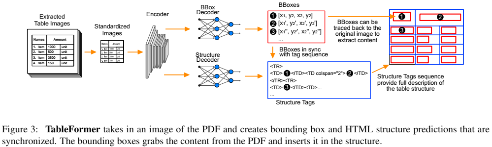
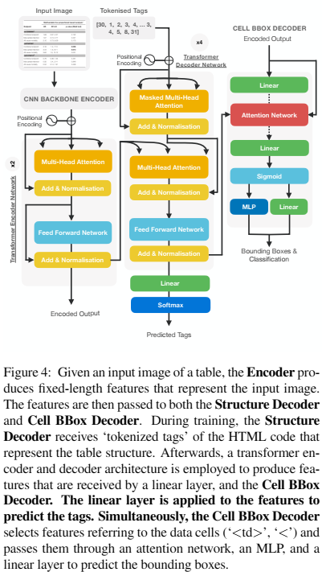
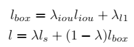
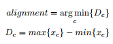

## TableFormer: Table Structure Understanding with Transformers(cvpr 2022)
### 一.概述
这篇论文来自IBM，与平安的TableMaster模型有着相似的idea。

文中提出重要的2种改进用于端到端的识别。首先，引入了一种新的table-cell对象检测解码器。这样，就可以直接从程序化的PDF源中获取表格单元格的内容，避免了自定义OCR解码器的训练。这种架构上的改变可以更准确的提取表格内容，并可以处理非英语表；其次，用基于transformer的解码器替换LSTM解码器。这提高了树编辑距离分数(TEDS)，在简单表上从91%提高到98.5%，在复杂表上从88.7%提高到95%。

文中构建了一个名为TableFormer的新模型和一个合成的生成表格结构的数据集SynthTabNet。本文主要贡献如下：

1.提出了TableFormer模型，这是一种基于transformer的模型，它以端到端的方式同时预测表格结构和表内容的边界框。

2.提出了一个合成生成的数据集SynthTabNet，具有各种不同外观样式和复杂性。

### 二.方法概述

输入一张表格的图片，TableFormer能够预测：1)表格结构序列token；2)单元格边框。

### 三.方法组件

    模型主要由3个部分组成：编码器CNN Backbone将输入图片编码成预定义长度的特征向量；特征向量输入到结构解码器(Structure Decoder)，
    产生表示表格结构的HTML标签序列；对于HTML标准数据单元格(' <td> ')的每次预测，该单元格的隐状态被传递给单元格边框解码器(Cell BBox Decoder)。
    针对跨单元格形式，例如跨行或者跨列，标签被分解为'<'，'rowspan='或'colspan='，带有跨单元格的数量（属性），和'>'。附加到“<”的隐状态传递给单元格边框解码器(Cell BBox Decoder)。
    一个共享前馈网络（FFN）从结构解码器(Structure Decoder)接收隐状态，去预测边界框的坐标及其分类。

#### 1.CNN Backbone 网络
TableFormer使用Resnet-18(移除了线性层和池化层，增加了大小为2828的自适应池化层)作为CNN Backbone网络。输入图像的大小为448×448像素，并且feature map的尺寸为28×28。此外，执行以下输入限制:
##### (1).图像的宽和高 <= 1024像素
##### (2).结构标签长度 <= 512个token
这部分的编码特征会输入到结构解码器和单元格边框解码器中。

#### 2.结构解码器(Structure Decoder)
这部分有2层transformer编码器，；4层transformer解码器，后接一个线性层和一个softmax层。(输入特征大小为512，前馈网络大小为1024，4个注意力头)。CNN backbone的输出会输入到transformer编码器中，而transformer编码器的输出会输入到transformer解码器中。

#### 3.单元格边框解码器(Cell BBox Decoder)
由CNN backbone生成的编码以及来自transformer解码器的每个数据单元所获得的特征传递给注意力网络。注意力网络接受两个输入并学习提供一个注意力权重编码。这个注意力权重编码与编码后的图像相乘，为每个表格单元格产生一个特征。
然后将每个表格单元格的输出特征输入前馈网络(FFN)。FFN由多层感知机(3层，带有ReLU激活函数)组成，该感知机预测每个表格单元格的边界框的归一化坐标。最后利用一个线性层对边界进行分类，预测其是否为空。

#### 4.损失函数

其中ls 是交叉熵损失，用于结构解码器(structure decoder)训练；lbox 是l1 损失，用于边框解码器(cell bbox decoder)训练。λ∈ [0, 1], and λiou, λl1 ∈ R ，为超参数。

#### 5.后处理
##### (1).获取最小网格维度——预测表格结构的行数和列数。这代表底层表格结构的最细粒度网格。
##### (2).在PDF单元格的边界框和预测单元格之间生成成对匹配。使用交并比(Intersection Over Union, IOU)来评估匹配的质量。
##### (3).使用精心选择的IOU阈值将匹配指定为“good”匹配和“bad”匹配。
###### (3a).如果列中的所有IOU分数低于阈值，则丢弃该列的所有预测(结构和边界框)。
##### (4).为每列具有良好(good)IOU的预测单元格找到最合适的内容对齐方式。列的对齐可以用下面的公式来确定：

其中c是{left, centroid, right}其中之一，xc是对应点的x坐标。

##### (5).使用步骤(4)中的对齐计算，计算所有表格列x坐标的中值和所有表格单元格的中值大小。在计算过程中使用中值，有助于消除由于偶尔出现的通常比正常的更宽的跨列而引起的异常值。
##### (6).将所有具有坏的(bad)IOU的单元格捕捉到相应的中值x坐标和单元格大小。
##### (7).在修正的边界框和PDF单元格之间生成一组新的成对匹配。这次使用IOU的修改版本，其中预测单元格和被PDF单元格面积所分割的单元格之间的交叉区域。如果同一PDF单元格有多个匹配，则优先选择得分较高的预测。这涵盖了PDF单元格小于预测或修正的预测单元格面积的情况。
##### (8).在一些罕见的情况下，我们注意到TableFormer可以将单个列混淆为两个列。当应用后处理步骤时，结果是两个预测列指向同一个PDF列。在这种情况下，我们必须根据最高的总的列交集分数去除重复列。
##### (9).在应用了所有先前的后处理步骤之后，有些PDF单元格可能仍然与预测的单元格没有任何匹配。但是，仍然可以通过将孤立PDF单元格的边界框映射到网格的几何形状来推断其正确匹配。该映射决定是将孤立单元格的内容附加到已经匹配的表格单元格中，还是应该创建一个新的表格单元格来与孤立单元格匹配。
###### (9a).计算每个网格行的水平带的上下边界(每行的最小/最大y坐标)。
###### (9b).将孤立的边界框与行带相交，并将单元格映射到最近的网格行。
###### (9c).计算每个网格列的垂直带的左右边界(每列的最小/最大x坐标)。
###### (9d).将孤立的边界框与列带相交，并将单元格映射到最近的网格列。
###### (9e).如果标识行和列下的表格单元格不为空，则使用孤立单元格的内容扩展其内容。
###### (9f).否则，创建一个新的结构单元格，并将其与孤立单元格相匹配。

