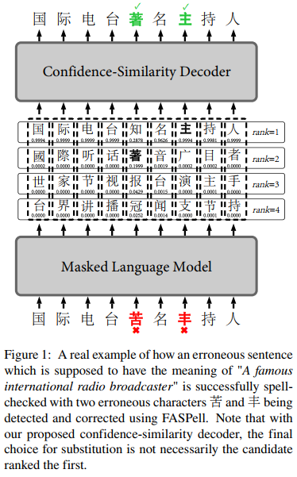
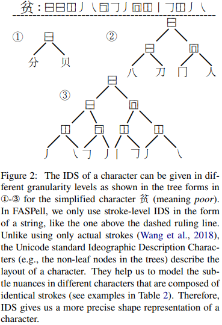
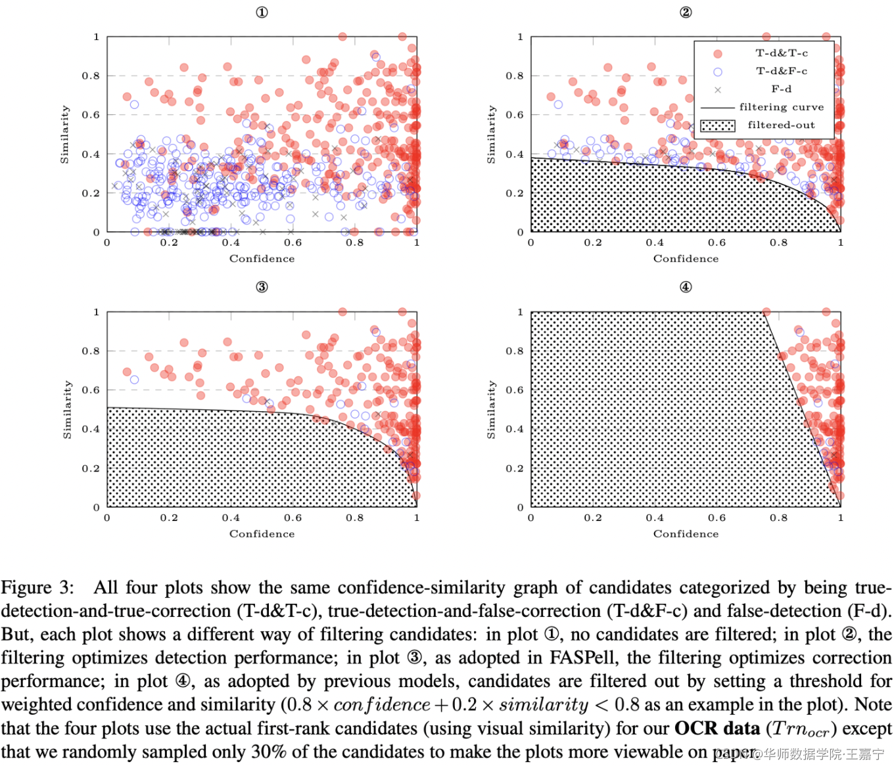

## FASPell: A Fast, Adaptable, Simple, Powerful Chinese Spell Checker Based On DAE-Decoder Paradigm(EMNLP2019)
### 一.概述
&emsp;&emsp;本文提出了一种由去噪自动编码器(DAE)和解码器(decoder)组成的中文拼写检查器——FASPell。 

&emsp;&emsp;首先，DAE通过利用BERT、XLNet、MASS等非监督预训练mask语言模型的力量，将监督学习所需的中文拼写检查数据量减少到<10000句。其次，解码器有助于消除混淆集的使用，这种混淆集在利用汉字相似性的显著特征方面缺乏灵活性和充分性。代码：https://github.com/iqiyi/FASPell。 
### 二.方法概述
 

&emsp;&emsp;如上图所示，模型由一个masked language model(MLM)作为去噪自动编码器(DAE)，这个编码器将产生候选集；使用一个置信度相似性解压码器(confidence-similarity decoder)去过滤候选集。
#### 1.Mask语言模型(Masked language model[MLM])
&emsp;&emsp;FASPell利用MLM模型Bert作为DAE。然而，仅仅使用预训练MLM模型有一个问题，即随机掩码引入的错误可能与拼写检查数据中的实际错误非常不同。因此，我们提出了以下方法来微调拼写检查训练集上的MLM模型：

(1). 对于没有错误的文本，遵循BERT中的原始训练过程

(2). 对于有错误的文本，通过以下方式创建两种类型的训练样本(这两种类型的训练样本被平衡为具有大致相似的数量):

&emsp;&emsp;a.给定一个句子，用错误的tokens本身掩盖错误的tokens，并将它们的目标labels设置为相应的正确字符

&emsp;&emsp;b.为了防止过拟合，还屏蔽了本身没有错误的tokens，并将其目标labels设置为本身
#### 2.字符相似度(Character similarity)
&emsp;&emsp;中文错别字主要是视觉上和语音上的相似两种。本文的相似度计算基于两个开放的数据库:Kanji数据库项目和Unihan数据库，因为它们提供了所有CJK语言中所有CJK统一表意文字的形状和发音表示。
##### 2.1视觉相似度(Visual similarity)
&emsp;&emsp;Kanji数据库项目使用Unicode标准-表意文字描述序列(IDS)来表示字符的形状。如下图中的示例所示，字符的IDS形式上是字符串，但实质上是有序树的预排序遍历路径。

 

&emsp;&emsp;本文模型只使用字符串形式的IDS。本文将两个字符之间的视觉相似度定义为1减去它们的IDS表示之间的标准化Levenshtein编辑距离。这里的标准化有两个原因：首先，我们希望相似度的范围从0到1，以便于以后的过滤。其次，如果一对较复杂的字符与一对较不复杂的字符具有相同的编辑距离，我们希望较复杂字符的相似度略高于较不复杂字符的相似度。(没有采用基于树形式的IDS，是因为树编辑距离(TED)比字符串编辑距离具有更大的时间复杂度)
##### 2.2语音相似度(Phonological similarity)
&emsp;&emsp;不同的汉字发音相同是很常见的。利用语音库Unihan数据库，为了计算两个字符的语音相似性，我们首先计算它们在所有CJK语言中的发音表示之间的1减去归一化的Levenstein编辑距离。然后取结果的均值。因此，相似度应该在0到1之间。
##### 2.3置信度相似性解码器(Confidence-Similarity Decoder)
&emsp;&emsp;以前的许多模型中的候选集过滤器都是基于对候选字符的多个特征设置不同的阈值和权重。由于解码器利用了上下文置信度和字符相似性，我们称之为置信度-相似性解码器(CSD，注意这里的置信度就是MLM预测的概率)，工作机制如下：

&emsp;&emsp;首先，考虑最简单的情况，即每个原始字符只提供一个候选字符。对于与原字符相同的候选字符，我们不替换原字符。对于那些不同的，我们可以绘制置信度相似度散点图，如下图。

 

&emsp;&emsp;目的是得到一条由Confidence和Similarity两个坐标共同控制的曲线，取代原先单一的概率阈值进行候选字的选择。

　消融实验的流程如下：

&emsp;&emsp;(1). 通过BERT语言模型计算得到句子中每个字的TOPN候选字。

&emsp;&emsp;(2). 分别计算rank=0..TOPN-1的候选字的Confidence和与原句中字的Similarity。

&emsp;&emsp;(3). 以Confidence为纵坐标以Similarity为横坐标，分别将不同rank下候选字所在位置标识在散点图中，用不同符号标明其检错和纠错正确与否。

&emsp;&emsp;(4). 通过散点图获取适当的曲线

&emsp;&emsp;通过合适的消融曲线，可以有效控制对候选字的选择，从而提高检错纠错的准确度。如文首模型架构图所示，在rank=1的情况下，只有‘主’字与原文中字词不同，它可以顺利经过由Confidence-Similarity消融曲线筛选;在rank=2的情况下，虽然每个候选字都与原文中字不同，但最终只有‘著’经过了消融曲线的筛选胜出，从而对原字进行了修改。
