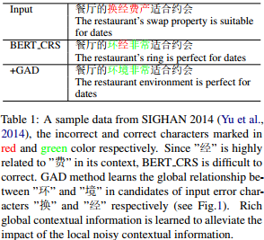

## Global Attention Decoder for Chinese Spelling Error Correction(ACL2021)
### 一.概述

作者认为现有的纠错方法大多是基于局部上下文信息进行纠错，没有考虑句子中错词的影响。将注意力放在错误上下文信息上可能会误导并降低CSC(Chinese Spelling Correction)的整体性能。为此，提出了一种用于CSC的全局注意力解码器(GAD)方法。具体而言，该方法学习了潜在正确输入字符与潜在错误候选字符之间的全局关系。获得丰富的全局上下文信息，减轻了局部错误上下文信息的影响。此外，设计了一种带有混淆集引导的BERT替换策略(BERT_CRS -> Confusion set guided Replacement Strategy)，以缩小BERT与CSC之间的差距。BERT_CRS生成的候选词覆盖正确字符的概率超过99.9%。

本文首先提出了一种带混淆集引导的BERT替换策略(BERT_CRS)，缩小了BERT与CSC任务之间的差距。然后，我们提出了一种新的基于BERT_CRS模型的全局注意解码器(GAD)，它学习了丰富的全局上下文表示，以减轻错误上下文信息在校正过程中的影响。具体来说，为了解决局部错误上下文信息的影响，我们引入了BERT_CRS生成的潜在错误字符和隐藏状态的附加候选。然后，全局注意力组件学习候选对象之间的关系，得到候选对象的全局隐藏状态和全局潜在关注权重。然后，对候选字符进行加权和运算，生成丰富的全局上下文隐藏状态。最后一个全连接层来生成正确的字符。

本文主要贡献如下：

A.为了缩小BERT和CSC之间的差距，我们引入了一种带有混淆集引导替换策略的BERT，该策略包含一个决策网络和一个全连接层，分别模拟CSC的检测子任务和校正子任务。

B.提出了一种全局注意解码器模型，该模型学习潜在正确输入字符和潜在错误字符候选字符之间的全局关系。学习了丰富的全局上下文信息，有效减轻了局部错误上下文信息的影响。
### 二.方法概述

#### 1.问题定义
输入一个句子X={x1,x2,...,xn}，n为字符数量，Bert_CRS模型将其编码成一个连续的表示空间V={v1,v2,...,vn}，vi∈Rd是第i个字符的上下文特征，维度为d。决策网络Φd 对V建模去拟合一个序列Z={z1,z2,...,zn}，这里的zi表示对第i个字符的检测label，1表示错误，0表示正确。Bert_CRS之上一个全连接层作为校正网络Φc ,此网络对V建模去拟合一个序列Y={y1,y2,...,yn}，这里的yi第i个字符的正确label。全局注意力解码器GAD模型对额外的候选c={c1,c2,...,cn}进行建模，以减轻局部错误上下文信息的影响，其中c表示可能正确的输入字符和可能错误的候选字符：

以上的k是候选字符个数。t是字符错误概率的阈值。
#### 2.CSC的Bert_CRS方法
引入了一种使用混淆集的替代策略，该策略缩小了BERT和CSC模型之间的差距。我们把这个模型称为BERT_CRS (BERT with Confusion set guided Replacement Strategy)。与BERT任务不同，BERT_CRS有几个修改：

A.放弃了NSP(bert的下一句预测)任务，采用了类似于CSC检测子任务的决策网络来检测错误信息。

B.作为MacBERT，我们引入了混淆集引导替换策略，通过替换语音和视觉相似的字符来达到屏蔽的目的，而不是使用[MASK] token进行屏蔽。当没有混淆字符时，我们将保留[MASK] token。该策略类似于CSC的纠错子任务。

C.使用23%的输入字符进行屏蔽。为了保持检测目标的平衡(0为未替换，1为替换)，我们分别设置了35%、30%、30%、5%的概率用于不进行屏蔽、用混淆字符替换、用[MASK] token屏蔽和用随机单词替换。计算得到的替换概率和掩蔽概率与BERT的屏蔽概率大致相同。

使用混淆集引导替换策略训练模型，top-k个候选字符几乎都来自混淆集。这为GAD模型做了准备。

学习：类似RoBerta，混淆集引导替代策略在训练过程中采用动态方法。在学习过程中，错误检测和纠错同步优化：

这里的Ld和Lc是检测与校正损失函数，L是两者的线性组合，λ∈[0;1]是系数，当λ=0时表示不考虑检测损失。
#### 3.全局注意力解码器(Global Attention Decoder)

GAD模块是transformer层的一个扩展，如上图。
##### (1).自注意力(Self Attention)
自注意力机制是transformer层的一部分，其将前面transformer层或者input embedding层的输出作为输入，从而获得更高语义表示的隐状态，见图1的左部分。第l层第i个位置的token的表示在自注意力方法中的表示如下：

这里的api是从第i到第p个token的注意力权重，是第(l-1)层的第p个token的表示。Wv是可学习的映射矩阵。该策略可以有效地编码丰富的token和句子级特征。然而，拼写错误信息也被编码到CSC的隐藏状态中。然后，将注意力集中在错误上下文信息上可能会误导并降低CSC的整体性能。
##### (2).全局注意力(Global Attention)
不是只使用局部输入信息(见公式5)，而是考虑潜在的正确输入和潜在错误字符的候选，以学习它们之间的潜在关系，从而减轻局部错误上下文造成的影响。具体而言，如图2所示，我们考虑两种输入源:

A.上下文表示V，它包含丰富的语义信息。

B.Top-k候选字符c由Φc校正网络生成。为了减少GAD在学习过程中的混乱，我们只生成潜在错误字符的候选字符(见公式1)。

为了对两种不同的信息建模，我们首先使用BERT_CRS中的词嵌入E将候选对象嵌入到连续表示中。然后，引入dense和layernorm层，对V和E(c)建模为输入状态GI：

全局注意力去学习候选c之间的潜在关系。第i个token的第j个候选token的表示GAi,j全局注意力部分定义如下：

以上的WVg是一个可学习的映射矩阵，是从第i个token的第j个候选到第p个token的第q个候选的注意力权重，GIp,q是第p个token的第q个候选的输入状态。在同一个token的候选之间采用屏蔽策略(masking strategy)：

这里。 最后，在全局注意力部分的第i个位置的全局注意力状态GAi定义如下 ：

以上βi,j为第i个token的第j个候选的全局注意力权重，用于量化特征GAi,j的全局相关性。表示未归一化的相关分数。类似于标准的transformer层，前馈层和层归一化将GA编码为最终的全局连续表示。此外，我们对全局注意力中的transformer层采用的多头技术。
##### (3).学习(Learning)
给定BERT_CRS生成的隐藏状态V和候选c，我们的GAD模型在学习过程中拟合正确的序列Y：

这里的Φg是GAD网络，Lg表示GAD的目标函数。
##### (4).训练设置
我们首先基于预训练的全词掩蔽BERT对300万个未标记语料库，对BERT_CRS模型进行微调。该过程运行5个epoch，batchsize为1024，学习率为5e-5，最大序列长度为512。然后，对BERT_CRS模型在所有标记的训练数据中进行微调6个epoch，batchsize为32，学习率为2e-5。接下来，我们修正BERT_CRS模型，并将候选数量k和错误检测概率t分别设置为4和0.25。最后，将GAD模型微调3个epoch，batchsize为32，学习率为5e-5。

