## PHMOSpell: Phonological and Morphological Knowledge Guided Chinese Spelling Check(ACL2021)
### 一.概述
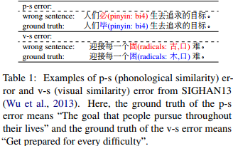

作者认为目前大多数中文拼写错误都属于音似或形似造成的错误，如上图。但以往的方法很少利用中文字符的语音和形态知识，或严重依赖外部资源来建模字符的相似度。为此，文中提出了一种端到端可训练的模型叫PHMOSpell，其提升了CSC(Chinese Spelling Check)利用多模态信息的性能。具体而言，我们分别从音频和视觉模式中获得汉字的拼音和字形表示，并通过精心设计的自适应门控机制将其集成到预训练的语言模型中。

方法通过自适应门控机制，在预训练模型中融合了拼音和字形特征。这些特征来源于文本到语音(TTS)任务的Tacotron2和计算机视觉(CV)任务中的VGG19 的中间表示。我们通过提出的自适应门控模块将它们与来自预训练语言模型的语义表示结合起来，使模型能够端到端进行训练。

本文主要贡献如下：

A.从多模态中导出了汉字的音系和形态知识，并将其应用于CSC。

B.设计了一种新的自适应门控机制，以端到端可训练的方式将多模态信息有效地整合到预训练的语言模型中。
### 二.方法概述
#### 1.问题定义(Problem Formulation)
输入一个句子，对句子进行检测并校正输出正确的等长句子。
#### 2.模型(Model)
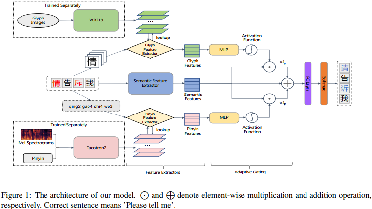

如上图，模型由3个特征抽取器模块和一个用于融合特征的自适应门控机制模块组成。输入一个句子，模型首先抽取每个字符的拼音特征，字形特征以及上下文语义特征，然后通过自适应门控模块进行融合。最后，每个字符的融合表示输入到一个全连接层去计算在整个词汇表中的概率，选择概率最高的字符作为替代。
#### 3.拼音特征抽取器(Pinyin Feature Extractor)
在本文中，我们利用Tacotron2(TTS，文本到语音)，一个循环序列到序列的声谱图预测网络，来帮助建模语音表示，因为它的位置敏感注意力可以在字符序列和声学序列之间创建有效的时间对齐。当给定一个中文句子X时，我们的模型首先使用拼音将其转换为拼音序列。文中说自己训练一个Tacotron2模型。然后使用拼音特征提取器作为查找表，得到拼音序列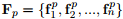的稠集特征，其中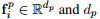为拼音特征的维数。
#### 4.字形特征抽取器(Glyph Feature Extractor)
由于汉字是由图形组件组成的，很直观地，汉字的表示可以从这些组件的空间布局中受益。对VGG19进行微调，以从字形图像中恢复标识符为目标，解决域自适应问题。之后，我们放弃最后一个分类层，并使用VGG19的最后一个最大池化层的输出作为字形特征。对于给定的句子X，我们的字形特征提取器能够首先为其字符检索图像，然后生成字形特征：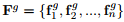，这里的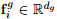是第i个字符的字形特征，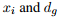是字形特征的维度。
#### 5.语义特征抽取器(Semantic Feature Extractor)
除了语音和形态信息外，我们还采用经验主导的预训练语言模型从语境中获取语义信息。这里利用Bert抽取语义信息。给定一个输入句子X，抽取器输出Bert最后一层的隐藏状态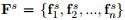，这里的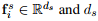是语义特征的维度。
#### 6.自适应门控机制(Adaptive Gating)
以前的大多数CSC方法只是简单地使用加法或串联来融合不同的特征。然而，这些融合策略忽略了特征之间的关系。为了解决这一问题，我们提出了一种创新的自适应门控机制，可以很好地控制特征的融合。定义如下：

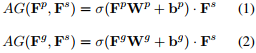

这里的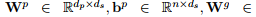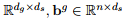是学习参数。σ 是非线性激活函数ReLU。“.”是逐元素相乘。我们使用所提出的门控机制来控制拼音和字形特征中有多少信息与语义特征融合并转移到下一个分类器模块。融合特征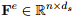如下：

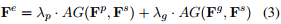

这里的λp + λg = 1是系数。最后，通过线性组合对Fe和Fs进行残差连接:

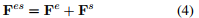

#### 7.训练(Training)
Fes的表示输入到一个全连接层做最终的分类，定义如下：

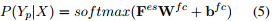

这里的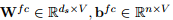是全连接层可学习的参数，V是词汇表大小，Yp是对错句X的预测的句子。

训练模型的目标是匹配预测序列Yp和真实序列Yg。学习过程是最小化字符的负对数似然：

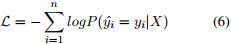

这里的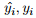是第i个字符的Yp和Yg。
#### 8.推理(Inference)
在推理时，我们以模型给出的最高概率作为每个字符的校正选择候选对象。对于检测任务，通过检查所选候选字符与输入字符是否不同来完成。
#### 9.训练设置
使用bert-base-chinese初始化语义特征提取器的权重，使用torchvision库中预训练的VGG19初始化字形特征提取器的权重。随机初始化自适应门控的权重。优化器为AdamW，5个epoch，学习率为1e-4，训练batchsize为64，评估batchsize为32。SIGHAN13 数据集λp=0.6，λg=0.4，SIGHAN14和SIGHAN15 数据集λp=0.8，λg=0.2。使用Tacotron2的开源实现训练了130k步(默认参数)，除了衰减步被设置为15000。拼音数量是1920，拼音特征的维数是512。汉字是用黑体字体在8106字形图像中书写。对VGG19在字形图像上进行了50个epoch的微调，batchsize为32，学习率为5e-4。字形特征的维度是25088。

