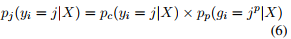

## PLOME: Pre-training with Misspelled Knowledge for Chinese Spelling Correction(ACL2021)
### 一．概述

作者提出了一种基于错误拼写知识的预训练屏蔽语言模型(PLOME -> Pre-trained masked Language model with Misspelled knowledge)，该模型可以联合学习如何理解语言和纠正拼写错误。为此，PLOME根据混淆集屏蔽具有相似字符的所选token，而不是像BERT那样使用固定token “[MASK]”。除了字符预测，PLOME还引入了语音预测，从语音层面学习拼错知识。此外，语音和视觉相似性知识对这项任务很重要。PLOME利用GRU网络根据字符的拼音和笔画对这些知识进行建模。

代码：https://github.com/liushulinle/PLOME。

本文的主要贡献如下：

A.PLOME是第一个为中文拼写纠错而设计的特定任务语言模型。提出的基于混淆集的掩蔽策略(masking strategy)使我们的模型能够在预训练过程中联合学习语义和拼写错误知识。

B.PLOME结合了拼音和笔画，这使它能够建模任意字符之间的相似性。

C.PLOME是第一个在字符和语音层级上对这项任务进行建模的模型。
### 二．方法概述

#### 1.基于混淆集的屏蔽策略(Confusion Set based Masking Strategy)
我们不用固定的token “[MASK]”，而是用一个与其相似的随机字符替换每个选中的token。相似的字符是从一个公开的混淆集(Wu et al.，2013)中获得的，它包含两种类型的相似字符:语音相似和视觉相似。因为语音错误的频率是视觉错误的两倍，这两种类型的相似字符在掩蔽过程中被选择的机会不同。我们完全屏蔽了语料库中15%的token。此外，我们使用动态掩蔽策略，每次将序列输入到模型中时都会生成掩蔽模式。

总是用混淆集中的字符替换选中的token会导致两个问题。(1).模型倾向于对所有输入做出校正决策，这是因为在预训练期间预测的所有token都是“拼写错误”。为了避免这个问题，选中的token中有一定比例是不变的。(2).混淆集的大小是有限的，然而，在实际文本中任意一对字符的滥用可能会导致拼写错误。为了提高泛化能力，我们用词汇表中的随机字符替换一定比例的选中的token。概括来説，如果第i个token被选中，我们用以下策略替换：(1).60%的时间用一个随机的语音相似字符；(2).15%的时间用一个随机的视觉上相似字符；(3).15%的时间不变；(4).10%的时间用词汇表中的随机token。如上图Table 1。
#### 2.嵌入层(Embedding Layer)
每个字符的嵌入是字符embedding，位置embedding，语音embedding和形状embedding的和。前2个与Bertbase一样。

##### (1).语音嵌入(Phonic Embedding)
即字符的拼音，在本文中，我们使用Unihan数据库来获得字符-语音映射(除去音调)。为了建模字符之间的语音关系，我们将每个字符的拼音字母输入到1层GRU网络中以生成语音嵌入embedding，其中相似的拼音预计具有相似的嵌入embedding。
##### (2).形状嵌入(Shape Embedding)
利用笔画顺序去表示一个字符的形状，即汉字笔画书写顺序的笔画序列，笔画数据来自Chaizi数据库。为了建模字符之间的视觉关系，将每个字符的笔画顺序输入到另一个1层GRU网络中生成形状嵌入embedding。
#### 3.Transformer 编码器(Transformer Encoder)
与Bertbase一样的架构，12层，12个头，768维度。
#### 4.输出层(Output Layer)
对被选中的字符进行2个预测。
##### (1).字符预测(Character Prediction)
与BERT类似，PLOME基于最后一个transformer层生成的嵌入embedding来预测每个掩码token的原始字符。对给定句子中的第i个token预测的字符概率为：

这里的是第i个token xi的真实字符被预测为词汇表中的第j个字符的条件概率，hi表示xi最后一层transformer的嵌入输出，是字符预测的参数，nc是词汇表大小。
##### (2).拼音预测(Pronunciation Prediction)
汉语共有大约430种不同的发音(以拼音表示)，但有2500多个常用汉字。因此，许多汉字都有相同的发音，所以易误用。为了学习语音层面的拼错知识，PLOME还预测了每个掩码token的真实发音，其中发音由无音调的语音表现。发音预测的概率为:

这里的为掩码字符xi的正确发音被预测为语音词汇表中第k个语音的条件概率，hi为xi的transformer最后一层的嵌入输出，是语音预测的参数，np语音词汇表的大小。
#### 5.学习(Learning)
2个损失，一个字符预测损失；一个语音预测损失：

Lc是字符预测目标，li是xi的真实字符。Lp是语音预测目标，ri是真实语音。联合如下：

#### 6.微调过程(Fine-tuning Procedure)
##### (1).训练
学习目标与预训练过程完全相同(参见5)。这个过程类似于预训练，不同之处在于:(1).消除了1中介绍的屏蔽操作。(2).所有输入字符都需要预测，而不是像预训练那样只选择token。
##### (2).推理
PLOME预测每个掩码token的字符分布和发音分布。我们定义联合分布为：

这里的是xi的原始字符被预测为第j个字符的概率(联合了字符和发音预测)，pc和pp是公式(1)和公式(2)，jp是第j个字符的发音。为此，我们构造一个指标矩阵，如果第i个字符的发音是第j个语音，则将Ii,j设为1，否则设为0。联合分布如下：

我们用联合概率作为预测分布。对于每个输入符号，选择联合概率最高的字符作为最终输出：。联合分布同时考虑了汉字和发音的预测，因此更准确。
