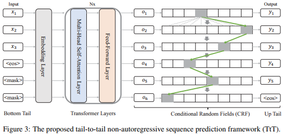
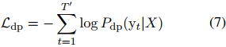

## Tail-to-Tail Non-Autoregressive Sequence Prediction for Chinese Grammatical Error Correction(ACL2021)
### 一．概述

作者语法错误类型以及相应的纠正有3类，如上图所示:

A.替换(Substitution)：如音似造成的错误，这可通过替换进行校正而没有改变整个句子结构，这是一个固定长度的操作，如Type1。

B.删除和插入(Deletion and Insertion)：这2种情况主要处理冗余字符和遗漏字符，如Type2。

C.局部改写(Local paraphrasing)：有时，替换、删除、插入等简单的操作不能直接纠正错误。因此，需要微调改写来重新排序句子的部分单词，如Type3。

删除、插入和局部改写可被视为变长操作，因为它们可能改变句子的长度。

文中认为句子中的大多数词不需要改变，如上图，灰色虚拟为保持不变，红色实线为3种类型的错误。作者认为一方面CGEC(Chinese Grammatical Error Correction)模型应当有能直接将正确的词从下尾移到上尾的能力，Bert有这能力；另一方面，中文语法纠错大部分采用序列标注或者序列翻译模型，最大似然估计MLE(Maxinum Likelihood Estimation)通过作为参数学习方法，但这在中文语法纠错场景下，会有严重的类别或标签不平衡问题。

为此，对CGEC提出了一个新的框架，叫tail-to-tail非自回归序列序列(TtT)。具体来说，为了将token信息从下尾直接移动到上尾(from the bottom tail to the up tail)，引入了基于BERT的序列编码器进行双向表示学习。为了同时进行替换、删除、插入和局部改写，CRF层堆叠在上尾上，通过对相邻token之间的依赖关系建模来进行非自回归序列预测。采用焦点损失Focal loss惩罚策略来缓解类不平衡问题，因为句子中的大多数token都没有改变。
本文的主要贡献如下：

A.提出了一种新的尾到尾(tail-to-tail)非自回归序列预测框架(TtT)来解决CGEC问题。

B.采用带有CRF层的BERT编码器作为主干，可以同时进行替换、删除、插入和局部释义。

C.考虑到句子中的大多数token不变，采用焦点损失Focal loss惩罚策略来缓解类不平衡问题。

代码：https://github.com/lipiji/TtT 。
### 二．方法概述 

如上图是整个方法框架。输入一个有语法错误的句子X=(x1,x2,...,xT),T是句子长度。方法的目标是纠正句子中的错误，生成一个正确的句子Y=(y1,y2,...,yT`)，这里的T和T`长度不同，T`可能等于，大于或者小于T。双向语义建模和自下而上的直接token信息传递由多个Transformer层进行。条件随机场(CRF)层堆叠在上尾上，通过对相邻token之间的依赖关系建模来进行非自回归序列生成。引入了低秩分解和beam Viterbi算法来加快计算速度。采用焦点损失(Focal loss)惩罚策略缓解训练阶段的类不平衡问题。
#### 1.变长输入(Variable-Length Input)
因为输入的句子与预测的句子的长度可以不等。这可能在训练和推理阶段影响预测句子的完整性。故这里需要进行预处理。假定X=(x1,x2,x3,<eos>)：(1).当T=T`时，即Y=(y1,y2,y3,<eos>)，不需要处理；(2).当T>T`时，即Y=(y1,y2,<eos>)，这意味着在纠正时，X中有一些token被删除。在训练阶段，对Y进行pad填充，有T-T`的<pad>填充到Y的尾部，即Y=(y1,y2,<eos>,<pad>)；当T<T`时，即Y=(y1,y2,y3,y4,y5,<eos>)，这意味着更多的信息被插入句子中。因此，需要填充<mask>到X的尾部，表明这些位置可能会被转为一些新的token，即X=(x1,x2,x3,<eos>,<mask>,<mask>)。
#### 2.双向语义建模(Bidirectional Semantic Modeling)
从图3中可以看出，这部分是一个embedding层加一个L层Bert结构，最终输出表示。
#### 3.非自回归序列预测(Non-Autoregressive Sequence Prediction)
##### (1).直接预测(Direct Prediction)
在上面获得的语义表示HL，加一个softmax层预测结果。具体来说，插入一个线性变换层，利用softmax运算生成目标词汇V上的概率分布Pdp(yt):

这里。然后，基于预测分布获得了每个状态的结果：

然而，这种直接预测方法虽然对定长语法纠错问题有效，但只能进行相同位置的替换操作。对于需要删除、插入和局部改写的复杂纠错情况，性能是不可接受的。

导致性能差的一个重要原因是丢失了相邻token之间的依赖信息。因此，应该进行依赖关系建模，以提高生成的性能。所以，这里利用线性链CRF来解决这个问题。
##### (2).利用CRF依赖建模
对输入的句子X，在CRF的框架下，长度为Y`的目标句子Y的似然如下：

这里的Z(X)是归一化因子，s(yt)表示位置t标签y的得分，这从公式(3)中可获得。st(Vyt)，其中Vyt是token yt的词汇表索引。值t(yt−1，yt) = Myt−1，yt表示token yt−1到yt的转移分数，其中M∈R|V|×|V|为转移矩阵，是进行依赖关系建模的核心项。通常，M可以在端到端训练过程中作为神经网络参数学习。然而，|V|通常非常大，特别是在文本生成场景中(超过32k)，因此在实践中无法有效地获得M和Z(X)。为此，我们引入两个低秩神经参数指标E1, E2∈R|V|×dm来近似全秩转移矩阵M:

这里的dm<=|V|。计算归一化因子Z(X)，原始Viterbi算法需要搜索全路径。 为了提高效率，这里我们在每个时间步长大约只访问截断的top-k个节点。
#### 4.利用Focal惩罚训练
因此，考虑到CGEC任务直接自下而上信息传递的特点，在训练阶段可以将直接预测和基于crf的依赖关系建模这两个任务合并到一个统一的框架中。原因是，直观上，直接预测将侧重于每个位置的细粒度预测，而crf层将更多地关注整个全局序列的高质量。我们采用极大似然估计(Maximum Likelihood Estimation, MLE)进行参数学习，并将负对数似然(negative log-likelihood, NLL)作为损失函数。因此，直接预测Ldp的优化目标为:

基于crf依赖性建模的损失函数Lcrf为:

最终的优化目标：

句子中的多数词是不需要改变。考虑到在这两个任务中使用最大似然估计作为参数学习方法，然后简单的复制策略可以导致损失函数方面的急剧下降，即类别不平衡。这里在直接预测和CRF损失函数中引入focal loss：

其中γ是控制惩罚的超参数。很明显，上式的第一个公式在token水平上受到惩罚，而第二个公式在样本水平上加权，并在batch训练条件下起作用。采用focal策略的最终优化目标为:

#### 5.推理
在推理阶段，对于输入源句子X，我们可以使用原始的|V|节点Viterbi算法来获得目标全局最优结果。我们还可以利用截断的top-k Viterbi算法来提高计算效率。