## Read, Listen, and See: Leveraging Multimodal Information Helps Chinese Spell Checking(ACL2021)
### 一．概述
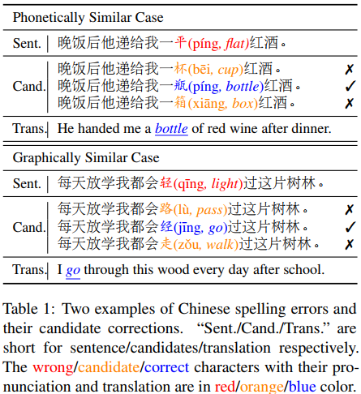

作者认为汉语拼写错误大多是语义、语音或图形相近的汉字误用造成的。之前的方法要么使用启发式方法，要么使用手工制作的混淆集来预测正确的字符。在本文中，我们直接利用汉字的多模态信息，提出了一种名为realise的中文拼写检查器。realise模型通过(1)捕获输入字符的语义、语音和图形信息；(2)有选择地混合这些模态中的信息去预测正确的输出。

代码：https://github.com/DaDaMrX/ReaLiSe。

在本文中，我们提出了REALISE(读Read，听Listen，看See)，一个中文拼写检查器，利用语义，语音和图形信息来纠正拼写错误。realize模型采用三个编码器从文本、声学和视觉模式中学习信息表示。首先，采用BERT作为语义编码器的backbone，捕获文本信息。对于声学形态，使用汉语拼音(拼音)，汉字语音的罗马化拼写系统，作为语音特征。我们设计了一个分层编码器，在字符级和句子级对拼音字母进行处理。同时，在视觉形态上，我们构建了多通道字符图像作为图形特征，每个通道对应一个特定的中文字体。然后，利用ResNet块对图形编码，获取字符的图形表示。

为了融合三种不同模态的表示，设计了一种选择性模态融合机制来控制每种模态的多少信息可以流向混合表示。此外，由于预训练微调过程已被证明在各种NLP任务中是有效的，我们提出在相应的模态中通过预测给定输入正确字符来预训练语音和图形编码器。在这项工作中，我们抛弃了预定义的混淆集，直接使用多模态信息来发现所有汉字之间微妙的相似关系。

本文的主要贡献如下：

A.提出在CSC任务中，除了文本语义之外，还利用了汉字的语音和图形信息 。

B.引入了选择性融合机制来整合多模态信息。

C.提出了声学和视觉预训练任务来进一步提高模型的性能。

### 二．方法概述
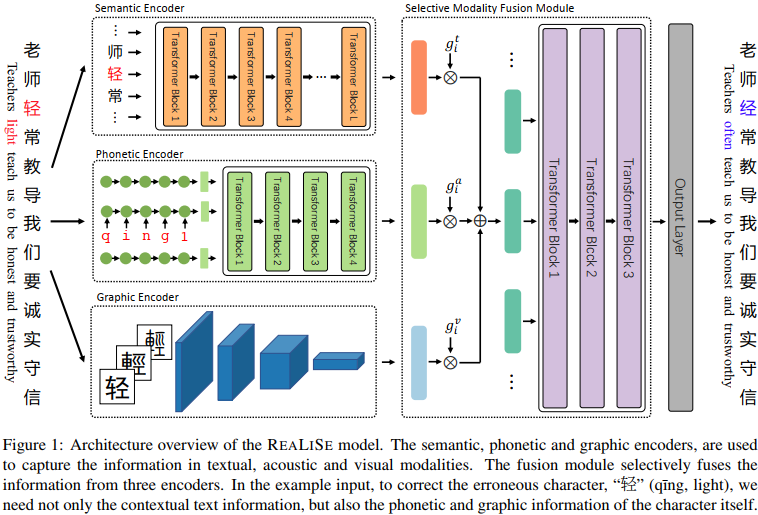

如图1所示，首先使用多个编码器从文本、声学和视觉模式中捕获有价值的信息。然后，开发了一个选择性模态融合模块，以获得上下文感知的多模态表示。最后，输出层预测错误校正的概率。
#### 1.语义编码器(The Semantic Encoder)
采用Bert作为语义编码器。输入token X={x1,...,xN}首先通过input embedding投影到Ht0中。Transformer编码器层的计算表示为：

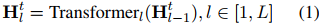

以上L是Transformer层数。最后一层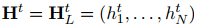的输出作为输入token的语义表示。

#### 2.语音编码器(The Phonetic Encoder)
汉字拼音有5种音调，比如a=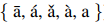，可以用数字表示{1,2,3,4,0}。虽然所有汉字的拼音词汇量都是一个固定的数字，但我们使用了一个字母序列来捕捉汉字之间细微的语音差异。例如，“中”和“棕”的拼音分别是“zhong1”和“zong1”。这两个字读音很相似，但意思却大不相同。因此，我们将拼音表示为一个符号序列，例如，{z,h,o,n,g,1}代表“中”。我们将输入句子中第i个字符的拼音表示为pi = (pi,1,...,pi,|pi|)，其中|pi|为拼音pi的长度。

在realise中，设计了一个分层语音编码器，它由一个字符级编码器和一个句子级编码器组成。
##### (1).字符级编码器(The Character-level Encoder)
对基本的发音建模，捕捉汉字之间细微的发音差异。它是一个单层单向GRU模型，其将第i个字符xi的拼音编码如下：

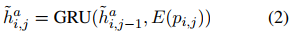

式中E(pi，j)为拼音符号pi，j的嵌入，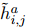是GRU的第j个隐状态。最后一个隐状态用作xi的字符级语音表示。
##### (2).句子级编码器(The Sentence-level Encoder)
这里是一个与语义编码器具有相同隐藏大小的4层Transformer。它的目的是获得每个汉字的语境化语音表示。由于独立的语音向量不按顺序区分，我们预先对每个向量进行位置嵌入。然后，我们将这些语音向量打包在一起，并应用Transformer层来计算声学模态的上下文化表示，表示为。

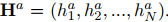
#### 3.图形编码器(The Graphic Encoder)
这里使用ResNet作为图形编码器。图形编码器有5层ResNet块(表示为ResNet5)，然后是一个LayerNorm层，如下：

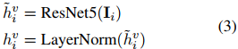

以上的Ii是输入句子中第i个字符xi的图形。

为了有效地提取图形信息，ResNet5中的每个块将图像的宽度和高度减半，并增加通道数。因此，输出是一个长度等于输出通道数的向量，即高度和宽度都变为1。此外，我们将输出通道的数量设置为语义编码器中隐藏的大小，用于后续的模态融合。我们将输入句子的视觉模态表示为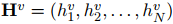。

从预设的字体文件中读取xi的字符图像。由于汉字的文字经过数千年的演变，为了尽可能地捕捉汉字之间的图形关系，我们选择了三种字体，即简体和繁体的黑体字体和小篆字体。三种字体对应字符图像的三个通道，其大小设置为32 × 32像素。
#### 4.选择性模态融合模块(Selective Modality Fusion Module)
前面经过语义、语音和图形编码器之后，得到了文本、声学和视觉模式下的表示向量Ht、Ha和Hv。为了预测最终正确的汉字，开发了一个选择性模态融合模块来整合这些不同模态的向量。该模块融合信息分为两个层次，即字符级和句子级。

首先，对于每个模态，使用一个选择性门单元来控制有多少信息可以流向混合多模态表示。例如，如果一个字符由于其发音与正确的字符发音相似而拼写错误，那么声学模态中的更多信息应该流入混合表示。门控的值是由一个全连接层和一个sigmoid函数计算得到。输入包括三种模态的字符表示和语义编码器输出Ht的均值，以捕获输入句子的整体语义。形式上，将文本、声学和视觉模态的门值表示为gt、ga和gv。第i个字符的混合多模态表示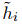计算如下:

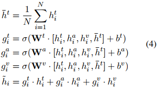

这里的Wt，Wa，Wv，bt，ba，bv是学习参数。σ为sigmoid函数，[·]表示向量的拼接。

然后，应用Transformer在句子层面充分学习语义、语音和视觉信息。所有字符的混合表示被打包成H0=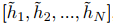，第i个字符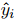的概率分布如下：

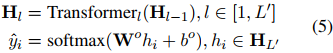

式中L`为Transformer层数，Wo和bo为学习参数。
#### 5.声音和视觉预训练(Acoustic and Visual Pretraining)
虽然声音和视觉信息是必不可少的CSC任务，同样重要的是如何将它们与正确的字符联系起来。为了学习语音-文本和视觉-文本的关系，我们提出对语音和图形编码器进行预训练。

对于语音编码器，我们设计了输入法预训练目标，即编码器在给定输入拼音序列的情况下恢复汉字序列。这就是中文输入法的作用。我们在编码器的顶部添加了一个线性层，将隐藏状态转换为汉字词汇表的概率分布。我们用训练数据中存在拼写错误的句子的拼音对语音编码器进行预训练，使其恢复出不存在拼写错误的字符序列。

对于图形编码器，我们设计了一个光学字符识别(OCR)预训练目标。给定汉字图像，图形编码器学习视觉信息，在汉字词汇表上预测对应的汉字。这就像OCR任务所做的，但我们的识别只在字符级别和输入脚本上进行。在预训练过程中，我们还在上面添加了一个线性层来进行分类。

最后，我们加载语义编码器、语音编码器和图形编码器的预训练权值，并使用CSC训练数据进行最终的训练过程。
