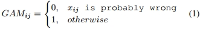

## An Error-Guided Correction Model for Chinese Spelling Error Correction(EMNLP2022) 
### 一.概述

模型需要避免过度校正，并将正确的token与语音和视觉上相似的token区分开来。本文提出了一种错误引导(error-guided)纠错模型(EGCM)，以提高汉语拼写纠错能力。利用BERT的强大功能，提出了一种新的零样本错误检测方法来进行初步检测，引导我们的模型更多地关注编码过程中可能出现的错误token，避免在生成过程中修改正确的token。此外，引入了一个新的损失函数来整合错误混淆集，使我们的模型能够区分容易被误用的token。再者，此模型支持高效并行解码，以满足实际应用需求。

代码：https://github.com/ruisun1/MaskPredict-main。

作者认为之前的方法存在一些问题：

首先，给定一个输入序列，只有一小段可能会拼写错误。然而，对于以前的大多数模型，它们在开始时完全看不到错误，因此它们在编码时平等地关注所有token，并从左到右生成每个token以进行推理。因此，以前的模型效率低下，可能会造成过度校正。由于这些模型获得了更强的纠正错误的能力，它们也倾向于错误地修改正确的token。

其次，混淆集为每个中文token定义了一组语音和视觉上相似的token，为拼写纠正提供了有价值的知识，如图2所示。但是，使用它的方法还有待进一步改进。由于模型每次都从混淆集中随机选择一个token，因此可能会忽略其它token。

第三，在实际应用中部署CSC模型时，推理的时间成本是一个需要考虑的关键问题。然而，以往的大多数模型都试图提高生成质量，而忽略了计算速度。

为此，提出一种错误指导的方法。首先，利用Bert，提出一个零样本的错误检测方法去做初步的检测，这能为校正模型提供正确的指导信号。根据指导，我们的模型更多地关注编码中可能出错的token，并在生成过程中固定可能正确的token，以避免过度校正。此外，还引入了一种新的损失函数来有效地集成混淆集。通过应用该损失函数，学习将混淆集中的每个相似token与目标token区分开来，并对最相似且被误用可能性最大的token给予更多关注。为了加快推理速度，我们采用掩码预测策略(mask-predict strategy)来支持并行解码，其中低生成概率的token被屏蔽并迭代预测。

本文主要贡献如下：

A.提出了一种新的零样本错误检测方法，该方法引导校正模型更多地关注编码中可能出错的token，并在推理中固定可能正确的token，以避免过度校正。

B.提出了一个新的损失函数来利用混淆集，使我们的模型能够区分相似的token，并更加关注容易被误用的token。

C.采用错误指导掩码预测解码策略进行拼写校正，支持高度并行解码，大大提高了计算速度。

D.将所有模块集成到一个统一的模型中，从而在校正质量和推理速度方面实现了新的最先进的性能。

### 二.方法概述

文中提出的Error-Guided纠错模型如图3所示。这里利用条件mask语言模型(conditional masked language model[CMLM])作为backbone，其是一个encoder-decoder架构。在CMLM架构中，原错误句子X=(x1,x2,x3,...,xn)，目标句子Y=(y1,y2,y3,...,yn)。Y中几个token被[MASK]替换，这些被替换的token构成Ymask集。Y中剩下的没有被mask掉的token构成Yobs集。对于CSC任务，给定一个源句子X和没有被mask掉的目标token集Yobs，目标是预测P(y|X,Yobs)的概率，以及生成token y，这里的y∈Ymask。

首先提出一种零样本拼写错误检测方法，为纠错模型提供两种引导信号，如图4所示。 第一个引导信号是用于错误聚焦编码器(error-focused encoder)的引导注意力掩码(Guidance Attention Mask)，其中可能正确的token被掩码，以推动我们的模型更多地关注错误的token。  第二引导信号是用于推理的引导(Guidance for Inference)，其用作解码的开始以避免错误地修改正确的token。此外，引入了一个新的损失函数来利用混淆集。在推理过程中，应用了一种错误引导的掩码预测策略(error-guided mask-predict strategy)，其中正确的token被固定，可能错误的token被掩码以及迭代重新预测。 
#### 1.零样本错误检测(Zero-shot Error Detection)
输入一个句子X=(x1,x2,x3,...,xn)，做一个初步的检测，检测哪些token可能是错误的，哪些是正确的。

如图4，首先通过重复n个句子，构建一个n×n矩阵(有多少字符重复多少次)，然后挨个对每个字符进行mask（看对角元素都是M）。然后利用Bert根据未mask掉的token对同行中的被mask掉的token进行预测。因此，对于句子X中从x1到xn的每个位置，都获得了预测的token及其概率。每个预测的top-k个概率的token作为候选项，这里假设，如果原始token xi出现在候选项中，则认为该token是正确的。否则，此token可能是错误的，需要更正。

基于以上错误检测的输出，这里构建2个引导信号，即Guidance Attention Mask和Guidance for Inference，如图4所示。Guidance Attention Mask(GAM)构建为一个矩阵：

以上xij表示第i个句子中的第j个token。GAMij表示在GAM中第i行第j列的元素。Guidance for Inference(GFI)是对原句子中所有错误的token进行mask。此外，GAM将被映射到以错误为中心的编码器(error-focused encoder)中，GFI将被用来初始化解码器。
#### 2.错误感知编码器(Error-aware Encoder)
利用transformer的encoder-decoder架构作为中文拼写纠错方案。这里融合以错误为中心的编码器(error-focused encoder)来改动transformer中的encoder，如图3的左边部分。Encoders是一个标准的Transformer编码器，在此基础上，引入了一个以错误为中心的编码器Encoderef，它利用引导注意力掩码(Guidance Attention Mask)来暴露可能错误的token，并将我们模型的注意力从正确的token上转移开。Encoders的输出被输入到以错误为中心的编码器(error-focused encoder)Encoderef中。Guidance Attention Mask(GAM)作为Encoderef计算自注意力时的一个额外的注意力mask，其将通知模型关注句子中的出错部分。Encoders和Encoderef的输出计算如下：

#### 3.训练中，集成错误混淆集(Integrating Error Confusion Set for Training)
训练时，Ymask中的token是来自对target正确句子中的随机选择，如图3。为了更好地适应汉语拼写纠正中单字符错误和多字符错误的要求，采用了两种屏蔽策略，即mask-sperate和mask-range。mask-sperate即是从句子中选择一定数量的单个字符进行mask；对于mask-range，即选择2或者3的跨度来选择连续的token进行mask。将这些mask掉的token用[MASK]替换，形成Ymask，这些[MASK]即是模型的生成对象。

在transformer解码器decoder中有3个注意力模块。self-attention模块之后，解码器首先关注原始错误句子的表示Hs。然后，解码器关注正确token被mask掉的句子的表示Hef。前一个解码器层的输出作为下一个解码器层的输入：

这里的H0=Embedding(Yobs)。Q，K，V是Quey，Key，Value矩阵。Yobs是target句子中未被mask掉的token集。由解码器在词汇表V上生成输出概率分布P:

这里，t表示序列长度。

在Ymask中的每个token上优化模型。在传统损失函数的基础上，引入了一种新的损失函数来整合混淆集知识。

使用最大似然估计(MLE)进行参数学习，并利用负对数似然(NLL)作为损失函数，其计算如下:

为了充分利用混淆集知识，引入了一种新的损失函数Lcs。对于Ymask中的每个token yi，根据混淆集找出yi的相似token的集合，即Yconf。将Yconf中的token视为yi的负样本。使用这些负样本来帮助我们的模型更好地学习目标token和相似token之间的差异。混淆损失Lcs的优化目标定义为:

这里的yc是yi在混淆集中的相似token。模型的最终优化目标为：

这里的γ 是平衡这2种损失函数的超参。
#### 4.错误指导生成(Error-Guided Generation)
在推理阶段，采用掩码预测方法(mask-predict)，其中低概率的token被mask掉，并在以一个常量次数的迭代中进行预测(迭代预测)。

为了给模型提供一个良好的生成起点，我们利用Guidance for Inference(GFI)作为解码的初始化。GFI生成一个草稿句子，其中可能错误的token被mask，而可能正确的token未被mask。在生成过程中，未被mask的token将被固定，并且在每次迭代中只考虑被mask掉的token进行修改。固定这些正确的token将有效地教会我们的模型避免过度校正。图5显示了我们的模型如何在3次迭代中纠正错误的句子。

模型运行一个预先确定的迭代次数T。草稿句子中[MASK]的数量以“Nori”表示。因此，在第t次迭代中被屏蔽的token数量定义为。是Guidance for Inference(GFI)中被屏蔽的token集。在后面的第t次迭代，我们从之前的t-1次迭代中概率得分最低的掩码token中选择Nt个token：

这里的pi是yi的概率分值，由公式(13)，(14)计算。是第t次迭代可能错误的被mask掉的token集，是在后面的迭代中被认为是正确和固定的未被mask掉的token集。在每次迭代中，模型根据源文本X和来预测中可能错误的token。我们为每个掩码token yi ∈选择概率最高的预测，并相应地更新其概率得分:

其中是yi被预测为词汇集V中的token为w的条件概率。
#### 5.局限性
在本文中，使用零样本拼写错误检测的结果作为指导信号。隐藏了可能有错token的句子和固定了其他token的句子被用作解码的开始。这意味着如果一个错误的token没有被分配[MASK] token，它将永远不会在以后的迭代中被纠正。

混淆集中相似的token是相互孤立的。然而，汉语存在各种拼写错误，目标token可能不在原token预定义的相似token集中。而这种错误是永远无法通过模型学习来纠正的。

