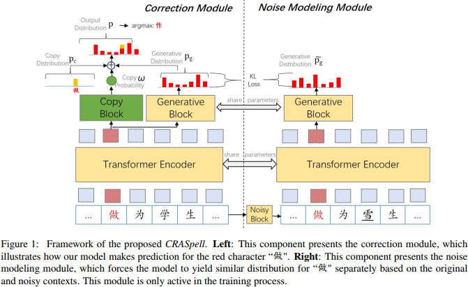
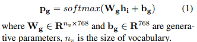
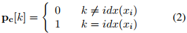
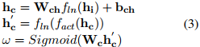
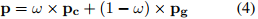
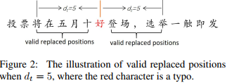
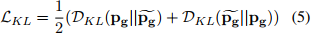
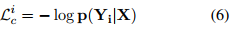
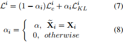

## CRASPell:A Contextual Typo Robust Approach to Improve Chinese Spelling Correction(ACL2022)
### 一．概述
作者认为基于bert的纠错模型有2个限制：(1)文本中有多个错别字符(文本中超过1个错别字)，会导致效果不好；(2)倾向将低频字符过纠为高频字符。为了使我们的模型对错别字带来的上下文噪声具有鲁棒性，我们的方法首先为每个训练样本构建一个有噪声的上下文。然后，校正模型被强制产生基于噪声和原始上下文的相似输出。此外，为了解决过度纠错问题，我们引入了copy机制，以鼓励我们的模型在纠错字符和输入字符根据给定上下文都有效时更倾向于选择输入字符(原始输入的字符和纠正后的字符在上下文都有效时)。

代码：https://github.com/liushulinle/CRASpell。

纠错模型本质上是基于上下文对错别字进行识别和纠正。在多错误样本中，上下文中至少包含一个错别字。这种错别字使得上下文中包含噪声信息，我们认为正是这种上下文中的噪声导致模型在多错误样本识别效果变差。作者称为上下文错误干扰(Contextual Typo Disturbance)。

Bert模型学习了如何从大语料库中基于上下文恢复掩码token。当一个被mask的位置有多个有效字符时，模型倾向于使用训练语料库中高频字符来恢复它。基于bert的模型倾向于将低频但有效的表达过度纠正为高频的表达。例如，“这并非是否...”过度纠正为“这不是説...”。作者称为过纠(Overcorrection)。

因此，解决以上问题的关键是提升模型对上下文噪声的建模能力。我们的方法首先为每个训练实例生成一个有噪声的上下文，然后强制校正模型基于原始和有噪声的上下文产生相似的输出。此外，为了解决过纠的问题，我们引入了copy机制。最后，给定文本中每个位置的输出是生成分布和复制copy分布的总和。这样原始输入的字符和纠正后的字符在上下文都有效时，原始字符将更有可能保持不变。

本文主要贡献如下：

A.指出了现有CSC方法的两个局限性：上下文错误干扰(Contextual Typo Disturbance)和过纠(Overcorrection)。

B.提出有效的方法去处理以上的局限性。
### 二．方法概述

上图由校正模块和噪声建模模块组成。
#### 1.任务定义
输入句子X={x1,x2,...,xn}，对其进行校对，生成正确句子Y={y1,y2,...,yn}。
#### 2.校正模块(Correction Module)
如图1的左边部分，输入的是句子embedding嵌入E={e1,e2,...,en}，这里的ei表示句子X中的字符xi的embedding，其是单词embedding，位置embedding和segment embedding的和(即bert的输入)。然后E输入到Bert中，产生隐表示矩阵H={h1,h2,...,hn},维度是768。该模块的最终输出是生成分布和copy分布的加权和，其中权重为模型学习到的copy概率。
##### (1).生成分布(Generative Distribution)
生成分布是通过图1中的生成模块(generative block)计算，是由一层带softmax的前馈网络计算得出：

##### (2).复制分布(Copy Distribution)
xi在词汇表中的索引表示为idx(xi)，xi的复制分布Pc∈{0, 1}nv用一个one-hot向量表示：

##### (3).复制概率(Copy Probability)
复制概率是通过图1中的复制模块(copy block)计算，是一个带layernorm的2层前馈网络：

这里的hi是transformer模块输出的隐状态表示，Wch∈R768×dc，bch∈Rdc，Wc∈Rdc×1是模形参数，fact是激活函数，fln是layernorm函数。

最后输出的分布P：

模型在最终输出中包含了复制分布Pc，这使得我们的模型有更多的机会选择(原始的字符，不用校正改变)输入字符(它是有效的，但不是Bert输出最好的)。
#### 3.噪声建模模块(Noise Modeling Module)
噪声建模模块旨在通过鼓励校正模型为原始和噪声上下文产生相似的分布来解决上下文错字干扰问题。如图1的右边部分，该模块首先根据输入样本生成一个有噪声的上下文，然后将有噪声的上下文作为输入，生成一个生成分布。最后，强制生成分布与校正模块生成的分布相似。注意，噪声建模模块仅在训练过程中有效。
##### (1).噪声块(Noisy Block)
该组件通过替换原始训练样本的字符来生成噪声上下文。有两个因素影响生成的噪声上下文的质量，如下：

A.替换哪些位置？

错字周围的噪声影响了CSC模型对错字的校正。因此，我们从错别字位置进行采样以进行替换，这被定义为距离最近的错别字小于dt个token的位置。图2显示了dt = 5时的有效替换位置。如果文本不包含任何错字，则噪声块将直接输出原始文本，而不进行任何替换。

在我们的工作中，对每个错别字，我们最多只替换一个位置。如果有效位置已经存在错字，我们将不会替换任何位置。

B.用什么字符替换?

用混淆集中相似的字符进行替换：(1)70%的时间，用随机的音似的字符替换；(2)15%的时间用随机的形似字符替换；(3)15%的时间用随机的词汇表中的字符替换。
##### (2).生成分布(Generative Distribution)
给定一个训练样本A，噪声建模模块产首先构建一个A的噪声实例B，然后按照公式(1)对B计算生成一个生成分布。这里的transformer编码器和生成块(generative block)与校正模块(correction module)共享参数。
##### (3).KL散度损失(KL-divergence Loss)
通过最小化生成分布之间的双向KL散度，强制校正模块和噪声建模模块产生相似的输出：

#### 4.学习
给定一个训练样本(X,Y),第i个token的校正损失(correction loss)为：

这里的X是字符序列，Y是对应正确的字符序列，p是公式(4)的输出分布。通过优化2个目标进行学习：

α是用于Lc和LKL的平衡因子。请注意，构造噪声本身不会参与训练过程，而只作为上下文活动。该策略旨在确保构造噪声不会改变训练语料库中正样本和负样本的比例。