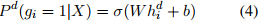

## MDCSpell: A Multi-task Detector-Corrector Framework for Chinese Spelling Correction(ACL2022)
### 一.概述
作者认为基于Bert的纠错模块直接对句子的每个字符进行校正，这不是最优的，因为它们只根据上下文来纠正句子的每个字符，而上下文很容易被拼写错误的字符误导。还有一些工作提出使用错误检测器(error detector)通过mask掉检测到的错误来指导校正。然而，这些方法抑制了拼错字符的视觉或语音特征，而这些特征对校正至关重要。

为此，提出了一种新的通用检测-校正多任务框架，其中校正器使用BERT来捕获原始句子中每个字符的视觉和语音特征，检测器使用一个轻型transformer来检测拼错字符的位置。并使用后期融合策略来融合校正器的隐状态和检测器的隐状态，通过端到端的联合训练消除拼错字符的误导影响。

本文主要贡献：提出了一种新的通用多任务检测-纠错CSC框架MDCSpell，该框架既可以利用对纠错至关重要的视觉和语音特征，又可以最大限度地减少其对上下文的误导影响。该框架易于实现，并且任何基于bert的CSC模型都可以很容易地适应该框架。
### 二.方法概述
#### 1.问题定义
输入一个句子X=(x1,x2,...,xn)，校对后的句子Y=(x1,x2,...,xn)。
#### 2.动机

图1中(a)部分的直接预测方法的缺点是缺乏对错别字位置的认识，仅仅根据上下文来纠正每个错别字，容易被错别字误导。(b)部分在纠错模块前增加检测模块，mask掉可能出现错误的位置，并在被mask掉的位置预测正确的字符。尽管这种方案在一定程度上削弱了拼写错误的误导性影响，但它也导致了一个新的问题：纠错性能仍然可能是次优的，由于拼写错误的字符的语音和视觉信息(有助于校正，可能与正确的字符高度相似)，被mask抑制。(c)部分是文中提出的方案，直接将原句作为纠错模块的输入，保留了错字的视觉和语音特征，之后纠错模块的隐状态与检测模块的隐状态进行了融合。通过端到端联合训练，将拼错字符的误导影响降到最低。
#### 3.MDCSpell结构

提出的框架如上图，其主要由一个基于transformer的检测器和一个基于bert的校正网络组成。这2个网络的输入共享word embedding。在校正网络的最后，融合校正和检测的隐状态，融合后的信息输入到一个分类层，从而生成校正结果。这2个网络是同时进行端到端训练。

具体来説，对句子进行word embedding+position embedding+segment embedding，产生句子表示(这是常规操作)。将句子表示输入到检测和校正网络去分别获取编码向量。检测网络是基于多层transformer的结构，需要拟合每个位置的字符是否拼错。因此，检测网络的输出编码向量包含了位置可能出错的概率信息。校正网络是一种基于BERT的结构，需要检测每个位置需要输出什么字符。接下来，我们将两个编码向量的信息融合以生成最终的编码向量。最后，由词嵌入表(word embedding table)转置初始化的密集层(dense layer)以最终编码向量作为输入，生成预测结果。
#### 4.检测网络(Detection Network)
检测网络是基于transformer结构的二分类任务，用于确定每个位置字符的错误概率。这部分的输入是句子的词嵌入+位置嵌入+段嵌入。然后经过transformer编码器，输出检测编码向量。最后，通过一个映射层，将编码向量映射到2维空间，这表示每个位置字符的正确和出错概率。这里使用多层相同的transformer结构，每个transformer的block定义如下：

这里的Q，K，V是当前输入序列的表示。MultiHead和FFN分别是多头和前馈。这里定义transformer块最后一层的隐状态为，此隐状态既用于预测拼错字符的位置，又将位置信息传递给校正网络(corrrection network)。这里利用一个dense层和一个激活函数去预测是否是错字。对于原始输入句子中的每个字符的出错概率如下：

这里的Pd(gi=1|X)是条件概率，表示与hdi对应的字符拼写出错的可能性，σ 为sigmoid函数，hdi表示检测网络最后一层的输出，W和b是dense层的参数。
#### 5.校正网络(Correction Network)
校正网络是一种基于BERT-base的多分类任务，用于寻找正确的字符来替换拼写错误的字符。Bert-base由12个相同的transformer块组成，其最后一层的隐状态为。

然后，对检测网络和校正网络的隐状态进行融合。这里直接加和：

这里的Hd是检测网络中transformer最后一层的隐状态，Hc是校正网络bert最后一层的隐状态。

最后，这里不将校正任务作为一个随机初始化映射层的分类任务，而是作为一个相似度任务，即如果一个位置的字符是正确的，那么通过检测和校正网络的编码，最终编码的向量应该与输入字符(原始的输入字符)的词嵌入非常相似。相反，如果一个位置的字符是错误的，那么最终的编码向量应该与正确字符的词嵌入相似。分类任务的公式如下:

这里使用词嵌入表的转置(the transpose of the word embedding table)来初始化映射层W的权重，而不是随机初始化。(大量的随机初始化映射矩阵参数，可能导致收敛缓慢，最终导致性能不佳。考虑它们的相似性，我们利用词嵌入表的转置来初始化映射层的权重。通过这样做，校正网络的训练收敛速度大大提高，并稳定地达到预期的性能。)
#### 6.训练
将检测任务定义为字符是否需要修改的分类任务，将校正任务定义为正确字符是什么的分类任务，并将它们的损失函数形式化为：

Ld和Lc分别是检测与校正的损失，将这两个函数线性组合：

λ ∈ [0， 1] 。
我们使用预训练BERT作为校正网络。为了更快的收敛，我们用BERT的前两层和嵌入层初始化检测模块中transformer的权值。整个训练过程分为两个阶段。第一阶段是使用将近300万训练数据对模型进行微调，其中batchsize为32，学习率为2e -5。第二阶段是在SIGHAN训练数据上对模型进行微调，其中batchsize为32，学习率为1e-5。

