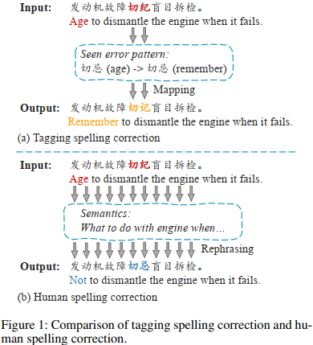
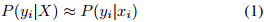
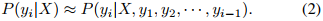
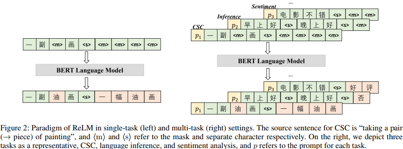
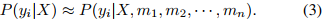

## Chinese Spelling Correction as Rephrasing Language Model(AAAI2024)
### 一．概述
目前最先进的方法将CSC(Chinese Spelling Correction)作为序列标注任务，并在句子对上微调基于bert的方法。然而，我们注意到在将一个字符标注为另一个字符的过程中存在一个严重缺陷，即校正过于依赖于错误。这与人类的思维方式相反，在人类的思维方式中，人们根据语义重新表述完整的句子，而不是仅仅根据之前记忆的错误模式。这样对于机器纠错带 来了通用性和移植性瓶颈。

为此，我们提出了复述语言模型(Rephrasing Language Model, ReLM)，该模型被训练成通过填充额外的槽来复述整个句子，而不是字符到字符的标注。

代码：https://github.com/gingasan/lemon

作者认为基于序列标注的纠错模型在训练过程中大量记忆错误字符和正确字符之间的映射，并简单地复制其他字符，这在测试集中仍然可以获得不错的分数。但这意味着最终的纠正将过度地依赖于原始错误本身，而忽略了整个句子的语义。上图(a)部分，模型会强记见过的编辑对，导致在新的样本上表现很不好。最根本原因来源于Tagging(标注)这种拟合方式，模型会不可避免地陷入到上述强记的问题。(b)部分，和Tagging不一样，我们大部分时候不会关注句子里典型的易错字，而是会注重看懂这个句子想表达什么，也就是语义（semantics）。随后，我们会根据记住的这个句子的大概，在心里把它重新写一遍，只是这个过程一般只发生在潜意识里。

不同于字符到字符的序列标注，我们提出将句子重新表述作为微调CSC模型的训练目标，称为rephrasing Language model (ReLM)，其中源句子将首先编码到语义空间中，然后根据给定的掩码槽(mask slots)将其表述为正确的句子。ReLM模型也是基于Bert。

本文主要贡献如下：

A.提出ReLM来缩小机器拼写纠正和人工拼写纠正之间的差距。

B.ReLM显著增强了CSC模型的泛化性，并在微调和零样本CSC基准测试中刷新了新的最先进的结果。

C.探讨了并增强了CSC对其他任务的可移植性。

D.分析表明，ReLM有效地利用并保留了预训练模型中预训练的知识，而标注模型则没有。
### 二．方法概述
#### 1.问题定义
输入一个句子X={x1,x2,...,xn}，模型对其中可能错误的字符进行校正，生成结果Y={y1,y2,...,yn}。
#### 2.标注(Tagging)
序列标注是许多自然语言处理任务中的常见模型，其中模型被训练以将一个字符映射到另一个相应的字符，例如命名实体识别，词性标记。所有这些任务都共享一个关键属性，即它们强烈依赖于输入和输出字符之间的对齐信息。CSC模型可以极大地记忆将xi纠正为yi的不重要的编辑对，并在xi的不同上下文中继续应用，而无需参考语义。因此，原来的训练目标退化为：

这里的xi是一个错误字符。
#### 3.复述(Rephrasing)
在本文中，我们提出用复述代替序列标注作为CSC的主要训练目标。为了消除模型拟合错误的趋势，这里训练预训练模型去复述原始句子。具体来说，Transformer层首先将源句子转移到语义空间。然后，该模型生成一个新的句子，同时根据语义纠正其中的所有错误。这个过程与人类进行拼写纠正的过程是一致的。当一个人看到一个句子时，他首先会把这个句子记在脑子里(类似于把它编码到语义空间)，然后根据他的语言本能(PLM中预训练的权重)把这个语义转换成一个新的句子。我们看到，除了学习序列标注之外，预训练知识为这种学习复述提供了很好的基础。而序列标注并没有很好地利用预训练的好处。

复述过程也可以基于自回归架构建模，并使用解码器逐个生成输出字符。具体来说，我们将源字符X和目标字符Y连接起来作为输入句子，{x1,x2,...,xn,<s>,y1,y2,...,yn,<eos>}，这里的<s>和<eos>是分隔符和结束符。训练模型自回归预测所有目标字符。因此，基于复述的拼写纠正寻求解决以下概率(yi,i>=1)：

#### 4.复述语言模型(Rephrasing Language Model)

基于Bert结构，提出非自回归复述模型ReLM。如上图，输入句子拼接上等数量的[MASK]，即{x1,x2,...,xn,<s>,m1,m2,...,mn}，随后让模型在这些[MASK]上重新写一遍原句，并改正其中的潜在错别字。由于BERT可以同时看到左侧和右侧上下文，因此ReLM寻求解决yi, i=1~n的以下概率:

ReLM优于自回归模型，因为它总是可以生成与输入相同长度的输出句子，这使得它更加准确。
#### 5.辅助掩码语言建模(Auxiliary Masked Language Modeling)
与标注模型不同，在CSC上进行微调的ReLM仍然是以语言模型为核心。然而，模型仍然有机会学习源句和目标句的对齐。因此，我们提出了一个关键策略，即用未使用的token统一地掩盖源句子中的一小部分非错误token，以极大地正则化模型，防止学习字符到字符的对齐。ReLM最终需要纠正潜在的错字，同时恢复整个句子。
#### 6.与序列标注的区别(Distinguish from Sequence Tagging)
ReLM是P（yi|X）的有偏估计，它对P（yi|X，m1，m2，··，mn）进行优化。模型依赖于整个语义。与公式(1)相反，公式(3)预测yi以整个源句子X作为条件。具体来说，在ReLM中没有字符对齐，并且模型不允许像在序列标注中那样找到执行字符到字符映射的快捷方式。
#### 7.ReLM用于多任务(ReLM for Multi-Task)
在典型的多任务学习中，我们为每个任务添加一个特定的分类头，并为所有任务训练一个共享编码器。例如，CSC将在具有句子分类的编码器内共享相同的语言表示。然而，实证分析表明，当传统的基于标注的CSC与其他任务联合训练时，它的性能可能会大大下降。

相比之下，以语言模型为核心的ReLM自然适合语言建模之上的多任务学习，而基于标注的CSC则不适合。具体地说，每个单独的任务都被模板化为mask语言建模的格式，如图2所示。一般来说，所有的任务都统一为一种类似复述的格式，这增强了CSC对各种任务的可移植性。此外，ReLM支持提示调优。我们在输入的句子前面加上一系列可训练的字符作为提示符，引导模型针对不同的任务，并针对每个任务优化相应的提示符。我们发现，引入提示可以进一步改善结果，但程度不大。
