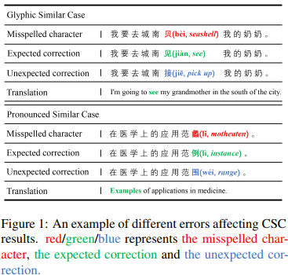
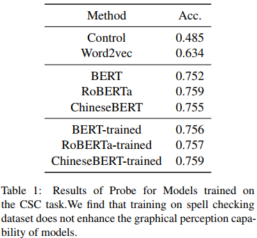
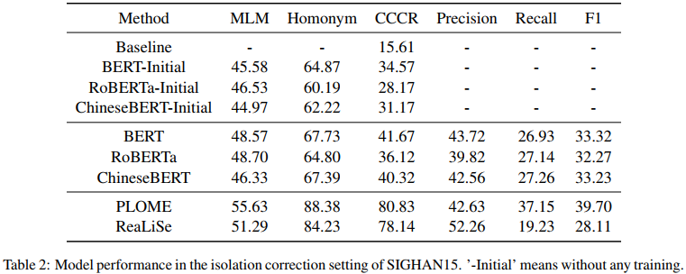

## Investigating Glyph-Phonetic Information for Chinese Spell Checking:What Works and What’s Next?(ACL2023) 
### 一.概述
之前的研究已经探索了利用字形和发音等信息来提高CSC(Chinese Spell Checking)模型识别拼错字符的能力，并在公共数据集上取得了较好的准确率。然而，这些CSC模型的泛化能力尚未得到很好的理解:尚不清楚它们是否包含字形-语音信息，如果包含，是否充分利用了这些信息。在本文中，我们旨在更好地理解字形语音信息在CSC任务中的作用，并提出改进的方向。

代码：https://github.com/piglaker/ConfusionCluster。

作者认为目前CSC取得了一些进展，但CSC模型的泛化性在实际应用中仍然受限。如何提高CSC模型的泛化能力?目前的模型能否识别并利用字形语音信息进行预测?作者重新审视以前的工作，确定了一些以前未探索的问题和潜在的未来研究方向：

Question1： 现有的中文预训练模型是否对汉字的字形语音信息进行编码？ 汉语文字是形态语义的，汉字中包含着附加的语义信息。在研究现有的CSC模型之前，我们试图研究现有的主流中文预训练语言模型是否有能力捕获字形语音信息。

Question2：现有的CSC模型是否充分利用拼错字符的字形语音信息进行预测?在CSC任务中引入字形语音信息可以帮助识别拼错字符，提高模型的性能。然而，现有的CSC模型是否能有效地利用字形语音信息的研究却很少。

从经验上讲，主要观察总结如下：

A.证明了BERT等中文预训练语言模型在预训练过程中对字形-语音信息进行编码而不需要明确的引入，这可以为未来中文预训练模型的设计提供见解。我们还提出了一个简单的探测任务，用于测量中文预训练模型中包含多少字形语音信息。

B.分析了CSC模型利用拼错字符的能力，并解释了为什么目前的CSC方法在测试集上表现良好，但在实践中表现不佳。提出了一种新的探测实验和一种新的基于拼错字符覆盖率(CCCR)的度量校正。

C.提出了一个新的CSC任务设置，称为隔离校正，以更好地测试CSC模型的泛化性和校正性能。这种设置减轻了原始数据集中存在的短板，使CSC任务更具挑战性和现实性。
### 二.实验1：字符字形-语音的探究
在本节中，我们进行了一个简单的基于mlp的探究，以探索中文预训练语言模型中字形和语音信息的存在，并量化token捕获字形-语音信息的程度。在本实验中，我们分别考虑字形和语音信息。
#### 1.字形探究(Glyph Probe)
对于字形，训练一个二元分类器探测来预测一个字符是否包含在另一个字符中。我们使用中文预训练语言模型中这些字符的冻结嵌入作为输入。
#### 2.语音探究(Phonetic Probe)
对于语音，我们训练了另一个二元分类器探测来预测两个字符是否具有相似的发音，同样使用来自中文预训练语言模型的这些字符的冻结嵌入作为输入。
#### 3.结果和分析

我们发现，不同范式构建的语言模型在感知图形信息方面大致接近，但在感知语音信息方面较弱。值得注意的是，ChineseBERT在这个探测上的表现更为显著，可能是因为它从嵌入阶段就明确地引入了图形和发音信息。

我们发现在拼写检查数据集上进行训练并不能提高模型的图形感知能力。
### 三.实验2：同形同音校正的探究
在这个实验中，我们的目标是探索现有模型在多大程度上可以利用拼错字符的信息。为此，提出了一种新的探测方法，即CCCR (Correction with Misspelled Character Coverage Ratio)，考察该模型在进行预测时能否根据拼写错误字符的字形语音信息调整其预测概率分布。我们提出了一种方法来评估模型使用来自拼写错误字符的附加信息进行预测的能力，以及评估模型是否包含字形-语音信息。

为了测试模型的泛化能力，我们设计了隔离校正任务，去除训练集中所有重叠的对和测试集中所有重复的对。通过隔离，训练集减少了约16%。我们认为这样的设置可以更好地测试模型的泛化性，更具挑战性和实用性。在CCCR探针中，我们探索了模型是否依赖于其信息的能力，而不仅仅是记住孤立的SIGHAN数据集上的内容的能力。

结果和分析：

我们在三个通用中文预训练语言模型 (BERT、RoBERTa和ChineseBERT)和两个CSC模型(PLOME和realize)上进行了实验。在对隔离训练集进行微调后，我们比较了初始模型和模型之间的度量差异。结果如上图表2所示。

CCCR和F1值不匹配：结果表明，CSC模型的CCCR值与F1值不匹配。在隔离训练设置中，我们观察到PLOME和realize的F1值都明显低于表2中的表现，这表明它们做出正确预测的能力主要基于训练集中校正对的记忆。然而，他们的CCCR值仍然很高，这表明他们能够区分字形信息，但不能有效地纠正它。

在隔离校正实验中，刻板印象损害模型的泛化能力：这些结果表明，模型的校正性能主要依赖于它们的记忆能力，而对记忆的强烈依赖会阻碍泛化。隔离设置中较差的性能表明，目前的方法都没有很好的泛化，这对未来的CSC研究提出了重大挑战。我们建议该领域的未来研究遵循隔离实验设置来解决这一挑战。
### 四.结论
本文探讨了拼错字的字形信息在汉语拼写检查中的作用。根据我们的实验结果，我们得出以下结论:

1.目前的中文预训练语言模型编码了一些字形信息，但很少有语音信息。

2.现有的CSC模型不能充分利用拼错字符的字形语音信息进行预测。

3.SIGHAN数据集的训练集和测试集之间存在大量重叠，不利于测试CSC模型的泛化性。提出了一个更具挑战性和实用性的设置来测试CSC任务的泛化性。

作者认为文中详细的观察可以为该领域的未来研究提供有价值的见解。显然，对字形语音信息进行更明确的处理是必要的，研究人员应该考虑如何充分利用这些信息来提高CSC模型的可泛化性。