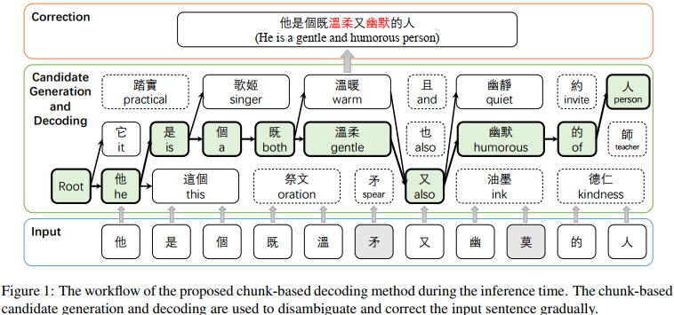
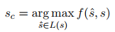
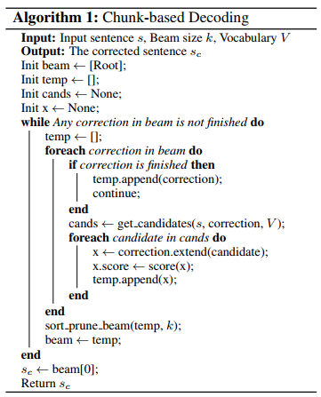
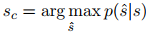
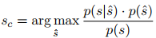
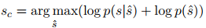
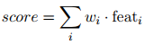
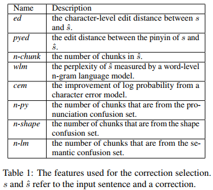
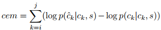

## Chunk-based Chinese Spelling Check with Global Optimization(EMNLP2020)
### 一.概述
&emsp;&emsp;作者认为，一方面，以往的工作大多只考虑对汉字读音或字形相近的错字进行校正，而没有对视觉上和语音上不相关的错字进行校正；另一方面，pipeline的体系结构被广泛用于处理各个模块中不同类型的拼写错误，这很难优化。

&emsp;&emsp;为此，作者提出：

&emsp;&emsp;1.用语义候选集扩展了传统的混淆集，以涵盖不同类型的错误

&emsp;&emsp;2.提出了一个基于块的(chunk-based))框架来统一纠正单字符和多字符的单词错误

&emsp;&emsp;3.采用全局优化策略来实现句子级的纠错选择

&emsp;&emsp;本文主要贡献如下：

&emsp;&emsp;1.提出了一种全局优化的基于块的解码方法，在统一的框架内纠正单字符和多字符的单词错别字

&emsp;&emsp;2.结合发音、形状和语义混淆集来处理不同的拼写错误

&emsp;&emsp;3.方法在三个基准数据集和一个OCR数据集上实现了新的最先进的性能

### 二.方法概述
 

&emsp;&emsp;上图是所提方法的流程。本文提出的拼写检查方法采用基于块的解码方法，统一处理单字和多字单词。在解码过程中，根据输入句子和部分解码后的句子动态生成可变长度的候选词。为了选择最佳的校正结果，采用全局排序优化方法将不同的特征组合在一起。
#### 1.基于块解码(Chunk-based Decoding)
&emsp;&emsp;基于块的解码将单字符单词、多字符单词、短语和习语等同地视为块。它提供了一个统一的框架，我们可以在其中轻松地扩展候选生成方法。该框架还使全局优化的实现成为可能。 给定一个具有n个字符的输入句子=[c1,c2,...,cn]，基于块的解码同时逐步分块和校正输入的句子。 它试图找到候选块的最佳组合，并以从左到右的方式将输入句子改写为正确形式:

 

这里的f 是一个评分函数，s是输入的句子，L(s)表示s的候选块的所有可能组合的集合。

 

&emsp;&emsp;如上图所示，解码用的是beam search，beam利用空的校正(empty correction)进行初始化。在循环中，我们用动态生成的候选块扩展beam中每个部分解码的校正。一个评分模型被用来给每个校正一个置信度分数。在每个循环结束时，我们对beam进行排序并以低置信度对校正进行剪枝以减少搜索空间。最后，在beam的每次校正对整个输入句子进行解码后，我们输出最高置信度的校正作为最终结果。

&emsp;&emsp;本质上，解码阶段联合搜索所有可能的分块及其校正。从另一个角度来看，解码逐渐消除歧义并改写句子。 
#### 2.候选生成(Candidate Generation)
&emsp;&emsp;之前的工作针对候选词的检索是根据发音或形状混淆集。为了处理单字符单词拼写错误和视觉上或音系上无关的拼写错误，我们将发音和形状混淆集扩展为语义混淆集。

&emsp;&emsp;候选生成模块假定输入句子中的每个字符都可能拼写错误。根据三个方面的混淆集，我们生成了所有可能的块候选，用于部分解码的校正。给定词汇表V、输入句子s和起始位置i，我们将从i开始且在最大长度范围内的字符块视为潜在的打字错误，并生成可能的校正候选项:

发音：给定一个字符块chunkij = [ci,···,cj]从句子s中的第i个字符到第j个字符，我们将chunkij转换为它的拼音，并从V中检索发音相似的所有候选字符。

形状：除了发音，我们还考虑了候选人的形状相似。在chunkij中，我们用视觉上相似的字符替换字符，并保留可以在V中找到的候选字符。在实践中，为了在速度和质量之间取得平衡，我们只考虑与chunkij有1次编辑距离(1次替换)的候选项。

语义：除了音似和形似外，这里也利用语言模型根据上下文信息检索语义上合理的候选词。这里利用masked language model作为语言模型，并在CSC训练数据上对预训练的masked 模型进行微调，并使用每个字符的前k预测作为语义混淆集。对于候选词的生成，我们将chunkij中的每个字符替换为语义相似的字符，并保留在V中可以找到的候选词。与形状混淆集类似，在实践中，我们只考虑与chunkij有1个编辑距离(1个替换)的候选项。
#### 3.校正选择(Correction Selection)
&emsp;&emsp;这里将介绍校正选择的训练策略和我们用于全局优化的特征。之前的大部分工作都遵循噪声信道模型，该模型将纠错任务表述为:

 

其中s是输入句子，s^表示可能的校正。该公式可以通过贝叶斯规则进一步改写为：

 

其中p(s|s^)和p(^ s)分别为错误模型概率和句子概率。然后我们忽略p(s)因为它对每个s^都是常数，然后取对数：

 

该公式将错误模型概率与句子概率以对数形式结合为线性模型。在实践中，错误模型和句子概率是复杂的。在实验中，我们使用一组特征，并采用线性模型作为打分函数进行近似。

 

其中wi是第i个特征feati的权重。

&emsp;&emsp;下表列出了我们用于校正选择的特征及其描述。

 

&emsp;&emsp;其中ed和pyed通过字符级和发音级来计算纠错句和输入句的相似度。较长的数据块通常比较短的数据块更明确，因此使用较少n-chunk的校正通常更合理。wlm用于检查修正的流畅性。n-py, n-shape和n-lm为不同的混淆集分配权重。cem用于对字符级错误概率进行建模。我们直接使用语义混淆集中经过微调的掩码语言模型(masked language model)作为错误模型。当一个块字符[ci,···,cj]被[ c^i,···,c ^j]替换，我们计算块级(chunk-level)cem近似为:

 

&emsp;&emsp;其中p( c^k|ck,s)是在给定输入句子s的情况下用c^k替换ck的概率。

&emsp;&emsp;对于不同特征的组合，我们采用最小错误率训练(MERT)算法。给定前n个输出，MERT算法通过学习将解码后的句子根据与金句的相似度重新排序来优化评分函数。MERT算法不是局部排序，而是直接通过句子级指标度量相似性，以实现全局优化。
