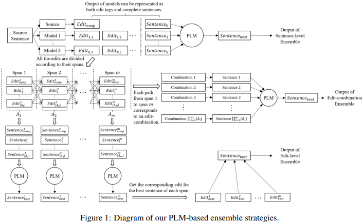
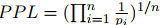
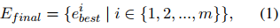
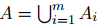
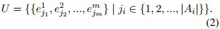
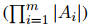
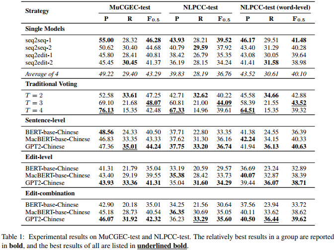

## Are Pre-trained Language Models Useful for Model Ensemble in Chinese Grammatical Error Correction?(ACL2023)
### 一.概述
模型集成被广泛用于语法错误纠正(GEC)，用于提高了模型的性能。假设基于预训练语言模型(PLMs)计算的困惑度(PPL)的模型集成将有利于GEC系统。为此，我们探索了几种基于具有四个复杂单一模型的强预训练语言模型集成策略。然而，在基于预训练语言模型的集成之后，性能并没有提高，甚至会变得更差。这个令人惊讶的结果让我们对数据进行了详细的分析，并提出了一些关于GEC的见解。在测试数据中，正确句子的人为参考远远不够，正确句子与惯用句子之间的差距值得我们关注。此外，基于预训练语言模型的集成策略为扩展和改进GEC基准数据提供了有效的方法。

代码：https://github.com/JamyDon/PLMbased-CGEC-Model-Ensemble。

在这项工作中，我们假设在预训练语言模型计算的困惑度(PPL)的帮助下选择最佳集成输出应能提高CGEC的最终性能。我们对四种CGEC模型进行了集成实验，包括两个序列-序列模型(sequence-to-sequence)和两个序列-编辑模型(sequence-to-edit)。我们尝试了四种集成策略:传统投票(traditional voting)、句子级集成(sentence-level ensemble)、编辑级集成(edit-level ensemble)和编辑组合集成(edit-combination ensemble)，后三种策略利用了预训练语言模型的能力。

令我们惊讶的是，与预训练语言模型集成的结果并不超过传统投票的结果，甚至比大多数单一模型还要差。为了找出为什么低PPL不能带来更好的GEC性能，我们对集成结果进行了详细的分析，并得到了一些关于GEC的见解:

1)在测试数据中，人工参考不足，而基于预训练语言模型的集成策略经过人工检查后产生了有价值的候选，可以认为是对人工参考的必要补充。

2)当面对一个错误的句子时，人类专家会以最小的努力纠正它，而基于预训练语言模型的集成策略会生成更自然、更地道的文本，这对海外语言学习者有很大的帮助。

3)基于预训练语言模型的模型能力强大，虽然试图生成流畅的句子，但有时会忽略源句子的原意，导致过度纠错，这在未来的工作中需要解决。
### 二.基本方法
#### 1.单CGEC模型
文中实现了4个单模型作为基线，分别是2个seq2seq模型和2个seq2edit模型。
##### (1).seq2seq模型
这两个seq2seq模型都是基于BART-base-Chinese。一个seq2seq模型采用“dropout-src”策略，输入句子中的每个token都以10%的概率替换为“[PAD]”。另一种是在正常训练之前，在THUCNews上构建的合成数据上进行预训练。
##### (2).seq2edit模型
我们使用GECToR-Chinese作为我们的seq2edit模型，以预训练的Structbert-large-Chinese作为backbone。我们的两个seq2edit模型只是在随机种子上有所不同。
#### 2.预训练语言模型
采用三个预训练语言模型来进行模型集成。
##### (1).Bert-base-chinese
它在两个任务上进行预训练:掩模语言模型(MLM)和下一句预测(NSP)。在MLM中，每个token有15%的机会被替换，15%中有80%替换为”[MASK]”，10%替换为随机单词，10%使用本身。
##### (2).MacBert-base-chinese
类似于BERT，但在MLM中采用了全词屏蔽、N-gram屏蔽和相似词替换。此外，利用句子顺序预测(SOP)代替NSP。
##### (3).Gpt2-chinese
它采用生成式预训练，通过仅提供前一个单词来预测句子中的下一个单词。
### 三.集成策略

以源句子和四个单一模型的输出作为输入，提出了四种集成策略。我们基于预训练语言模型的集成策略如上图所示。
#### 1.传统投票(Traditional Voting)
不同的模型为最终结果投票。对于每个句子，我们认为不少于T个模型建议的编辑操作作为正确结果。在我们的工作中，我们对T从2到4进行实验。
#### 2.句子级集成(Sentence-level Ensemble)
使用不同的预训练语言模型，我们计算了源句子的困惑度(ppl)和四个单一模型的输出。具体来说，给定一个句子S = (w1, w2，…， wn)， 预训练语言模型计算出单词wi的概率记为pi，然后。选择PPL最低的句子作为最终输出。
#### 3.编辑级集成(Edit-level Ensemble)
给定源句子S，单个模型建议的所有编辑构成候选集合A，编辑跨度的个数记为m。编辑跨度表示编辑在句子中位置的开始-结束对。第i个编辑跨度(包括“noop”)上的所有编辑(来自不同的单个模型)的集合表示为Ai。A=，eij表示第i个编辑跨度(edit span)上的第j个编辑(edit)。

对于每个编辑跨度(Ai in A)，我们生成|Ai|新句子，每个句子对应Ai中的单个编辑。然后，我们用预训练语言模型计算这些新句子的PPL，并接受PPL最低的句子对应的编辑，我们将其标记为eibest。

使用每个跨度的最佳编辑，即最终编辑集Efinal结合了这些最好的编辑，描述为:

然后在Efinal的基础上产生最终的假设句。
#### 4.编辑组合集成(Edit-combination Ensemble)
一个源句子可能包含不止一个错误。对于每个句子，该策略将所有编辑组合应用于源句子并生成许多新句子。

具体来说，给定源句S，编辑候选集合A仍然为，然后我们得到所有可能的编辑组合：

然后，生成新的句子，每个都对应于U中的编辑组合。PPL最低的句子将被接受为最终输出。考虑到计算复杂度，我们只对编辑组合个数不超过300个的句子应用此策略。
### 四.结果

实验结果如上表所示。传统的投票策略达到了最好的性能，在字符水平上得分为44.09 F0.5，明显高于最佳的单一模型。随着阈值T的增大，准确率上升，召回率下降。当T = 3时，F0.5得分达到峰值。

然而，基于预训练语言模型的集成策略的性能比简单的投票策略差得多，甚至低于大多数单一模型。在准确率和召回率方面，传统投票比单一模型的准确率更高，召回率更低，而基于预训练语言模型的策略则相反。在三种集成策略中，句子级集成策略效果最好。

在不同的预训练语言模型中，GPT2-Chinese在三种集成策略中都取得了最好的效果。这可能是因为基于bert的模型天生擅长掩模预测，而不是计算整个句子的ppl。随后，我们基于GPT2-Chinese进行了进一步的分析。
