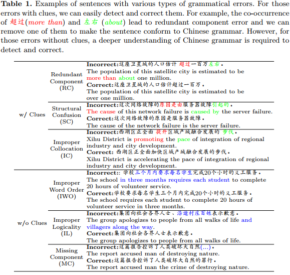
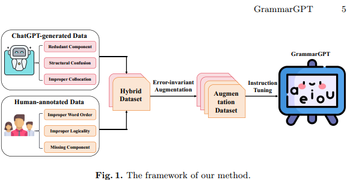
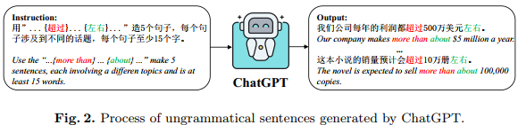
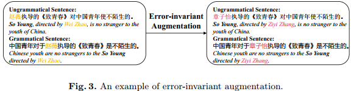
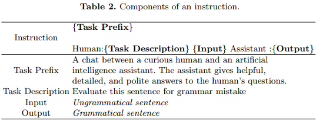

## GrammarGPT Exploring Open-Source LLMs for Native Chinese Grammatical Error Correction with Supervised Fine-Tuning(arxiv2023)
### 一．概述
语法纠错的目的是自动纠正不符合语法的句子。最近，一些工作已经证明了闭源大型语言模型(llm，例如ChatGPT)在语法错误纠正方面的出色能力。然而，开源llms(大语言模型)的潜力仍未得到开发。本文介绍了开源llm GrammarGPT，初步探讨了其在汉语语法纠错方面的潜力。GrammarGPT的核心配方是利用chatgpt生成和人工注释的混合数据集。对于有线索的语法错误，我们提出了一种启发式方法，通过提供线索来引导ChatGPT生成不符合语法的句子。对于没有线索的语法错误，我们从公开的网站上收集不符合语法的句子，并手动纠正它们。此外，我们采用错误不变增强方法来增强模型对汉语母语语法错误的纠正能力。我们最终构建了大约1k个并行数据，并利用这些数据对开源llm进行指令微调(这里采用大模型Phoenix，由港中文开发)。实验结果表明，GrammarGPT显著优于现有的SOTA系统。尽管模型参数比SOTA基线大20倍，但指令微调所需的数据量却少了1200倍，这说明了开源llm在本地CGEC上的潜力。

代码：https://github.com/FreedomIntelligence/GrammarGPT 

上图列出了以中文为母语的人所犯的六种主要语法错误，可分为有(w/)线索和无(w/o)线索两种类型。我们可以发现，错误的句子是流利的，符合中国人的习惯。然而，他们不符合汉语语法，这是更难以纠正。

在本文中，我们介绍了GrammarGPT，这是一个新的模型，用于研究开源llm架构通过监督微调解决中文语法错误纠正(CGEC)的潜力。对CGEC llm进行微调的关键挑战是获得包含母语人士语法错误的高质量并行数据。然而，手工标注这些数据不仅耗时而且成本高，因此有必要探索自动数据标注方法。最近的研究成功地利用了ChatGPT提炼的数据和真实世界数据集，对特定领域的llm进行微调，有效地降低了成本，同时实现了卓越的性能。受这一研究思路的启发，我们提出了一个混合数据集，其中包含了不同类型的汉语语法错误。

具体来说，我们首先提出了一种带有线索的语法错误的启发式方法，如图1所示，通过提供这些线索来引导ChatGPT生成不符合语法的句子。然后，对于那些没有线索的错误，我们从公开网站上收集不符合语法的句子，并手工纠正。此外，我们提出了一种错误不变的数据增强方法，通过将并行数据中的命名实体替换为相似实体来增强数据的多样性，从而提高了模型对汉语语法错误的纠正能力。我们最终构建了1k个并行数据，并利用这些数据对llm进行指令微调。实验结果表明，GrammarGPT可以显著优于最先进的(SOTA)系统。虽然模型参数的大小比SOTA基线大20倍，但用于微调的数据却小了1200倍，这证明了开源llm在中文语法错误纠正方面的潜力。

本文主要贡献如下：

A.第一个探索开源LLM的潜力，通过指令微调来纠正母语汉语语法错误。

B.构建了一个由ChatGPT和人工标注生成的混合数据集，该数据集可以有效地覆盖中文语法错误，从而将llm训练成一个优秀的语法检测器。

C.设计了一种错误不变的数据增强方法，将并行数据中的命名实体替换为相似的命名实体，使模型更准确地纠正语法错误。

D.实验结果表明，GrammarGPT的性能明显优于SOTA系统，指令调优的数据量仅为SOTA系统的1/1200。
### 二．方法概述
针对特定任务的指令调优工作可以根据数据源分为三种类型:ChatGPT生成的、人工注释的以及ChatGPT和人类的混合数据集。

上图展示了我们的方法框架，其中包括构建包含六种本地汉语语法错误的并行数据，以促进开源语言模型(llm)的微调。虽然人工注释的数据提供了高质量的样本，但相关的高成本仍然是一个重大问题。为了解决这个问题，我们采取了一种折中的方法。我们首先通过提供从互联网收集的线索来指导ChatGPT生成带有线索的不符合语法的句子。然后对来自互联网的没有线索的不符合语法的句子进行标注。此外，我们提出了一种错误不变增强技术，将并行数据中的命名实体替换为相似实体，进一步增强了模型对汉语语法错误的纠正能力。最后，我们将并行数据转换为指令，然后利用这些指令对llm进行微调。
#### 1.构建合成数据
##### (1).ChatGPT生成的数据

如表1的前三行所示，有线索的语法错误很容易通过识别具体的线索来发现和纠正。例如，“超过”和“左右”一起使用导致成分冗余，“原因是由”和“引起的”一起使用导致结构混乱，“提升”和“步伐”一起使用导致搭配不当。相反，我们可以通过将这些线索插入到符合语法的句子中来构建不符合语法的句子。由于ChatGPT的强大功能，我们可以通过提供这些从公共网站收集的线索来指导ChatGPT生成符合我们要求的不符合语法的句子。如上图所示。
##### (2).人类标注的数据
有些类型的原生非语法错误很难识别，如表1的最后三行所示。我们可以发现那些不符合语法的句子是流畅的，没有明显的语法错误线索可以帮助我们识别它们。对于这类语法错误，我们主要从公开的网站上收集不符合语法的句子，然后手工标注。
#### 2.错误不变的数据增强

为了优先考虑模型对本地语法错误的关注并提高其鲁棒性，我们设计了一种错误不变的增强方法，如上图所示。 汉语语法错误往往是微妙的，很少出现在命名实体的位置上。为了解决这个问题，我们采用了一种策略，用相似的实体替换并行数据中的命名实体。通过使用这种增强方法，模型可以专注于识别不变的错误，而不是特定的名词，从而提高了模型在纠正细微和难以察觉的语法错误方面的性能。
#### 3.指令微调

指令调优已经成为调优llm的主流方法，通过提供明确的指令来增强模型理解。在本文中，我们遵循这一主流趋势，通过指令调优对llm进行微调。指令细节如上表所示，主要由四个部分组成。

1.任务前缀(Task prefix):该组件指导llm承担AI助手的角色。

2.任务描述(Task desciption):这里概述了llm需要完成的具体任务。

3.输入(Input):这对应于在微调过程中作为输入的不符合语法的句子。

4.输出(Output):这表示符合语法的句子，作为微调期间的期望输出。
