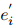

## Spelling Error Correction with Soft-Masked BERT(ACL2020)
### 一.概述
&emsp;&emsp;目前该任务的最先进的方法是基于BERT(语言表示模型)从句子的每个位置的候选字符列表中选择一个字符进行纠正(包括非纠正)。然而，作者认为该方法的准确性可能不是最优的，因为BERT没有足够的能力来检测每个位置是否存在错误，这显然是由于使用掩语言建模(mask language model)的预训练方式(在BERT的预训练中，只有15%的字符被屏蔽用于预测，导致学习的模型不具备足够的错误检测能力)。为此，文中提出了一种新的神经体系结构来解决上述问题，它由一个错误检测网络和一个基于BERT的错误校正网络组成，前者通过我们所谓的soft-masking技术与后者连接。使用的“soft-masked bert”方法是通用的，它可以用于其他语言检测纠错问题。

&emsp;&emsp;本文的主要贡献如下：

&emsp;&emsp;1.提出soft-masked bert架构用于中文拼写纠错(CSC)

&emsp;&emsp;2.实验验证模型的有效性

&emsp;&emsp;Soft-masked bert包括2个网络，一个是检测网络；一个是基于bert的校正网络。检测网络是一个Bi-GRU网络，用来预测字符在每个位置是错误的概率。然后利用该概率对该位置的字符嵌入embedding进行soft-masking。soft-masking是传统“hard masking”的扩展，当误差概率等于1时，前者退化为后者。然后将每个位置的soft-masked嵌入embedding输入到校正网络中。校正网络利用BERT进行错误校正。在端到端联合训练过程中，这种方法可以迫使模型在检测网络的帮助下学习正确的上下文进行纠错。
### 二.方法概述
 

&emsp;&emsp;Soft-masked bert模型由检测网络Bi-GRU和纠正网络Bert组成。检测网络预测错误的概率，纠正网络预测错误纠正的概率，前者通过soft masking将其预测结果传递给后者。

&emsp;&emsp;模型首先对句子中所有的字符创建embedding，作为input embedding。接着，它将embedding序列作为输入，并使用检测网络输出字符序列(embedding)的错误概率。然后，它计算input embedding和[MASK] embedding通过错误概率加权的加权和。计算出的嵌入embedding以一种软(soft)方式掩盖了序列中可能出现的错误。然后，将soft-masked嵌入序列作为输入，并使用校正网络输出错误纠正的概率，该网络是一个BERT模型，其最后一层是softmax函数。在input embedding和最后一层的embedding之间有一个残差连接。
#### 1.检测网络(Detection Network)
&emsp;&emsp;检测网络是一个二分类的序列模型，输入是序列的embedding E = (e1, e2,··· , en) ，这里的ei 是字符xi 的embedding，它是字符的词嵌入word embedding、位置嵌入position embedding和段嵌入segment embedding的总和，像BERT一样。输出是一个标签序列G = (g1; g2;· · · ; gn) ，其中gi 表示第i 个字符的label，1表示该字符不正确，0表示正确。对于每个字符，有一个概率pi ，表示为1的可能性。pi 越高，字符错误的可能性越大。

&emsp;&emsp;在这项工作中，我们将检测网络实现为双向GRU (Bi-GRU)。对于序列的每一个字符，错误的概率pi 定义为：

 

其中，Pd(gi = 1|X) 表示检测网络给出的条件概率，σ表示sigmoid函数，hdi表示Bi-GRU的隐状态，Wd和bd是参数。 隐状态定义如下：

 

上式中，最后一步是GRU两个方向隐状态的联合。

Soft masking相当于input embedding和以错误概率为权重的mask embedding的加权和。第i个字符的Soft-masked embedding  表示如下：

 

以上，这里的ei 是input embedding，emask 是mask embedding。如果错误概率较高，则Soft-masked embedding  接近mask embedding emask  (被隐码);否则它接近于input embedding ei(接近本身)。[mask embedding是什么，bert embedding?]
#### 2.纠正网络(Correction Network)
纠正网络是Bert模型，输入是soft-masked embedding。Bert由12个相同的模块堆叠组成。

对于序列的每个字符，纠错概率定义为：

 

其中，Pc(yi = j|X)为字符xi在候选列表中被校正为字符j的条件概率，softmax为softmax函数， 为隐藏状态，W和b为参数。其中隐状态 是通过与残差连接的线性组合得到：

 

 是bert最后一层输出的隐状态，ei是字符xi的input embedding。
#### 3.学习(Learning)
优化2个目标，一个是错误检测；一个是错误纠正：

 

上式中，第一个是检测目标，第二个是纠正目标。通过线性组合：

 

λ∈[0;1]是系数。

