## SpellGCN: Incorporating Phonological and Visual Similarities into Language Models for Chinese Spelling Check(ACL2020) 
### 一．概述
&emsp;&emsp;作者认为现有的方法都试图将汉字之间的相似度知识纳入其中，然而，它们要么将相似性知识作为外部输入资源，要么仅仅作为启发式规则。为此，本文提出通过专门的图卷积网络(SpellGCN)将语音和视觉相似性知识纳入CSC(Chinese Spelling Check)的语言模型。该模型在字符上构建一个图，SpellGCN学习将该图映射到一组相互依赖的字符分类器。这些分类器应用于由另一个网络(如BERT)提取的表示，使整个网络能够端到端可训练。

&emsp;&emsp;代码：https://github.com/ACL2020SpellGCN/SpellGCN

&emsp;&emsp;文中，作者提出一个拼写检查的卷积图网络模型，其能够捕捉发音/形状的相似性，并探索字符之间的先验依赖关系。具体来说，分别为发音和形状关系构建了两个相似图。SpellGCN将图形作为输入，并在相似字符之间的交互之后为每个字符生成一个向量表示。然后将这些表示构造为从另一个骨干模块提取的语义表示的字符分类器。将图表示与BERT相结合，SpellGCN可以利用相似度知识并相应地生成正确的校正结果。本文主要贡献如下：

&emsp;&emsp;1.提出了一种新的端到端可训练SpellGCN，将发音和形状的相似性集成到语义空间中。研究了图卷积和注意的组合运算。

&emsp;&emsp;2.从定量和定性两个方面研究了SpellGCN的性能。实验结果表明，我们的方法在三个基准数据集上取得了最好的效果。

&emsp;&emsp;这里本质上应该是GCN+Bert模型。
### 二．方法概述
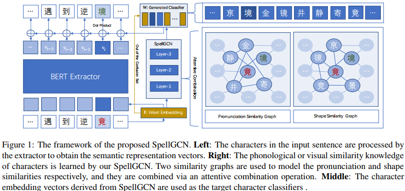

&emsp;&emsp;如上图，方法主要由2部分组成，一个字符表示抽取器和一个SpellGCN模块。提取器为每个字符派生一个表示向量。在提取器之上，使用SpellGCN对字符之间的相互依赖性进行建模，它输出包含交互后相似字符信息的目标向量。
#### 1.SpellGCN结构(Structure of SpellGCN)
&emsp;&emsp;SpellGCN针对形似与音似需要2个相似图Ap与As，这些相似数据来自一个开源的混淆集。每个相似图都是大小为RN×N的二值邻接矩阵，由混淆集中的N个字符构建而成。边Ai,j ∈{0,1}表示第i个字符和第j个字符对是否在混淆集中。

&emsp;&emsp;SpellGCN的目标是学习一个map函数，通过Ap与As的卷积操作，将第L层的输入节点embedding HL∈RN×D(这里的D是字符embedding的维度)映射成一个新的表示HL+1。此映射map函数有2个主要子组件：一个图卷积运算和一个注意图联合运算。
##### (1).图卷积运算
&emsp;&emsp;图卷积运算的目的是吸收图中相邻字符的信息。每一层均采用GCN中的轻量级卷积层:

&emsp;&emsp;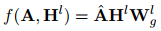

&emsp;&emsp;这里的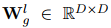是一个可训练的矩阵，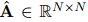是邻接矩阵A的归一化形式。注意，我们使用BERT的字符嵌入作为初始节点特征H0，我们省略了卷积后的非线性函数。由于我们采用BERT作为我们的抽取器，它有自己学习到的语义空间，我们从方程中去除激活函数，以保持派生的表示与原始空间相同，而不是完全不同的空间。
##### (2).注意图联合运算
&emsp;&emsp;图卷积运算处理单个图的相似性。为了将发音和形状相似图结合起来，采用了注意力机制。对于每个字符，我们将组合操作表示如下：

&emsp;&emsp;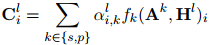

&emsp;&emsp;这里的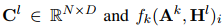是图k的第i行卷积表示，αi,k是表示图k权重的第i个字符的标量。权重αi,k的计算如下：

&emsp;&emsp;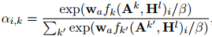

&emsp;&emsp;这里的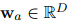是跨层共享的可学习向量，β是控制注意力权重平滑度的超参数。
##### (3).累加输出(Accumulated Output)
&emsp;&emsp;在图卷积和注意力组合运算后，得到了第L层的表示CL。为了保持抽取器的原始语义，将前几层的所有输出累加后输出:

&emsp;&emsp;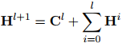

&emsp;&emsp;通过这种方式，SpellGCN能够专注于捕获字符相似度的知识，将语义推理的责任留给抽取器。
#### 2.SpellGCN用于中文拼写检查(SpellGCN for Chinese Spelling Check)
&emsp;&emsp;这里利用SpellGCN的最后输出作为目标字符的分类器。
##### (1).混淆集相似图(Similarity Graphs from Confusion Set)
&emsp;&emsp;SpellGCN的相似图构建的数据来自(Chinese spelling check evaluation at SIGHAN bake-off 2013)。 它是由大多数(~ 95%)汉字的相似字符组成的预定义集合，这些字符被分为五类：A.形似；B.相同的发音和音调；C..相同的发音和不同的音调；D.音似和相同的音调；E.音似和不同的音调。由于音似比形似类别更细粒度，我们将音似合并成一个图。因此，这里构建了音似和形似两个图。
##### (2).抽取器的字符表示(Character Representation by Extractor)
&emsp;&emsp;用于最终分类的字符表示由抽取器给出。这里采用Bert作为backbone模型。其将序列X作为输入，最后一层的输出作为表示V。这里Bert的结构是12层，12个自注意力头，维度为768。
##### (3).SpellGCN作为字符分类器(SpellGCN as Character Classifier)
&emsp;&emsp;当给定字符xi的表示向量vi时，模型需要通过一个全连接层来预测目标字符，该全连接层的权重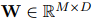由SpellGCN的输出配置(M是抽取器词汇表的大小)：

&emsp;&emsp;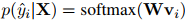

&emsp;&emsp;具体来说，SpellGCN的输出向量在任务中扮演了分类器的角色。使用SpellGCN HL最后一层的输出(其中L是层数)对混淆集中的字符进行分类。由于混淆集只涵盖词汇表的一个子集，我们使用抽取器的词嵌入作为被混淆集排除的词的分类器。这样，表示ui∈{1,...,N}是抽取器词汇表中第i个字符的混淆集索引，W表示如下：

&emsp;&emsp;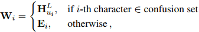

&emsp;&emsp;这里的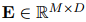是抽取器的嵌入矩阵。如果字符在混淆集中，我们使用来自SpellGCN的嵌入。否则，嵌入向量与BERT中一样使用。我们没有建模一个包含抽取器词汇表中所有字符的大型紧凑图graph，而是为了提高计算效率而选择了这种实现，因为混淆集中有大约5K个字符，而提取器词汇表中有超过20K个字符。

&emsp;&emsp;总的来说，目标函数是最大化目标字符的对数似然度:

&emsp;&emsp;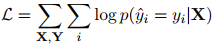

#### 3.预测推理(Prediction Inference)
这里简单地使用具有最高概率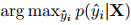的字符作为校正任务的预测结果。通过检查预测是否与目标字符yi匹配来实现检测。
#### 4.超参
Bert的微调利用AdamW，batchsize为32，学习率是5e-5，6个epoch。SpellGCN为2层。注意力联合运算中的平滑度β为3。
