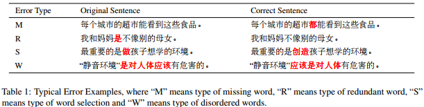
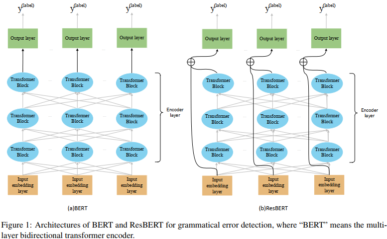
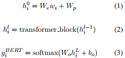
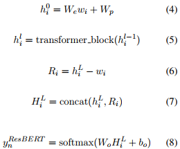

## Combining ResNet and Transformer for Chinese Grammatical Error Diagnosis(ACL2020) 
### 一.概述

&emsp;&emsp;CGED(Chinese Grammatical Error Diagnosis)旨在诊断四种语法错误，即缺词(M)、冗词(R)、选词不当(S)和词乱序(W)，如上图。自动CGED系统包括错误检测和纠错两部分。在错误检测方面，我们的系统建立在多层双向transformer encoder的模型上，并将ResNet集成到编码器encoder中以提高性能。对于错词校正，我们设计了两个模型，分别对选词不当(S)和缺词(M)错误推荐校正结果。具体一点，使用RoBERTa和n-gram语言模型针对造词不同(S)错误；联合预训练masked语言模型和统计语言模型针对缺词(M)错误。

&emsp;&emsp;CGED针对输入的句子，需要指出：A.句子正确与否；B.句子中包含哪种错误；C.错误的位置；D.选词不当(S)和缺词(M)错误的校正。
### 二.方法概述
#### 1.错误检测(Error Detection)

&emsp;&emsp;这里将错误检测作为序列标注问题。输入一个句子x，使用BIO编码生成相应的标签序列y。这里联合ResNet和transformer encoder来解决这个标注问题。
##### (1).transformer encoder
&emsp;&emsp;这里使用Bert对输入的句子进行编码。模型由三部分组成：一个input embedding层I；一个编码层E；一个输出层O。输入一个句子S=w0,...,wn。编码如下：

&emsp;&emsp;

&emsp;&emsp;wi是当前token，N表示序列长度。公式(1)是input embedding。这里的transformer_block包括自注意力，全连接层以及输出hli。l是层数量，l>=1。L是Bert的层总数。公式(3)表示输出层。Wo是输出权重矩阵，bo是输出层的偏置，yBERTi是一个语法错误检测预测。
##### (2).融合ResNet
&emsp;&emsp;神经网络模型的低层学习单词结构，而高层学习单词的含义。对于强调语法性质的任务，如汉语语法错误检测，来自较低层次的信息被认为是重要的。本文将利用残差联合word embeddding和深层的网络信息。输入一个句子S=w0,...,wn。ResBert如下：

&emsp;&emsp;

&emsp;&emsp;公式(6)是一个残差学习框架，这里的hLi隐层输出和input embedding被用来近似残差函数。然后将hLi和Ri的连接输入到输出层。
##### (3).从模型库逐步集成选择(Stepwise Ensemble Selection from Libraries of Models)
&emsp;&emsp;我们发现不同的随机种子和dropout值可能会导致每次训练结束时的不同表现。合并不同的模型结果以提高性能是很简单的。我们不是通过加权平均来组合所有的单一模型，而是从模型库中使用前向逐步选择来找到一个模型子集，这些模型在一起平均时会产生优异的性能。模型库是使用不同的随机种子和dropout值生成的。基于的集成选择如下：

&emsp;&emsp;A.从空的集成开始。

&emsp;&emsp;B.将库中的模型添加到集成中，使集成的性能最大化到验证集上的中文语法错误检测度量。

&emsp;&emsp;C.重复步骤2到一个迭代的固定次数，或者直到所有的模型都被使用。

&emsp;&emsp;D. 从嵌套的集合中返回在验证集上具有最大性能的集合。 

&emsp;&emsp;选择在每个步骤中要添加的最佳模型时的投票系统是按照span-level评估，其工作方式如下：

&emsp;&emsp;A.标记错误文本跨度的每单个模型都计为该错误文本跨度的投票（例如，如果给定位置的单词“是”被一个单个模型标记为R型，则它会收到一个投票）。请注意，只有被单个模型识别为错误类型的文本范围才被视为候选。

&emsp;&emsp;B.如果错误文本的每个候选范围收集的票数最少，例如30％*子集模型的数量，则被标记为真实错误。

&emsp;&emsp;提出的简单前向模型选择方法是有效的，但有时会对验证集过拟合，降低测试集上的集成性能。为了减少验证集上的过拟合，我们对Caruana等人(2004)所描述的选择过程进行了三个补充:

&emsp;&emsp;A.替换选择(Selection with Replacement)

&emsp;&emsp;在不替换的情况下选择模型，性能会随着最佳模型添加到集合中而提高，达到峰值，然后迅速下降。选择可更换的模型大大减少了这一问题。选择并更换允许模型被多次添加到集合中。这允许选择通过加权模型来微调集合：多次添加到集合中的模型会获得更多的权重。

&emsp;&emsp;B.集成初始化的排序(Sorted Ensemble Initialization)

&emsp;&emsp;简单的前向模型选择过程从空集合开始。在选择的早期，当集合很小时，正向选择有时会过拟合。为了防止过拟合，我们根据模型的性能对库中的模型进行排序，并在步骤之前将N个最佳模型放入集合中。设置N=5。

&emsp;&emsp;C.集成选择bagged(Bagged Ensemble Selection)

&emsp;&emsp;随着库中模型数量的增加，发现过拟合验证集的模型组合的机会也增加了。Bagging可以减少这个问题。我们通过从库中随机抽取模型样本并从中进行选择来减少模型的数量。如果M个模型的特定组合过拟合，则这M个模型在随机模型袋(random bag of models)中的概率小于(1 - p)M (p是bag中模型的比例)。 我们使用p=0.5，bag集成选择20次，以确保最佳模型将有多次机会被选中。最后的集成平均值是20个。 
#### 2.错误校正(Error Correction)
对选词不当(S)和缺词(M)错误，本文设计2种不同的模型进行纠正：
##### (1).选词不当(S)错误
&emsp;&emsp;利用RoBerta和n-gram模型。我们使用以前比赛的CGED训练集进行微调RoBERTa-wwm，并将CGED数据与新闻语料库结合起来训练一个5-gram的语言模型。

&emsp;&emsp;校正包括单字校正和多字校正。对于单字校正，我们将RoBERTa生成的前20个结果和L2学习者语料库中3500个最常见的字符作为候选字符。我们根据RoBERTa和n-gram的预测概率、视觉相似性和语音相似性对候选词进行评分。然后，我们选择得分最高的字符作为校正结果；对于多字符校正，我们也选择RoBERTa在每个位置生成的前20个字符。我们将这些字符组合在一起形成单词，并将词汇表中的字符保留为候选字符。除了单字校正时的四种特征外，我们还考虑了错误词与候选词之间的Levenshtein距离。
##### (2).缺词(M)错误
&emsp;&emsp;将此类任务视为一项完形任务，并利用预训练的mask语言模型和统计语言模型相结合来生成可能的纠正结果。对于疑似缺失的位置，我们将缺词(M)错误的校正过程分为两个步骤，首先提出可能的校正，然后评估和选择最合理的校正。

&emsp;&emsp;在使用预训练的mask语言模型时，我们首先通过基于bert的序列标注模型预测疑似缺词(M)错误位置的缺失字符数。然后，我们在位置前的句子中添加与预测相同数量的[MASK]符号。之后，我们使用BERT预测每个[MASK]符号最可能的字符，并将其视为校正候选字符。在使用统计语言模型的情况下，我们准备了一个L2学习者的汉语高频词汇表，并将该词汇表中所有可能的汉语词汇补充到缺词(M)错误的位置，生成一系列的纠正候选词。为了评估每个候选的概率，我们使用它们来构建修改后的句子，并使用在L2学习者语料库上预训练的统计语言模型计算原始句子和所有修改后句子的困惑度。如果修改后的句子的困惑度明显低于原句子的困惑度，并通过人工阈值控制，我们将该候选词视为预测的纠正结果。
#### 3.训练设置
&emsp;&emsp;我们选择ELECTRA判别器作为transformer的初始化。这里使用中文ELECTRA-Large判别器模型，具有1024个隐藏单元，16个头，24个隐藏层，324M个参数。128个token，batchsize为64，学习率为2e-5，epoch为120。使用16个不同的随机种子和每个随机种子5个不同的dropout值来训练80个单模型用于逐步集成选择。

