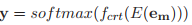

## Correcting Chinese Spelling Errors with Phonetic Pre-training(ACL2021) 
### 一.概述
作者认为中文拼写纠错(CSC)现有的方法要么只使用预训练的语言模型，要么将语音信息作为外部知识。在本文中，我们提出了一种新的端到端CSC模型，利用强大的预训练和微调方法，将语音特征集成到语言模型中。在训练语言模型中，我们用语音特征和与之相似的单词代替了传统的用特殊标记来屏蔽单词的方法。我们进一步提出了一种自适应加权目标，在统一的框架下联合训练错误检测和纠错。

方法首先修改预训练的掩码语言模型(masked language model)的学习任务。我们不是用不加区分的符号“[MASK]”替换字符，而是用拼音或发音相似的字符来屏蔽字符。这使得语言模型能够探索汉字和拼音之间的相似性。然后，我们使用带两个网络的模型对纠错数据进行微调，一个检测网络预测每个单词拼写错误的概率，一个纠错网络通过融合单词嵌入(word embedding)和拼音嵌入(pinyin embedding)的概率作为输入来生成纠正结果。我们在统一的框架下联合优化检测和校正网络。

本文主要贡献如下：

1.提出了一种新的端到端CSC模型，该模型将语音特征纳入语言表示。该模型对共享空间中的汉字和拼音符号进行编码。

2.语音信息的整合极大地促进了CSC。在基准SIGHAN数据集上的实验结果表明，我们的方法显著优于以前最先进的方法。
### 二.方法概述
本文提出的端到端CSC模型由2个组件组成，检测与校正。检测模块将xw作为输入，然后预测每个字符拼写出错的概率。校正模块联合xw的嵌入embedding和其相应的拼音序列xp作为输入，然后预测正确的序列。文中提出用拼音出错的概率作为权重去融合xw和xp的嵌入embedding。

我们首先通过学习从发音相似的字符和拼音中预测字符来预训练一个掩码语言模型，MLM-phonetics。然后在微调中，我们联合优化检测和校正模块。
#### 1.模型架构

上图中，下方是错误检测模块，上方是校正模块。这两个都是基于transformer构建。
##### (1).检测模块(Detection Module)
对于输入的句子xw=(xw1,xw2,...,xwn)，检测模块的目标是检测输入句子xw中的字符是否正确。这里用1表示有错误，0表示正确。检测公式如下：

这里的ew=(ew1,ew2,...,ewn)是xw的词嵌入embedding。E是预测编码器encoder，fdet是一个全连接层，其将句子表示映射成二值序列yd=(yd1,yd2,...,ydn)，ydi∈{0, 1}。

利用peeri表示字符xwi出错的概率：

这里的θd 是错误检测模块的参数。
##### (2).校正模块(Correction Module)
校正模块的目标是基于检测模块的输出生成正确的字符。
我们不仅使用词嵌入(word embedding)作为输入，还使用拼音嵌入(pinyin embedding)来整合语音信息。具体来说，我们首先使用PyPinyin工具生成拼音序列xp，从嵌入层(embedding layer)中得到拼音嵌入ep，并通过线性组合将其与词嵌入ew融合:

这种组合使用检测模块预测的拼写错误概率作为权重来平衡语义特征(字符嵌入)和语音特征(拼音嵌入)的重要性。有两种特殊的情况：如果perri = 0，则表示检测到字符xwi是正确的，并且模型仅使用其嵌入em中的单词；如果perri = 1，则表示检测到该字符是错误的，模型使用其拼音嵌入。

最后，校正的结果y通过一个全连接层fcrt进行预测：

这里注意，嵌入embedding、编码器E和校正网络fcrt的参数由MLM-phonetics初始化。在预训练中，通过对MLM-phonetics的训练，从易混淆的对应词和拼音中重构出正确的字符，从而进行融合嵌入转换。
#### 2.联合微调
模型有2个目标：训练检测模块参数fdet以及调整检测和校正模块以达到最佳平衡。这里联合优化检测损失Ld和校正损失Lc：

以上的θd和θc是检测和校正模块的参数。是检测结果的真值，是检测模块的预测，这两个都是0或1。

其中，校正损失为检测结果概率加权后的负对数似然，。这是为了区分两个任务的职责。当检测模块给出一个低置信度预测时，即接近0.5，em融合了权重相似的语义特征和语音特征。但我们希望检测模块能够提供明确的对错判断，
接近1。因此，em可以由语义特征或语音特征主导。在这种情况下，错误词的纠正不会受到em中的语义特征的干扰，反之亦然。因此，我们对检测模块给出的低置信度预测进行惩罚。具体来说，当检测结果的概率较低时，Lc减小，模型将更加关注Ld的优化。当检测概率较高时，模型以平衡方式对的Ld和Lc进行优化。

联合优化目标：

#### 3.预训练MLM-phonetics
预训练MLM-phonetics语言模型：集成语音特征；解决在CSC结构中的使用标准mask语言模型的问题。标准mask语言模型任务的输入与预训练的分布相同，而CSC的输入句子与预训练样本不同，存在一定的误差。为了充分利用预训练技术，我们对预训练任务进行了修改。在预训练一个标准的掩码语言模型(MLM-base)，通过预测训练模型15%随机选择的字符，这些字符分别以80%、10%和10%的采样率被[MASK] token、随机字符和它们自己替换。
为了避免输入歧义和整合语音特征，我们提出了两种预训练替代方案:混淆汉字(confused-Hanzi)和噪声拼音(noisy-pinyin)。以下进行说明：

A.[MASK]替换
B.随机汉字替换
C.保持不变
D.混淆汉字(confused-Hanzi)替换
E.噪声拼音(noisy-pinyin)替换
以上，前3个是标准预训练mask语言模型的替换，后2个是本文提出的替换，用于建模字符和拼音token的相似性。在MLM-phonetics的预训练中，我们的数据生成器在训练样本中随机选择20%的token位置。如果选择了第i个token，我们根据经验将其替换为（1）40%的[MASK] token，（2）30%为该token的噪音拼音(noisy-pinyin)，以及（3）30%的时间来自其混淆集的混淆汉字(confused-Hanzi)。然后训练MLM-phonetics从替换的句子中预测原始句子。
提出的两个预训练任务可以消除预训练和微调CSC模型之间的输入分歧。混淆汉字替换模拟了检测模块的输入，两种替换共同促进了预训练模型适应融合嵌入(见以上em融合公式)。
#### 4.本方法的新颖性
首先，我们的模型结合了拼音和汉字的嵌入，防止了信息的丢失，更像是人工纠错的过程，用问题词的发音来预测纠错。
其次，我们通过提出新的预训练任务来共享预训练编码器的检测和校正。
第三，提出了一种自适应加权策略，用于联合训练错误检测和纠错。该策略鼓励模型产生清晰的检测结果，使得融合嵌入要么以语义特征为主，要么以语音特征为主，这更接近于预训练任务。