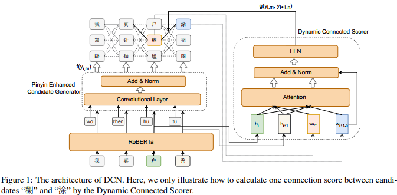
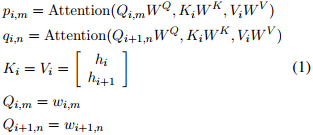
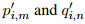
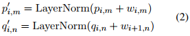
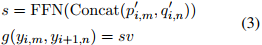
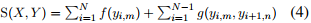
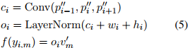
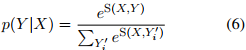
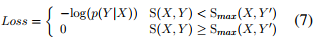

## Dynamic Connected Networks for Chinese Spelling Check(ACL2021)
### 一．概述
文中认为基于bert的非自回归语言模型依赖于输出独立性假设。不适当的独立性假设阻碍了基于bert的模型学习目标token之间的依赖关系，从而导致了不连贯的问题。为些，提出了一种名为Dynamic Connected Networks(DCN)的新架构，它通过拼音增强候选生成器生成候选中文字符然后利用基于注意力的网络对相邻中文字符之间的依赖关系进行建模。在数据集SIGHAN 2013,SIGHAN 2014以及SIGHAN 2015 达到了state-of-the-art。

代码：https://github.com/destwang/DCN 

首先，我们利用RoBERTa与拼音增强候选生成器结合语音信息，并在每个位置生成k个候选字符。对于每两个相邻的候选，DCN通过动态连接评分器(DCScorer)学习一个可变的连接评分，以确定它们之间的依赖程度。DCScorer通过将上下文表示和当前位置和下一个位置的候选字符嵌入embedding同时输入注意力层来计算连接分数。最终，模型生成了kn个候选路径，我们利用Viterbi算法快速找到得分最高的路径作为我们最终的校正结果。

本文主要贡献如下：

A.提出了一种新的端到端动态连接网络(DCN)，它可以缓解CSC任务中非自回归语言模型的不连贯问题。

B.提出了一种简单有效的拼音增强候选生成器，用于整合语音信息，生成更好的候选字符。
### 二．方法概述
#### 1.问题
输入一个句子，然后对句子进行校正输出。由于非自回归语言模型是基于输出独立性的假设，会导致输出汉字不匹配，导致不连贯问题。
#### 2.动态连接网络(Dynamic Connected Networks)
DCN可以学习输出的中文字符之间的依赖，减轻不连贯问题。

首先，RoBERTa使用拼音增强候选生成器生成一系列候选字符，我们抽取k个字符作为候选字符。对于每两个相邻的候选字符，我们通过动态连接评分器(DCScorer)学习连接分数以确定它们之间依赖的强度。最终的校正分数将由连接分数和候选生成器在每个位置的预测分数的联合预测来计算。

DCScorer需要同时考虑上下文信息、当前位置和下一个位置的候选字符。因此，我们使用注意力机制来学习当前候选的上下文表示p和下一个候选上下文表示q。两个相邻候选者之间的依赖强度通常与当前和下一个位置的RoBERTa隐藏表示更相关，因此注意力机制中的key和value只包含这两个隐藏表示。DCScorer定义如下:

这里的i是字符位置，m和n是当前位置和下一个位置的候先索引。Attention表示注意力机制，其中Q、K、V分别表示query、key和value，W表示注意力层需要学习的参数。h是最后一个transformer block的隐藏表示，w表示候选token嵌入embedding。

我们将候选token嵌入embedding添加到候选上下文表示。然后我们将输出输入到归一化层layernorm，得到两个表示：

将以上两个向量连接起来，输入到前馈层(FFN)。然后我们使用一个线性层来计算两个候选之间的连接分数：

以上的v是一个可训练的权重向量，以上(3)式下面公式的左部分为第i个位置的第m个候选与第i + 1个位置的第n个候选者之间的连接分数。

由于我们向DCScorer提供了k2对候选组合，因此我们将在每个位置生成k2个分数。最终，该模型将生成kn个候选路径，每个路径的得分由下式计算：

这里的y是候选字符，f(yi,m)是拼音增强候选生成器针对第i个位置的第m个候选的预测分数。
#### 3.候选生成(Candidate Generation)
通过基于RoBERTa的拼音增强候选生成器(Pinyin Enhanced Candidate Generator)生成候选中文字符。
##### (1).拼音增强候选生成器(Pinyin Enhanced Candidate Generator)
由于一个拼音通常对应许多汉字，因此很难正确转换。然而，当有多个连续的拼音时，我们将更有信心将拼音转换成正确的汉字。这是汉语拼音输入法的一个基本假设。

基于此，我们提出了一种拼音增强候选生成器，可以有效地减少歧义，生成更好的中文字符。具体来说，我们采用卷积层对连续拼音进行编码，并将卷积层的输出、RoBERTa的隐藏表示和字符嵌入加在一起。然后将求和结果输入到归一化层，通过线性层得到预测分数f(yi，m)。公式如下：

这里的p11是拼音embedding，wi是中文字符embeddding，hi是Roberta最后的隐藏表示，v1m是第m个候选的可训练的权重向量。
##### (2).候选采样方法
汉字较多，需要对候选进行采样学习。从词汇表中选择预测得分最高的top-k个字符。这也表明可以将难度较大的候选作为负训练样例，可以有效地提高模型的判别能力。
#### 4.学习
##### (1).损失函数
序列Y的概率可以用下面的方程近似表示：

其中Y1i为候选字符生成的路径。
损失函数是表示为概率分布的最大似然：

以上损失函数类似于LSTM-CRF中使用的损失函数。它只学习采样的负候选字符和它们之间的依赖关系，这将过度降低潜在候选字符的排名。这可能会使更多相似的候选排名更低。为了避免上述问题，我们对损失函数进行了限制，当gold分数大于或等于所有候选路径的最大分数时，将损失函数设为0。
##### (2).预训练
通过大规模的训练语料库可以更充分地学习中文字符之间的依赖关系。在本文中，我们使用中文维基百科数据预训练我们提出的模型。我们随机替换15%的字符，包括70%的MASK、15%的混淆集字符和15%的随机字符。我们利用了SIGHAN 2013发布的混淆集(Wu et al.， 2013)，它由发音相似度和形状相似度字符组成。基于RoBERTa模型，我们冻结了主要参数，只对拼音增强候选生成器(Pinyin Enhanced Candidate Generator)和动态连接评分器(Dynamic Connected Scorer)进行了微调。
#### 5.预测
在预测阶段，由拼音增强候选生成器从词汇表中生成top-k个候选字符。最终，有kn条路径。为了快速选择得分最高的路径，我们使用了基于动态规划的Viterbi算法对输出序列进行解码。
#### 6.参数
Roberta为基模型，优化器AdamW，学习率为5e-5，batchsize为32。训练时的候选大小为5，预测时为8。拼音增强候选生成器的卷积size为3。所有稳藏表示的维度为768。学习率从{2e-5,3e-5,5e-5}中搜索。

