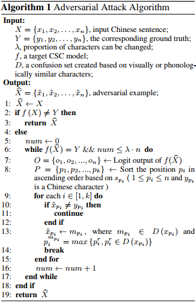
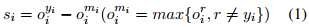

## Exploration and Exploitation: Two Ways to Improve Chinese Spelling Correction Models(ACL2021)
### 一.概述
文中认为CSC(Chinese Spelling Correction)模型可能无法纠正混淆集所涵盖的拼写错误，并且还会遇到未见过的拼写错误。为些提出了一种方法，该方法不断识别模型的弱点，以产生更有价值的训练实例，并应用特定任务的预训练策略来增强模型。生成的对抗性示例逐渐添加到训练集中。

代码：https://github.com/FDChongli/TwoWaysToImproveCSC 

在本研究中，我们希望在训练CSC模型时同时进行探索(未知拼写错误)和利用(混淆集覆盖的拼写错误)。为了鼓励模型探索未知情况，我们提出了一种基于字符替换的方法来预训练模型。训练数据生成器随机选择约25%的字符位置进行预测。如果一个字符被选中，我们用从混淆集中随机选择的字符(90%的时间)或随机字符(10%的时间)替换它。然后，要求该模型预测原始字符。

由于拼写错误和出现拼写错误的各种上下文的组合，即使给出并固定了混淆集，模型仍然可能无法纠正被其混淆集中的任何字符替换的字符。 为了更好地利用模型在训练阶段所经历的，我们通过对抗性攻击生成更有价值的训练数据（即通过向输入添加难以察觉的扰动来欺骗模型进行错误预测（Szegedy et al.，2014）），针对模型的弱点，这可以提高用于微调CSC模型的训练数据的质量及其对抗性攻击的鲁棒性。我们提出了一种简单而有效的对抗性示例生成方法：我们首先通过预先训练的模型识别出生成概率最低的最易受攻击的字符，并将其替换为其混淆集中的字符来创建对抗性示例。一旦获得了对抗样本，就可以将它们与原始的干净数据合并来训练CSC模型。我们的方法生成的样本比训练集中已经存在的样本更有价值，因为它们是针对当前模型的弱点生成的。
### 二.方法概述
#### 1.问题定义
该任务可以通过对P (Y|X)的条件概率进行建模和最大化来表述为条件生成问题。X为输入的句子，Y是校正后的句子。
#### 2.基本模型
这里利用Bert，SpellGCN以及Soft-maksed Bert模型进行测试，这些模型在CSC任务上实现了最先进或接近最先进的性能。然而，我们发现它们的性能和鲁棒性可以通过预训练和对抗训练进一步提高，这有助于模型探索看不见的拼写错误并利用自身的弱点。
#### 3.预训练方法
通过替换干净句子中的字符生成训练样例对，并训练模型来预测原始字符。一个句子平均包含不超过两个拼写错误，因此我们选择并替换句子中25%的字符。选择的字符将被从混淆集中随机选择的字符(90%的时间)或随机的字符(10%的时间)替代。后者帮助模型探索未被混淆集覆盖的未知拼写错误。
#### 4.对抗示例生成与对抗训练

为了有效地识别和缓解训练好的CSC模型的弱点，我们设计了一种针对CSC任务的对抗性攻击算法，该算法将句子中的token替换为拼写错误。本文的对抗样例生成算法可分为两个主要步骤：(1)确定要更改的易受攻击的token；(2)用上下文中最容易出现的拼写错误代替它们，如上图。

对于输入句子X的第i个位置，通过logit输出oi可以得到位置分数si，如下所示:

式中ori表示字符r在第i个位置的logit输出，yi表示根据真实句子Y的第i个字符。位置分数越低，模型对预测位置的置信度就越低。攻击这个位置会使模型输出更有可能发生变化。一旦计算出输入句子中每个字符的位置分数，我们就根据位置分数按升序对这些位置进行排序。这个过程可以减少替换，并尽可能保持原有的语义。

一旦确定了一个易受攻击的位置，该位置的token就会被一个音系或视觉上相似的字符所取代。混淆集D包含一组视觉上或音系上相似的字符。为了在保持上下文的同时欺骗目标CSC模型，使用混淆集中logit输出最高的字符作为替换。

给定训练集中的一个句子，其对抗性示例是基于上述算法替换几个字符生成的。使用这些示例进行对抗性训练，通过减轻CSC模型的弱点来提高其鲁棒性，并利用混淆集中容易拼写错误的知识来帮助模型更好地泛化。
