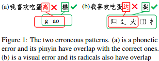
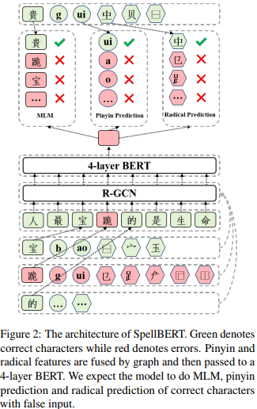
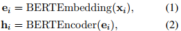
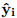
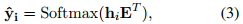
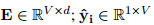
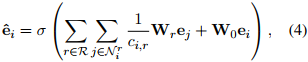
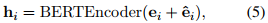

## SpellBERT: A Lightweight Pretrained Model for Chinese Spelling Check(EMNLP2021) 
### 一.概述
作者认为许多模型利用预定义的混淆集来学习正确字符与其视觉上相似或语音上相似的误用字符之间的映射，但映射可能是域外的。为此，我们提出了SpellBERT，一个基于图的额外特征和独立于混淆集的预训练模型。为了明确地捕捉这两种错误模式(音似和形似，如下图)，我们使用了一个图神经网络来引入词根和拼音信息作为视觉和语音特征。为了更好地将这些特征与字符表示融合，我们设计了类似于预训练任务的掩码语言模型(masked language model)。SpellBert只有Bert一半大小。

本文利用汉字字根特征和拼音特征，然后通过关系图卷积网络融合这2个特征。SpellBERT在训练和推理阶段是独立于混淆集的。在只有BERT一半大小的情况下，SpellBERT可以很好地表现出竞争力和泛化性。
### 二.方法概述

本文将CSC(Chinese Spelling Check)任务作为序列标注问题。如上图框架主要由3个部分组成：Bert编码器，特征融合模块以及一个预训练组件。
#### 1.基于MLM backbone
这里利用Bert作为backbone。每个输入的字符xi通过bert-embedding层获得embedding表示ei。然后ei输入到bert-encoder层获得表示hi：

之后，将计算hi与所有字符嵌入embedding的相似度，以得到词汇表上的预测分布，如下所示：

这里的，V是词汇表大小，d是隐层维度大小。其中E为bert嵌入层，E的第i行对应于公式(1)中的ei。最后，我们使用字符xk作为与hi相似度最高的xi的校正结果。
#### 2.融合视觉与语音特征(Fusing Visual and Phonetic Features)
为了建这两种错误模式，通过结合词根和拼音信息，为汉字表示ei注入视觉和语音特征。我们使用关系图卷积网络(简称R-GCN)将多种类型的特征填充到公式(1)中的字符表示ei中。我们把字符看作节点，输入序列X可以自然地组织成一个线形图。词根和拼音都被看作是图的节点。如果一个词根或拼音属于某个字符，我们将它们之间的连接构建为边。我们认为这些连接是不同的，这取决于它们之间的节点对。此外，由于局部上下文信息有利于更好地融合拼音和词根特征，我们在相邻字符之间构造边。为此，边的构建如下：
    
    A.字符和根号之间的一条边
	B.字符和拼音之间的一条边
	C.在固定长度上下文中，字符和相邻字符之间的一条边
	D.字符与自身之间的一条边
我们通过公式(1)中的字符嵌入embedding ei来初始化字符节点的特征。为了表示和更新字根节点和拼音节点的特征，我们还构造了一个额外的嵌入表，该嵌入表通过平均它们最相关的字符嵌入来初始化。这些特征在关系图上扩散如下:

以上ei表示字符xi的embedding，ej是相连节点j的特征；r表示边的类型；Nri为边类型为r的连接节点集合；Wr是边类型r的转换层；ci,r是一个特定于问题的规范化常数，在这里设置为|Nri|。上式看作是由词根和拼音信息增强的字符表示。最后，我们将增强表示与原始字符嵌入结合起来，将公式(3)更新为:

hi表示每个字符的最终表示。
#### 3.增强CSC预训练任务(Enhanced Pretraining Tasks for CSC)
考虑到字根特征和拼音特征是通过设计外部添加的，我们又设计了字根预测和拼音预测两个相似的预训练任务。在字根和拼音预测中，我们随机屏蔽字符到字根和拼音的连接，然后预测被屏蔽的连接。通过重构连接，模型可以学习到更好的表示，该表示不仅包含上下文信息，还包含视觉和语音信息。

和MLM一样，我们随机选择15%的字符进行处理。如果选择了一个字符，处理如下：

    A.10%的时间保持不变。然后预测汉字本身、它的字根和拼音。这是为了配合下游微调，每个字符都可以直接看到它的所有字根和拼音。
    B.60%的时间将其替换为[MASK]，并以80%的概率屏蔽其所有连接。然后预测被mased的字符和被masked的连接。
    C.30%的时间用困惑集中的字符替换，并以80%的概率屏蔽其所有连接。然后预测原字符及其连接。这是为了迫使我们的模型根据错误的字根和拼音来纠正字符。注意，我们只在这个阶段利用混淆集来构造拼写错误。
在我们的graph中，边没有表示，graph只在bert-embedding嵌入层和bert-encoder编码器层之间使用。因此，我们将边预测任务转化为token分类任务。对于每个字符xi，我们取其拼音和字根作为真值，并对不属于该字符的其他拼音和字根进行负采样。我们使用这些拼音和字根的特征嵌入作为分类层来计算它们与来自公式(2)中bert编码器层hi的相似度。相关的嵌入将彼此拉近，而不相关的嵌入将彼此拉开。
#### 4.减少参数(Reducing Parameters)
我们只使用4层BERT来初始化，预训练和微调我们的模型，这将参数总数从110M减少到55M。
#### 5.设置
预训练：Bert为4层；句子长度128；学习训练法5e-5；batchsize是1024；预训练10k步。
