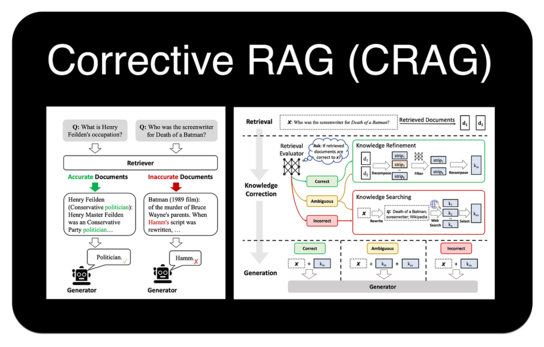
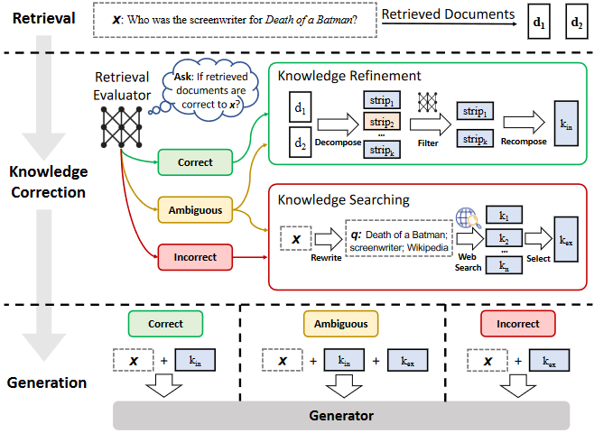
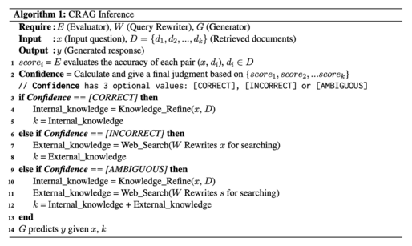

## Corrective Retrieval Augmented Generation(https://arxiv.org/pdf/2401.15884.pdf)
### 一．序言

RAG即检索增强生成(retrieval augmented generation)，当检索到不准确的数据时，会产生对模型的生成干扰。Corrective Retrieval Augmented Generation (CRAG)方法可以增强生成的鲁棒性(是当检索中有错误时)。

CRAG是一个轻量级的检索评估器，它评估被检索文档的整体质量，提供一个置信度来触发不同的知识检索操作。此外，为了解决静态和有限语料库的局限性，大规模网络搜索被用于增强检索结果。CRAG对检索到的文档采用分解-再重组(decompose-then-recompose)算法，允许选择性地关注关键信息并过滤掉不相关的细节。CRAG被设计为即插即用，并可与各种基于RAG的方法无缝集成。

代码： github.com/HuskyInSalt/CRAG
### 二.CRAG概述
如下图，构建一个检索评估器来评估检索的文档与输入的相关性。在对置信度进行估计的基础上，触发正确、不正确、不确定(Correct，Incorrect，Ambiguous)的知识检索动作。

所提出的方法为纠错检索增强生成(CRAG)，旨在自我纠正检索结果并提高生成文档的利用率。引入了一个轻量级检索评估器来评估给定查询的检索文档的总体质量。该评估器是检索增强生成(RAG)的关键组成部分，通过审查和评估检索文档的相关性和可靠性，为信息生成做出贡献。检索评估器输出一个置信度，根据评估实现不同的知识检索操作，如正确、不正确、不确定(Correct，Incorrect，Ambiguous)。对于不正确和不确定(Incorrect，Ambiguous)的情况，将网络搜索整合进来，以解决静态和有限语料库的局限性，旨在提供更广泛和更多样化的信息集。最后，在整个检索和利用过程中实现了分解-重构算法。该算法有助于消除对RAG没有帮助的检索文档中的冗余上下文，改善信息提取过程并优化关键信息的包含，同时减少非必要元素。
### 三.检索评估器(Retrieval Evaluator)
检索评估器的准确性在决定整个系统的性能方面起着关键作用。该算法确保了检索信息的精细化，优化了关键信息的提取，并最大限度地减少了非必要元素的包含，从而提高了检索数据的利用率。这里利用轻量级T5-large预训练模型对检索评估器进行了微调。
### 四.推理

### 五.结论
本文主要研究了检索增强生成(retrieval - augmented Generation, RAG)方法在检索结果不准确、导致语言模型生成错误知识时所面临的挑战。提出的解决方案被研究人员称为纠错检索增强生成(CRAG)。该研究引入了CRAG作为即插即用的解决方案，通过减轻不准确检索引起的问题来增强生成的鲁棒性。CRAG包含一个检索评估器，用于估计和触发三种不同的动作。在CRAG中包含网络搜索和优化的知识利用操作，改进了自动自我纠正，提高了检索文档的有效利用。

