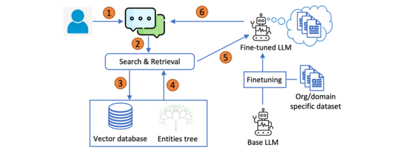

## T-RAG: LESSONS FROM THE LLM TRENCHES(https://arxiv.org/abs/2402.07483)
### 一.概述
大型语言模型(llm)越来越多地应用于各个领域，包括对私有企业文档的问答，其中数据安全性和鲁棒性至关重要。检索增强生成(retrieve - augmented Generation, RAG)是构建此类应用程序的重要框架，但要确保其健壮性，需要对其进行广泛的定制。本研究分享了在私有组织文档上部署LLM应用程序的经验，该应用程序使用名为Tree-RAG (T-RAG)的系统，该系统包含实体层次结构以提高性能。评估证明了这种方法的有效性，为现实世界的llm应用提供了有价值的见解。

由于这些文档的敏感性，安全风险是一个主要问题，这使得在公开api上使用专有的LLM模型以避免数据泄漏风险变得不切实际。这就需要使用可以部署在内部的开源模型。此外，有限的计算资源和基于可用文档的较小的训练数据集也带来了挑战。此外，确保对用户查询的可靠和准确的响应增加了复杂性，需要在这种环境中部署健壮的应用程序时进行广泛的定制和决策。

研究人员开发了一个应用程序，该应用程序将检索增强生成(RAG)与一个经过微调的开源大型语言模型(LLM)集成在一起，用于生成响应。该模型使用来自组织文档的指令数据集进行训练。

他们引入了一种新的评估指标，称为Correct-Verbose，旨在评估生成的响应的质量。该指标根据答案的正确性对答案进行评估，同时还会考虑是否包含超出原问题范围的其他相关信息。
### 二.T-RAG框架

下面是Tree-RAG (T-RAG)的工作流程：
#### 1.对于给定的用户查询，在向量数据库中搜索相关的文档块，该块作为LLM上下文学习的上下文参考。
#### 2.如果查询提到任何与组织相关的实体，则从实体树中提取有关实体的信息并添加到上下文中。经过微调的lama- 27b模型根据呈现的数据生成响应。
### 三.实体树(Entities Tree)
T-RAG的一个显著特点是，它将实体树与用于上下文检索的矢量数据库结合在一起。实体树存储有关组织实体及其层次结构安排的详细信息。此树中的每个节点表示一个实体，父节点表示它们各自的组成员关系。在检索过程中，框架利用实体树来增强从矢量数据库检索到的上下文。

实体树搜索和上下文生成的过程如下:
#### 1.最初，解析器模块扫描用户查询，查找与组织内实体名称对应的关键字。
#### 2.在识别一个或多个匹配后，从树中提取关于每个匹配实体的详细信息。
#### 3.这些细节被转换成文本语句，提供有关实体及其在组织层次结构中的位置的信息。
#### 4.随后，将此信息与从矢量数据库检索到的文档块合并以构建上下文。
#### 5.通过采用这种方法，当用户查询实体及其在组织中的层次位置时，模型可以访问有关实体的相关信息。

考虑到上面的图像，上下文生成的检索过程包括使用来自组织结构图的说明性示例来演示如何执行树搜索和检索。除了获取上下文文档之外，还使用spaCy库和自定义规则来标识组织内的命名实体。

如果查询包含一个或多个这样的实体，则从树中提取有关实体层次结构位置的相关信息，并将其转换为文本语句。然后将这些语句与检索到的文档一起合并到上下文中。

但是，如果用户的查询没有提到任何实体，则省略树搜索，只使用检索到的文档中的上下文。
### 四.总结
该研究结合了RAG和微调。同时利用本地托管的开源模型来解决数据隐私问题，同时解决推理延迟、令牌使用成本以及区域和地理可用性。通过spaCy框架使用实体进行实体搜索和上下文生成的方式很有趣。事实上，这不仅仅是一项研究，而是基于构建用于实际使用的LLM应用程序的经验所获得的经验教训。

