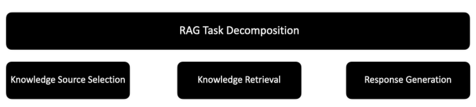
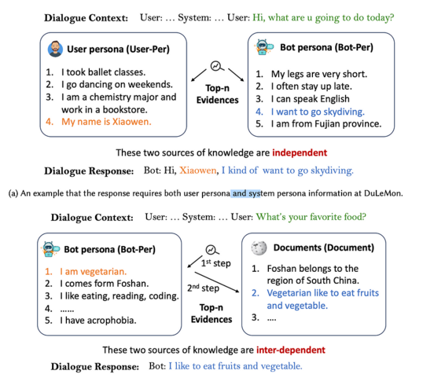
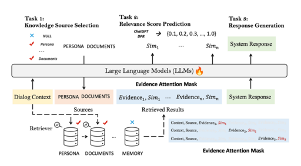

## UniMS-RAG: Unified Multi-Source RAG for Personalised Dialogue(https://arxiv.org/abs/2401.13256)
### 一．概述
本研究探讨如何分解RAG过程，加入多文件检索、记忆和个人信息等元素。大型语言模型(llm)在自然语言任务中表现出色，但在对话系统中的个性化和上下文方面面临挑战。该研究提出了一个统一的多源检索-增强生成系统(UniMS-RAG)，通过将任务分解为知识来源选择、知识检索和响应生成来解决个性化问题，如下图。

该系统包括一个自改进机制，该机制基于响应和检索证据之间的一致性分数迭代地改进生成的响应。实验结果表明，UniMS-RAG在知识来源选择和响应生成任务方面具有先进的性能。

上图显示了两个场景，其中用户和机器人角色是独立的，而(在第二个示例中)是相互依赖的。对于相互依赖的方法，需要有评估令牌(evaluation tokens)和代理令牌(acting tokens)。

知识源选择：智能和准确的知识来源选择，以及将多个信息来源综合成一个连贯而简洁的答案将变得至关重要。

复杂性：使用RAG的一个诱人之处在于其实现的简单性。然而，在agenic RAG、多文档搜索和添加会话历史等元素方面，需要进行大量工作。代理RAG是将代理层次结构与RAG实现相结合的地方。复杂性的引入和智能的增强是不可避免的。

个性化和上下文：个性化和通过会话历史维护上下文都是优秀用户体验的重要元素。UniMS-RAG根据其建议的RAG结构对这些元素进行优先排序。

持续改进：该研究包括一种自我细化推理算法，并结合RAG通常提供很大程度的可检查性和可观察性的事实。
### 二．UniMS-RAG框架
UniMS-RAG统一了计划、检索和阅读任务的训练过程，并将它们集成到一个综合框架中。利用大型语言模型(llm)的力量来处理外部知识来源，UniMS-RAG增强了llm在个性化知识基础对话中无缝连接各种资源的能力。这种集成简化了传统上分离的检索器和阅读训练任务，允许以统一的方式进行自适应证据检索和相关性评分评估。下图是所提出的称为UniMS-RAG的方法的说明。精心设计了三个优化任务（知识来源选择，相关性评分预测
，回答生成。）。

计划：这是在给定不同来源之间的关系的情况下，创建一系列应该使用哪些特定知识来源的决策的过程。

检索：根据决策从外部数据库检索前n个结果。

生成：将所有检索到的知识合并到最终的响应生成中。
### 三．总结
该方法寻求在多源环境中解决个性化的基于知识的对话任务，将问题分解为三个子任务:知识库选择、知识检索和响应生成。

提出的统一多源检索-增强对话系统(UniMS-RAG)使用大型语言模型(llm)同时作为计划、检索和阅读。

该框架在推理过程中引入了自我改进，使用一致性和相似性分数来改进响应。

在两个数据集上的实验结果表明，UniMS-RAG产生了更加个性化和真实的反应，优于基线模型。
